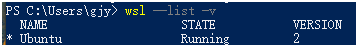

# 迁移安装的wsl发行版

其默认保存路径为: `C:\Users\xxx\AppData\Local\Docker\wsl\XXX`

1. 停止要迁移的wsl
`wsl -t DISTRO_NAME`

2. 将发行的wsl导出到tar文件中：
`wsl --export DISTRO_NAME OUTPUT_FILE`
示例: 
`wsl --export Ubuntu "D/my_wsl/ubuntu.tar`

3.  wsl取消注册
`wsl --unregister DISTRO_NAME`
示例: 
`wsl --unregister Ubuntu`
Note: 请注意`C:\Users\xxx\AppData\Local\Docker\wsl\DISTRO_NAME\ext4.vhdx`将被自动删除

4. 将导出的tar再导入回wsl
`wsl --import DISTRO_NAME NEW_WSL_PATH PKG_FILE_PATH`
说明: DISTRO_NAME: 名称
NEW_WSL_PATH: vhdx文件保存路径
示例: 
`wsl --import docker-desktop-data "D:/wsl/ubuntu" "D/my_wsl/ubuntu.tar"`
