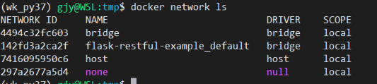
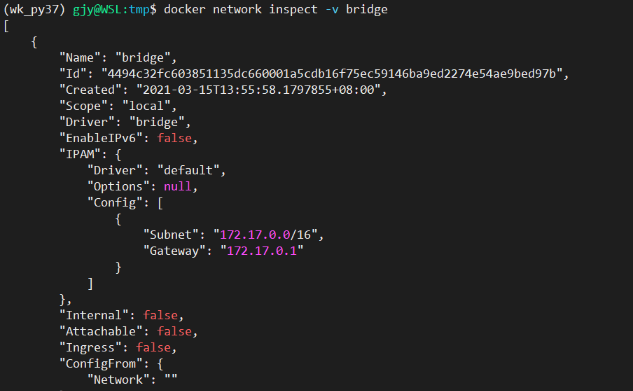

# 基本命令
## docker
* 启动: sudo service docker start

* 重启
    - 重启docker daemon:
        systemctl daemon-reload
        systemctl restart docker
    - WSL中部署的docker
        sudo service docker restart

* 查看镜像
    docker images

* 删除镜像
    docker rmi 镜像ID 镜像ID2

## 容器
* 查看已经在运行的容器:
    docker ps
    查看所有容器: docker ps -a
* 启动一个容器
    docker run imageID
    启动容器的同时启动一个bash交互终端
        docker run -it imageID /bin/bash
    启动一个容器并覆盖镜像中的entrypoint(入口)
        `docker run -it --entrypoint /bin/bash 镜像ID`
* 停止一个正在运行的容器
    docker stop 容器ID
    或 docker kill 容器ID
* 重启一个容器
    docker restart  容器ID

* docker exec: 在运行的容器中执行命令
    语法:
        docker exec [OPTIONS] CONTAINER COMMAND [ARG...]
        OPTIONS说明:
            -d :分离模式: 在后台运行
            -i :即使没有附加也保持STDIN 打开
            -t :分配一个伪终端
    eg: docker exec -it  mysql_docker /bin/bash #在容器mysql_docker中打开一个交互式终端bash

* 在容器中打开一个终端
    sudo docker exec -it -容器ID /bin/sh # 容器ID可通过'docker ps'查询; exit退出终端
    或
    docker attach 容器ID

* 删除容器
    docker rm 容器ID 容器ID2

## 镜像
docker build 命令用于使用 Dockerfile 创建镜像
语法： `docker build [OPTIONS] PATH | URL | -`
OPTIONS说明
    * -f: 指定要使用的Dockerfile路径(默认 PATH/Dockerfile)；
    * --force-rm: 设置镜像过程中删除中间容器；
    * --rm: 设置镜像成功后删除中间容器；
    * --label=[]: 设置镜像使用的元数据；
    * -m: 设置内存最大值；
    * --no-cache: 创建镜像的过程不使用缓存；
    * --pull: 尝试去更新镜像的新版本；
    * --quiet, -q :安静模式，成功后只输出镜像 ID；
    * --squash: 将 Dockerfile 中所有的操作压缩为一层;
    * --tag, -t: 镜像的名字及标签，通常 imageName:tagName；可以在一次构建中为一个镜像设置多个标签。
    * --network: 默认 default。在构建期间设置RUN指令的网络模式

### 示例
1. 使用当前目录的 Dockerfile 创建镜像，标签为"runoob/ubuntu:v1"。
`docker build -t runoob/ubuntu:v1 . `
2. 通过 -f 指定Dockerfile 文件的位置：
`docker build -t runoob/ubuntu:v1 -f /path/Dockerfile .`


## 容器&主机间文件复制
```
# 主机 => 容器
docker cp local_file_path CONTAINER-ID:/container-path

# 容器 => 主机
docker cp CONTAINER-ID:/container-path local_file_path
```

## 网络
1. 查看当前有哪些网络
    docker network ls


2. 查看指定网络的详细信息
    docker network inspect -v NetworkID



3. 添加一个子网(网段不能与已有网段重叠--已有网段通过'docker network inspect -v xxx'的方式查看)
docker network create --subnet=172.20.0.0/16 hadoop-network

# 常见问题
1. 报错: Get https://registry-1.docker.io/v2/: net/http: request canceled 
        网络问题, 更换源并重启docker daemon即可
        在'/etc/docker/daemon.json'文件中添加:
            "registry-mirrors":["https://docker.mirrors.ustc.edu.cn"]


# ssh
## 使用"ssh hostIP"登陆远程主机时,默认使用的是与当前用户名同名的用户进行登陆
本地和远程登陆用户名不一致时,可通过"~/.ssh/config "文件进行远程登录用户配置.
```
Host hostname
user username_test

Host hostname2
user username_dev
```
假设当前处于hostname的username_test用户下, 此时"ssh hostname2"等价于"ssh username_dev@hostname2".
最后修改的最重要的一点记住权限问题:config文件的权限同组用户严格为不能写权限.

## ssh免密配置
```
# 登陆master主机
su hadoop # 切换到指定用户

# 配置免密登陆
ssh-keygen -t rsa
ssh-copy-id -i id_rsa.pub hadoop@slave01 # 将公钥添加到slave01的'~/.ssh/authorized_keys'文件
ssh-copy-id -i id_rsa.pub hadoop@slave02
ssh-copy-id -i id_rsa.pub hadoop@master

# ### 在从机上重复上述操作 ###
```


