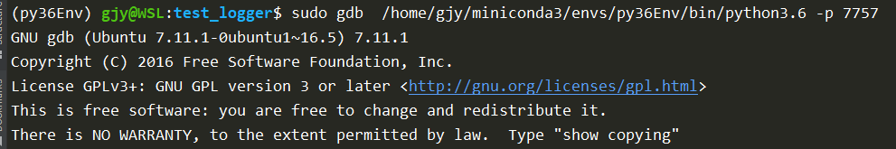

# gdb with python

## 参考文档
[参考 https://devguide.python.org/gdb/](https://devguide.python.org/gdb/)
[参考 gdbpython](https://meteorix.github.io/2019/02/13/gdbpython/)
[参考 cant-enable-py-bt-for-gdb](https://stackoverflow.com/questions/41160447/cant-enable-py-bt-for-gdb)
[参考 debugging-cpython-gdb](https://www.podoliaka.org/2016/04/10/debugging-cpython-gdb/)
[参考 gdb使用conda python](https://geronimo-bergk.medium.com/use-gdb-to-debug-running-python-processes-a961dc74ae36)

## 为什么使用gdb
当应用程序卡在某个地方(如死锁)，并且您需要附加到正在运行的进程以找出原因，而无需重新启动它。此时pdb无法帮助您，这就需要请出gdb。

**gdb Python 的好处**：
1. gdb允许附加到正在运行的进程，而无需在调试模式下启动应用程序或首先以某种方式修改应用程序代码
    (例如将类似import rpdb; rpdb.set_trace()的东西放入代码中)
2. gdb允许人们获取进程的核心转储并稍后对其进行分析。这很有用，当您不想在一段时间内停止进程时，当您自省其状态时，
    以及当您对 已经失败的进程进行事后调试时(例如，因分段而崩溃）
3. 大多数可用于 Python 的调试器（值得注意的例外是winpdb和pydevd）不支持在被调试的应用程序的线程之间切换。
    gdb 允许这样做，以及调试由非 Python 代码创建的线程（例如，在使用的某些本机库中）

## 常用指令
```
bt    # 当前C调用栈
py-bt  # 当前Py调用栈
py-list  # 当前py代码位置
info thread   # 线程信息
thread <id>   # 切换到某个线程
thread apply all py-list  # 查看所有线程的py代码位置
ctrl-c  # 中断
```

## 常见问题

### 在gdb中执行py命令时,提示'Undefined command'

原因: python gdb tool 未安装 或 未在gdb中加载python-gdb-tool.
解决方法: 
1. 检查是否安装指定版本的python-dbg.  `ls -la /usr/share/gdb/auto-load/usr/bin/`

如果没有安装则使用命令 `sudo apt-get install python3.X-dbg` 进行安装
或者手动从"https://github.com/python/cpython/tree/3.x/Tools/gdb"下载代码, 并按照上图格式创建链接文件。
2. 在gdb中使用`info auto-load`命令查看是否自动加载了'python3.X-gdb.py', 
    如果没有则手动加载`source /usr/share/gdb/auto-load/usr/bin/python3.X-gdb.py` (路径根据实际情况填写)
按上面步骤操作后'py-list/py-bt'等命令应该正常工作.


## 使用gdb调用 conda的python环境时, 在启动gdb调试时需要正确指定python路径
eg: 需要调试的程序是从conda的python3.6环境启动的.
      但在gdb中指定的python3.6使用的并不是需要被调试的那个环境.

解决方法: 启动gdb时指定正常的python解析器

此时会有一个小问题: 由于conda环境的 python 二进制文件有不同的路径;因此,gdb 无法自动加载 python 扩展.
您可以通过键入`(gdb) info auto-load`命令检查, 并通过`source /usr/share/gdb/auto-load/usr/bin/python3.x-gdb.py`手动导入扩展.


