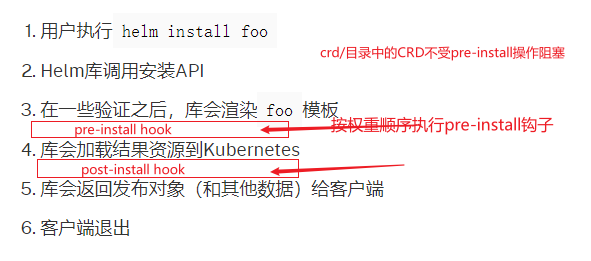
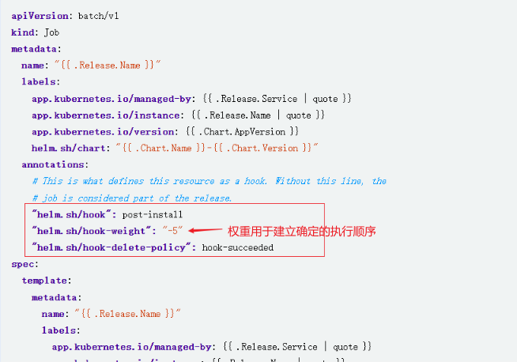

# helm hook
[charts_hooks](https://helm.sh/zh/docs/topics/charts_hooks/)
[视频](https://www.bilibili.com/video/BV1Ee411V7Us)
[helm-intermediate-getting-started-zh-cn.html](https://www.hellodemos.com/hello-helm-intermediate/helm-intermediate-getting-started-zh-cn.html)

# Chart Hook
Helm 提供了一个 hook 机制允许chart开发者在发布生命周期的某些点进行干预。比如你可以使用hook用于：
安装时在加载其他chart之前加载**配置映射**或**密钥**
安装新chart之前执行备份数据库的任务，然后在升级之后执行第二个任务用于存储数据。
在删除发布之前执行一个任务以便在删除服务之前退出滚动。


|    注释值    |                   描述                    |
| ------------ | ----------------------------------------- |
| pre-install  | 在模板渲染之后，Kubernetes资源创建之前执行 |
| post-install | 在所有资源加载到Kubernetes之后执行         |
| ...          |                                           |
	
	



## 权重用于建立确定的钩子执行顺序
当多个资源声明了同一个钩子时， 资源会串行执行。如果有钩子权重，会按照权重顺序执行。
如果权重不重要，可以设置为0.
eg: 如一个ConfigMap和一个Job都被声明为pre-install, 而Job依赖于ConfigMap; 此时可将ConfigMap的hook-weight设置为一个更小的值,以使其执行靠前.
**Note: 使用hook + weight可以固定资源的创建顺序,可以用于处理资源的依赖关系**

## 钩子资源不使用对应版本管理
钩子创建的资源无法作为发布的一部分进行跟踪和管理。
实际上，如果你在钩子中创建了资源，不能依靠helm uninstall去删除资源。
要删除这些资源，要么在钩子模板文件中 添加一个自定义的helm.sh/hook-delete-policy 注释，要么 设置任务资源的生存时间（TTL）字段。
因此不能被删除的钩子资源应该添加注释： helm.sh/resource-policy: keep

# 示例



# helm默认的资源执行顺序kind_sorter
Helm 是根据文件内容的 Kind来定义的执行顺序的，kind_sorter执行顺序基本上和类型间的使用(依赖)顺序有一定关联。
[kind_sorter.go](https://github.com/helm/helm/blob/release-3.0/pkg/releaseutil/kind_sorter.go)
```
var InstallOrder KindSortOrder = []string{
	"Namespace",
	"NetworkPolicy",
	"ResourceQuota",
	"LimitRange",
	"PodSecurityPolicy",
	"PodDisruptionBudget",
	"Secret",
	"ConfigMap",
	"StorageClass",
	"PersistentVolume",
	"PersistentVolumeClaim",
	"ServiceAccount",
	"CustomResourceDefinition",
	"ClusterRole",
	"ClusterRoleList",
	"ClusterRoleBinding",
	"ClusterRoleBindingList",
	"Role",
	"RoleList",
	"RoleBinding",
	"RoleBindingList",
	"Service",
	"DaemonSet",
	"Pod",
	"ReplicationController",
	"ReplicaSet",
	"Deployment",
	"HorizontalPodAutoscaler",
	"StatefulSet",
	"Job",
	"CronJob",
	"Ingress",
	"APIService",
}

```

