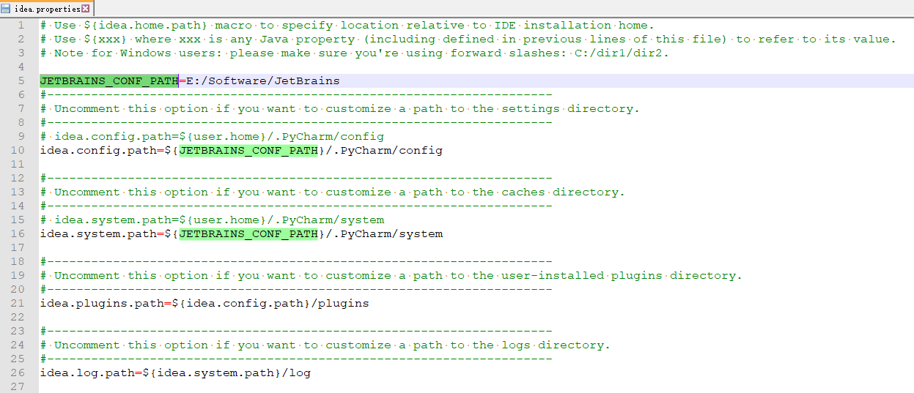

## pycharm修改默认缓存路径
'软件的安装目录/bin/idea.properties'文件, 一般调整如下几个目录即可
```
JETBRAINS_CONF_PATH=E:/Software/JetBrains
idea.config.path=${JETBRAINS_CONF_PATH}/.PyCharm/config
idea.system.path=${JETBRAINS_CONF_PATH}/.PyCharm/system
idea.plugins.path=${idea.config.path}/plugins
idea.log.path=${idea.system.path}/log
```

然后就是怎么把老的配置迁移到新的目录了，有两种方法：
第一种简单暴力，直接把C盘下的缓存目录拷贝到你写的目录下就可以了，我就是这么干的。
如果C盘下本来就没有的目录，比如plugins或者log，也不需要特意去新建文件夹，需要的时候它自动就会新建了。
第二种，你改了路径之后，重启软件，他会提示你导入配置，你选择老的路径导入就可以了，他会自动迁移过去。


