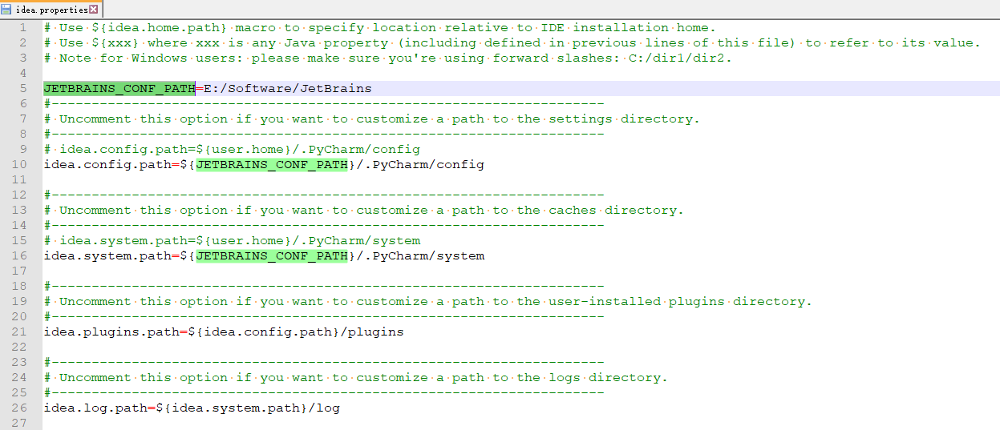

## 配置pycharm使用的python环境

​    File -> settings -> 在project Interpreter中选择要使用的环境(本地或远程)

## 建议为每一个项目创建一个虚拟环境:

​    这样可以单独控制该虚拟环境中的python解析器以及各个库的版本.
​    pycharm创建虚拟环境的方法如下:
​    File -> settings -> 在project Interpreter中Add -> 然后可以根据需要选择创建Virtualenv或Conda的虚拟环境
​    -> New environment -> 在Location中选择创建虚拟环境的目录, 在Base interpreter中选择基础的python解释器
​    -> ok
​    这样在project interpreter的下拉列表中就可以找到刚才创建的虚拟环境.
​    以后便可以针对该虚拟环境单独配置所需要的库了.

# 问题:

## 问题1:

​    描述:
​        使用pycharm连接远程环境后,pyspark相关代码可以正常执行,但pycharm上没有代码提示,无法跳转到定义.
​    解决方法:
​        能正常执行说明环境正常--因为远程环境python能正常找到包"ln -s /root/bigdata/spark/python/pyspark /miniconda2/envs/reco_sys/lib/python3.6/site-packages/pyspark"
​        a. 正常情况下只需要将对应的包拷贝到python环境下即可(如拷贝到"/miniconda2/envs/reco_sys/lib/python3.6/site-packages/"下)
​        b. 本次使用a操作无法解决.所以直接将远程环境中的pyspark包拷贝到本机的"C:\Users\用户名\.PyCharm2018.1\system\remote_sources\XXX\YYY" ,pyCharm就可对其进行代码补全了.
​        

    注: 这个路径与pyCharm连接的远程环境有关. 
       XXX与远程环境的".pycharm_helpers/python_stubs/XXX"对应,
       YYY与pyCharm的"External Librarys/Remote Libraries/YYY"配置对应(可以有多个)
   可通过在pyCharm的"External Librarys/Remote Libraries/YYY"右键"show in Exploer"找到对应的目录.

​    pyCharm import sklearn错误问题:
​    问题描述:在pyCharm中import sklearn提示from . import _arpack  ImportError: DLL load failed.
​             但在jupyter中可以正常import sklearn.
​    解决方法: 将如下三个路径设置到环境变量的最前面 --问题原因:可能是系统中有多个python环境
​        D:\Software\Anaconda3
​        D:\Software\Anaconda3\Scripts
​        D:\Software\Anaconda3\Library\bin
​    参考: https://blog.csdn.net/qq_32167817/article/details/88639536
​    ​
     **另外的方法**:
     在File-Settings中的project structure中点击右边的“add  content root”，
     添加py4j-some-version.zip和pyspark.zip的路径（这两个文件都在Spark中的python/lib文件夹下）
     

## 其它
### 中文显示阴影:
     强制指定UTF-8编码
     # _*_ coding:UTF-

###  自定义快捷键:
    * 全部折叠: Alt 0               　 全部展开: Alt Shift 0
    * 当前位置折叠: Alt +              当前位置展开: Alt -
    * 当前位置递归折叠: Alt Shift +　　 当前位置展开: Alt Shift -
    * 当前位置展开N层: Alt N (N为1,2,3,4)
    * 全部位置展开N层: Alt Shift N


### 远程环境配置
File-->Setting
添加远程解释器


## windows创建pyspark项目


## JetBrains配置&缓存目录迁移
Intellij,pycharm,phpstorm等jetbrains系列的软件, 会有一个缓存目录,默认放在C盘(`${USER_HOME}/AppData/Roaming/JetBrains` & `${USER_HOME}/AppData/Local/JetBrains`). 
长时间使用后占用空间很大, 所以想要迁移到其它盘.
**迁移方法**:
1. 打开'软件安装目录/bin/idea.properties'文件, 修改如下注释的5处
```
# Use ${idea.home.path} macro to specify location relative to IDE installation home.
# Use ${xxx} where xxx is any Java property (including defined in previous lines of this file) to refer to its value.
# Note for Windows users: please make sure you're using forward slashes: C:/dir1/dir2.

JETBRAINS_CONF_PATH=E:/Software/JetBrains  # 迁移目录主位置
#---------------------------------------------------------------------
# Uncomment this option if you want to customize a path to the settings directory.
#---------------------------------------------------------------------
# idea.config.path=${user.home}/.PyCharm/config
idea.config.path=${JETBRAINS_CONF_PATH}/.PyCharm/config  # 基于迁移目录主位置

#---------------------------------------------------------------------
# Uncomment this option if you want to customize a path to the caches directory.
#---------------------------------------------------------------------
# idea.system.path=${user.home}/.PyCharm/system
idea.system.path=${JETBRAINS_CONF_PATH}/.PyCharm/system  # 基于迁移目录主位置

#---------------------------------------------------------------------
# Uncomment this option if you want to customize a path to the user-installed plugins directory.
#---------------------------------------------------------------------
idea.plugins.path=${idea.config.path}/plugins # 插件

#---------------------------------------------------------------------
# Uncomment this option if you want to customize a path to the logs directory.
#---------------------------------------------------------------------
idea.log.path=${idea.system.path}/log    # 日志
```


2. 在完成第一步修改配置路径后, 重启软件, 选择导入配置, 会自动将配置迁移到新的目录
以PyCharm为例: 通过'Beyond Compare'对比可知 迁移后的'idea.config.path'对应`${USER_HOME}/AppData/Roaming/JetBrains/Pycharm`
迁移后的'idea.system.path'对应`${USER_HOME}/AppData/Local/JetBrains/Pycharm`
3. 完成迁移后可删除原来的配置`${USER_HOME}/AppData/Roaming/JetBrains` & `${USER_HOME}/AppData/Local/JetBrains`
注: [关于Roaming&Local目录](https://www.bilibili.com/video/BV1G84y1P7UM/)