Anaconda+PyCharm Python环境搭建与使用
# conda 安装虚拟环境
内部无网络环境，直接使用打包好的环境。
使用conda管理环境:
```
查看python环境:
    conda info --env: 所有查看python环境,前面有个'*'的代表当前环境
创建一个名为py36Env的环境，指定Python版本是3.6:
    conda create --name py36Env python=3.6  //这里创建的环境将安装在默认路径下
        //指定环境的路径: conda create -p D:/myEnvPath/envs/py36Env python=3.6 
删除py36环境:
    conda remove --name py36Env --all
        //指定环境的路径: conda env remove -p D:/myEnvPath/envs/py36Env
激活(进入)py36环境:
    source activate py36Env
        //指定环境的路径: source activate D:/myEnvPath/envs/py36Env
退出环境:
    conda deactivate 
```

使用pip管理包
```
pip freeze > requirements.txt # 导出环境信息
pip install -r ./environment.yml --ignore-installed
pip install jieba==3.5.3 -i https://pypi.tuna.tsinghua.edu.cn/simple
--ignore-installed: 忽略已安装的包
-i: 指定源
    如: pip install jieba==3.5.3 -i https://pypi.tuna.tsinghua.edu.cn/simple
–-default-timeout: 修改默认超时,网络不好时可使用
    pip --default-timeout=100 install jieba==3.5.3
--no-cache-dir: 不使用本地缓存
    
下载whl包: 
    # 下载指定的包及相关依赖whl, 会按照执行环境的平台&py版本进行下载
    pip download PKG_NAME
    
    # 可以指定平台和py版本.  指定平台时需要同时指定--only-binary参数
    pip3 download --only-binary=:all: --python-version=3.7  cx-Oracle==6.4.1
    可以指定多个--platform, 其取值可用: manylinux1_x86_64, linux_x86_64, any, win_amd64
```
    
## 建议为每一个项目创建一个虚拟环境:
单独控制每个虚拟环境中的python解析器以及各个库的版本；​这样可以为每个项目进行环境隔离，防止版本冲突等问题。


# 创建工程
File->Open->打开对应的目录即可

# 配置pycharm使用的python环境
为工程配置python环境
File->Settings->'Project: 项目名'->'Python Interpreter'->选择对应的python环境即可
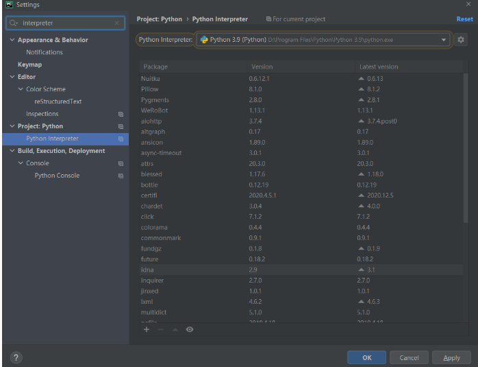

# 配置Testing默认执行方式
File->Settings->Tools->'Python Integrated Tools'->Testing->'Default Test Runner'
推荐选择Unittests方式进行执行(可以较快执行单个用例,pytest会搜索其它用例)

# 运行python程序

1. 在用例(或mian)前的'运行图标'上单击鼠标右键，选择指定的运行方式即可。
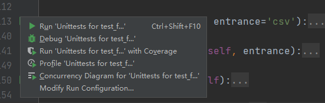
通过运行配置界面可以配置执行参数(如：环境变量等)
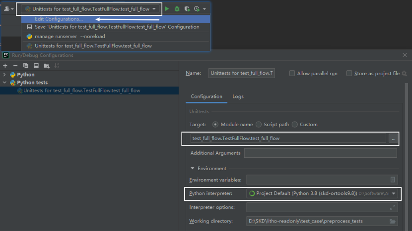

2. 通过命令行执行某个测试用例
`python -m unittest -v文件名.类名.方法名`
示例：
`python -m unittest -v test_case.preprocess_tests.test_full_flow.TestFullFlow.test_full_flow`


## 运行方式
### Run: 直接运行
    * 运行速度快但无法断点调试
### Debug: 调试运行；可以断点调试，修改变量值...
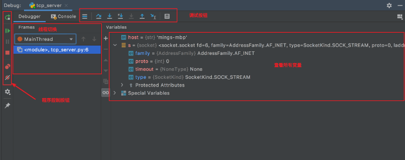
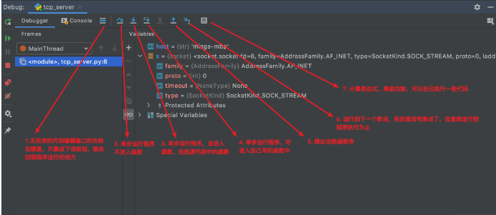
### Profile：性能分析
pycharm Profile运行方式会输出一个表格形式的耗时分析和一个调用图格式的耗时分析
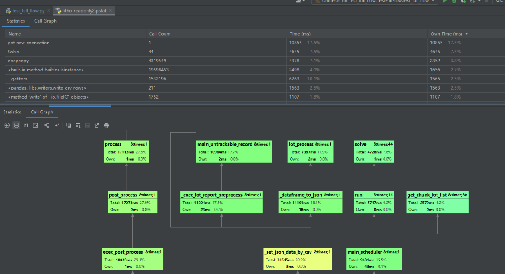


# 常用快捷键

* 重构变量/函数名: 在要重构的名称上右键鼠标->Refactor->Rename （快捷键: `Shift+F6`）
* 万能键：`Alt + 回车`， 可用于进行快速的代码补全/包导入/名称重构等操作
* 全局搜索快捷键: `Double Shift`
* 当前文件搜索与替换: `Ctrl+F` & `Ctrl+R`
* 书签: 添加/清除普通书签: F11, 添加/清除标记书签: `Ctrl+F11`, 展示所有书签: `Shift+F11`
* 跳转到行: `Gtrl+G`
* 折叠&展开代码: `Ctrl+Alt+=` & `Ctrl+Alt+-`
* Find in Path: `Ctrl+Shift+F` (Edit->Find->FindInFiles)
* 回到最后编辑的位置: `Ctrl+Alt+Backspace`
* 前进/后退 到上次"点击"的地方:  (Navigate菜单下Back/Forward)
    * 后退(回到上一次光标的位置): `Alt + Ctrl + ←`
    * 前进(回到后一次光标的位置): `Alt + Ctrl + →`
* 代码格式化: `Ctrl+Alt+L`
* 查看继承树: `Ctrl+H`  或 `Ctrl+O`
* 显示当前方法的调用树: `Ctrl+Alt+H`
* 在子类方法中快速进入父类方法: `Ctrl+U`
* Pycharm会通过红色波浪线来提示错误: 快速定位到错误行
    * 跳转到下一个有错误的行: F2
    * 跳转到上一个有错误的行: `Shift + F2`
* PyCharm 原生跳转到上/下一个方法的快捷键是
    * 跳转到上一个方法: `Alt + ↑ `
    * 跳转到下一个方法: `Alt + ↓ `
* 代码块跳转:
    * 跳到上一级代码块开始的地方: `Ctrl + [`
    * 跳到上一级代码块结束的地方: `Ctrl + ]`
* 在项目中搜索使用的位置：`Alt+F7`
* 显示当前位置: `Alt+Q`, 可以显示出当前处于哪个类或哪个函数
* 重写父类方法: 快捷键`Ctrl+O`


#  自定义快捷键
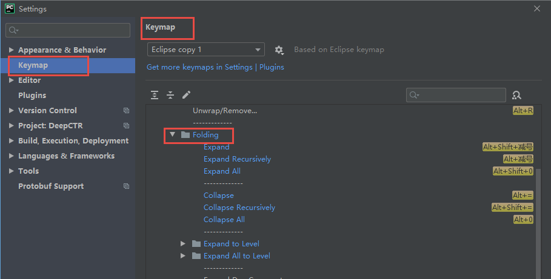

# 使用技巧
## json格式化 -- 快捷键 `Ctrl+Alt+L`
## 找回误删文件
Pycharm的Local History，会保存你对文件的所有操作记录
 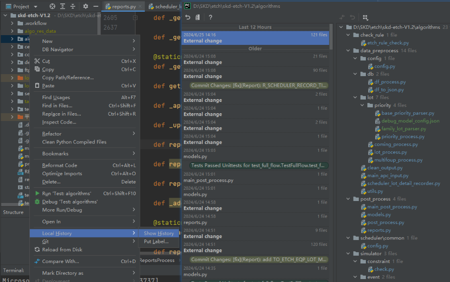

## 智能补全
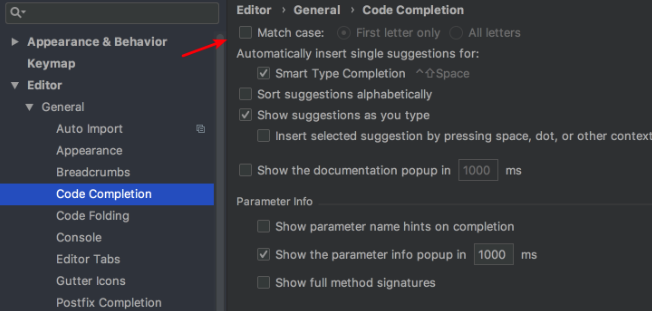

## tab自动转四空格
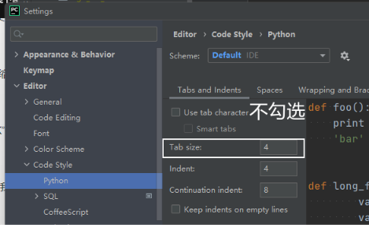

## 区域选择
扩大选中的区域： `Ctrl + W`
缩小选中的区域: `Ctrl + Shift + W`

## 中文显示阴影:
     强制指定UTF-8编码
     # _*_ coding:UTF-
     
## 远程环境配置
File-->Setting
添加远程解释器

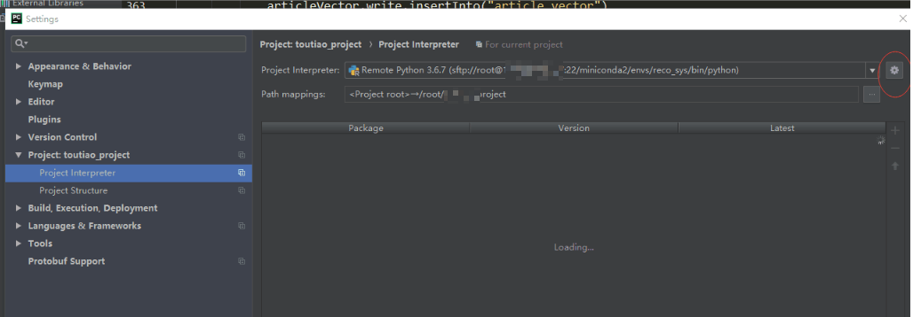

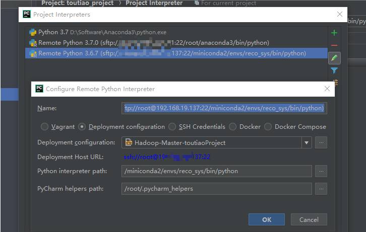

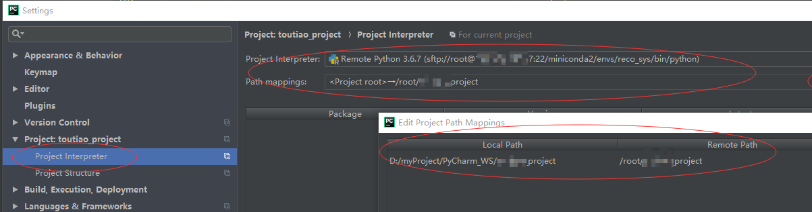


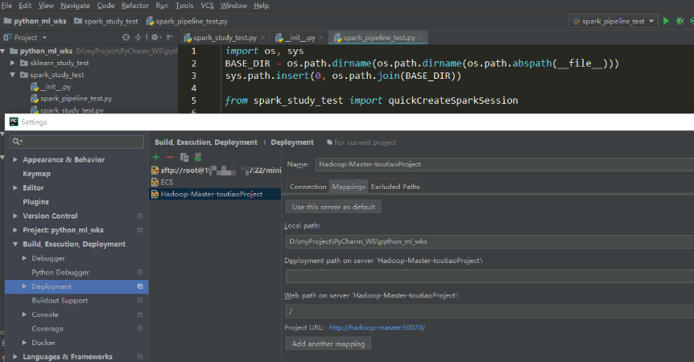


# JetBrains配置&缓存目录迁移
Intellij,pycharm,phpstorm等jetbrains系列的软件, 会有一个缓存目录,默认放在C盘(`${USER_HOME}/AppData/Roaming/JetBrains` & `${USER_HOME}/AppData/Local/JetBrains`). 
长时间使用后占用空间很大, 所以想要迁移到其它盘.
**迁移方法**:
1. 打开'软件安装目录/bin/idea.properties'文件, 修改如下注释的5处
```
# Use ${idea.home.path} macro to specify location relative to IDE installation home.
# Use ${xxx} where xxx is any Java property (including defined in previous lines of this file) to refer to its value.
# Note for Windows users: please make sure you're using forward slashes: C:/dir1/dir2.

JETBRAINS_CONF_PATH=E:/Software/JetBrains  # 迁移目录主位置
#---------------------------------------------------------------------
# Uncomment this option if you want to customize a path to the settings directory.
#---------------------------------------------------------------------
# idea.config.path=${user.home}/.PyCharm/config
idea.config.path=${JETBRAINS_CONF_PATH}/.PyCharm/config  # 基于迁移目录主位置

#---------------------------------------------------------------------
# Uncomment this option if you want to customize a path to the caches directory.
#---------------------------------------------------------------------
# idea.system.path=${user.home}/.PyCharm/system
idea.system.path=${JETBRAINS_CONF_PATH}/.PyCharm/system  # 基于迁移目录主位置

#---------------------------------------------------------------------
# Uncomment this option if you want to customize a path to the user-installed plugins directory.
#---------------------------------------------------------------------
idea.plugins.path=${idea.config.path}/plugins # 插件

#---------------------------------------------------------------------
# Uncomment this option if you want to customize a path to the logs directory.
#---------------------------------------------------------------------
idea.log.path=${idea.system.path}/log    # 日志
```
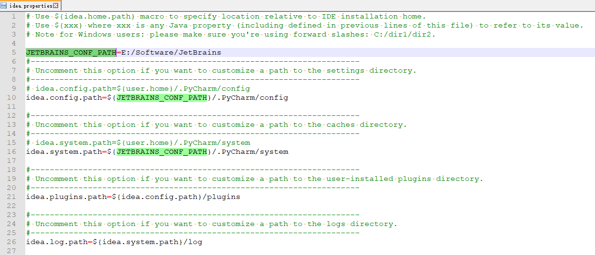

2. 在完成第一步修改配置路径后, 重启软件, 选择导入配置, 会自动将配置迁移到新的目录
以PyCharm为例: 通过'Beyond Compare'对比可知 迁移后的'idea.config.path'对应`${USER_HOME}/AppData/Roaming/JetBrains/Pycharm`
迁移后的'idea.system.path'对应`${USER_HOME}/AppData/Local/JetBrains/Pycharm`
3. 完成迁移后可删除原来的配置`${USER_HOME}/AppData/Roaming/JetBrains` & `${USER_HOME}/AppData/Local/JetBrains`
注: [关于Roaming&Local目录](https://www.bilibili.com/video/BV1G84y1P7UM/)

