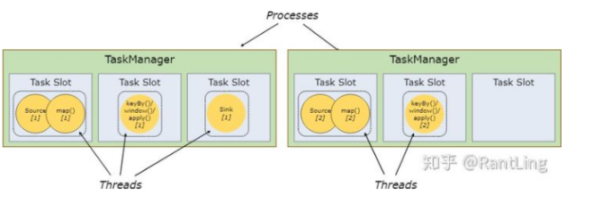

# flink

## Flink 架构

在Flink运行时涉及到的进程主要有以下两个：
**JobManager**：主要负责调度task，协调checkpoint以及错误恢复等。当客户端将打包好的任务提交到JobManager之后，JobManager就会根据注册的TaskManager资源信息将任务分配给有资源的TaskManager，然后启动运行任务。TaskManger从JobManager获取task信息，然后使用slot资源运行task； 
**TaskManager**：执行数据流的task，一个task通过设置并行度，可能会有多个subtask。 每个TaskManager都是作为一个独立的JVM进程运行的。他主要负责在独立的线程执行的operator。其中能执行多少个operator取决于每个taskManager指定的slots数量。Task slot是Flink中最小的资源单位。假如一个taskManager有3个slot，他就会给每个slot分配1/3的内存资源，目前slot不会对cpu进行隔离。同一个taskManager中的slot会共享网络资源和心跳信息。

