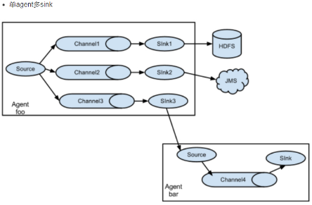

# flume

## Flume结构


### flume的Agent


**Agent主要由: source,channel,sink三个组件组成**
+ **Source**：采集源，用于跟数据源对接，以获取数据
    - 从数据发生器接收数据,并将接收的数据以Flume的event格式传递给一个或者多个通道channal,Flume提供多种数据接收的方式,比如Avro,Thrift等
+ **Channel**: 存储容器,它将从source处接收到的event格式的数据缓存起来,直到它们被sinks消费掉
    - channal是一个完整的事务,这一点保证了数据在收发的时候的一致性. 并且它可以和任意数量的source和sink链接. 支持的类型有: JDBC channel , File System channel , Memort channel等.
+ **Sink**：下沉地，采集数据的传送目的，用于往下一级 agent 传递数据或者往最终存储系统传递数据
    - sink将数据存储到集中存储器比如Hbase和HDFS,它从channals消费数据(events)并将其传递给目标地

**总结**：Flume就是将数据从数据源(source)收集过来，Flume会先缓存数据(channel),再将收集到的数据送到指定的目的地(sink)，最后Flume在删除自己缓存的数据


## Flume 事件
事件作为Flume内部数据传输的最基本单元.它是由一个转载数据的字节数组(该数据组是从数据源接入点传入，并传输给传输器，也就是HDFS/HBase)和一个可选头部构成.


## Flume采集结构图
### 单agent 采集数据


### 单agent多sink


### 多agent


## Flume使用
在Flume配置文件中,我们需要：
1. 命名当前使用的Agent的名称
2. 命名Agent下的source的名字
3. 命名Agent下的channel的名字
4. 命名Agent下的sink的名字
5. 将source和sink通过channel绑定起来.
配置模板如下:
```conf
# 为此Agent上的组件命名
# Agent取名为 agent_name
agent_name.sources = source_name,source_name1, ...
agent_name.sinks = channel_name, channel_name1, ...
agent_name.channels = sink_name, sink_name1, ...

# 配置source模板
agent_name.sources. source_name.type = value
agent_name.sources. source_name.property2 = value
agent_name.sources. source_name.property3 = value
...

# 配置sink
agent_name.sinks.sink_name.type = value
agent_name.sinks.sink_name.property2 = value
agent_name.sinks.sink_name.property3 = value
...

# 配置channel
agent_name.channels.channel_name.type = value
agent_name.channels.channel_name. property2 = value
agent_name.channels.channel_name. property3 = value
## 将source和sinks绑定到channel
agent_name.sources.source_name.channels = channel_name
agent_name.sinks.sink_name.channel = channel_name
...
```

eg: test.conf
```conf
# 为此Agent上的组件命名
# Agent取名为 agent_name1
agent_name1.sources = source_name1, ...
agent_name1.sinks =  sink_name1, ...
agent_name1.channels = channel_name1, ...

# 配置source模板
agent_name1.sources.source_name1.type = netcat
agent_name1.sources.source_name1.bind = 192.168.19.137
agent_name1.sources.source_name1.port = 44444
...

# 配置sink
agent_name1.sinks.sink_name1.type = logger

# 配置channel
agent_name1.channels.channel_name1.type = memory
agent_name1.channels.channel_name1.capacity = 1000
agent_name1.channels.channel_name1.transactionCapacity = 100
# 将source和sinks绑定到channel
agent_name.sources.source_name1.channels = channel_name1
agent_name.sinks.sink_name1.channel = channel_name1
...
```
启动agent命令
cd /root/bigdata/flume/
./bin/flume-ng agent -c conf -f ./conf/test.conf -n agent_name1 -Dflume.root.logger=INFO,console
参数说明:
    -c conf:指定 flume 自身的配置文件所在目录
    -f conf/netcat-logger.conf:指定我们所描述的采集方案
    -n a1:指定我们这个 agent 的名字


Flume支持各种各样的sources,sinks,channels,它们支持的类型如下:


**Source**
* Avro Source 序列化数据源
* ThriftSource 序列化数据源
* Exec Source 执行Linux命令行的数据源
* NETCAT Source 通过指定端口，ip监控的数据源
* Kafka Source 直接对接Kafka的数据源
* 自定义Source

**Channel**
* Memory Channel
* File Channel
* Kafka Channel
* JDBC Channe

**Sink**
* HDFS Sink 写入到HDFS
* Hive Sink 写入到Hive
* Avro Sink 写入到序列化
* HBase Sinks 写入到HBase
* HBase Sink 同步写入到HBase
* Async HBase Sink 异步写入到Hbase


## 案例：从A服务器采集文件内容到B服务器
需求：将A服务器中的日志实时采集到B服务器(使用一台模拟)
A服务器：监控一个文件实时采集新增的数据输出B服务器
B服务器：从指定网络端口采集数据输出到控制台

**A服务器中flume配置**:
配置采集源(source) : exec-source, 
下沉目标(sink): avro sink
source 和 sink 之间的传递通道： memory channel
```conf
#exec-memory-avro.conf

exec-memory-avro.sources = exec-source
exec-memory-avro.sinks = avro-sink
exec-memory-avro.channels = memory-channel

# Describe/configure the source
exec-memory-avro.sources.exec-source.type = exec
exec-memory-avro.sources.exec-source.command = tail -F /root/logs/collect.log
exec-memory-avro.sources.exec-source.shell = /bin/sh -c

# Describe the sink
exec-memory-avro.sinks.avro-sink.type = avro
exec-memory-avro.sinks.avro-sink.hostname = 192.168.19.137
exec-memory-avro.sinks.avro-sink.port = 44444


# Use a channel which buffers events in memory
exec-memory-avro.channels.memory-channel.type = memory

# Bind the source and sink to the channel
exec-memory-avro.sources.exec-source.channels = memory-channel
exec-memory-avro.sinks.avro-sink.channel = memory-channel
```

**B服务器中flume配置**
采集源(source): avro-source
```conf
#avro-memory-logger.conf
avro-memory-logger.sources = avro-source
avro-memory-logger.sinks = logger-sink
avro-memory-logger.channels = memory-channel

# Describe/configure the source
avro-memory-logger.sources.avro-source.type = avro
avro-memory-logger.sources.avro-source.bind = 192.168.19.137
avro-memory-logger.sources.avro-source.port = 44444

# Describe the sink
avro-memory-logger.sinks.logger-sink.type = logger

# Use a channel which buffers events in memory
avro-memory-logger.channels.memory-channel.type = memory

# Bind the source and sink to the channel
avro-memory-logger.sources.avro-source.channels = memory-channel
avro-memory-logger.sinks.logger-sink.channel = memory-channel
```

**启动：先启动B服务器**
bin/flume-ng agent --conf conf --conf-file conf/b.conf --name avro-memory-logger -Dflume.root.logger=INFO,console

**后启动A服务器:**
bin/flume-ng agent --conf conf --conf-file conf/a.conf --name exec-memory-avro -Dflume.root.logger=INFO,console

## 参数
* **channel参数解释**：
    + capacity：默认该通道中最大的可以存储的 event 数量
    + trasactionCapacity：每次最大可以从 source 中拿到或者送到 sink 中的 event数量
* **sinks参数解析**：
    + rollInterval：默认值：30
    + hdfs sink 间隔多长将临时文件滚动成最终目标文件，单位：秒；
      如果设置成 0，则表示不根据时间来滚动文件；
      注：滚动（roll）指的是，hdfs sink 将临时文件重命名成最终目标文件，并新打开一个临时文件来写入数据；
    + rollSize:默认值：1024
        当临时文件达到该大小（单位：bytes）时，滚动成目标文件；
        如果设置成 0，则表示不根据临时文件大小来滚动文件；
    + rollCount：默认值：10，当 events 数据达到该数量时候，将临时文件滚动成目标文件；
      如果设置成 0，则表示不根据 events 数据来滚动文件；
    + round：默认值：false，是否启用时间上的“舍弃”，这里的“舍弃”，类似于“四舍五入”。
    + roundValue：默认值：1时间上进行“舍弃”的值；
    + roundUnit：默认值：seconds，时间上进行“舍弃”的单位，包含：second,minute,hour
    + exec-memory-hdfs.sinks.hdfs-sink.hdfs.useLocalTimeStamp = true：添加时间戳，
        创建文件可以使用时间(也可以通过FLume的拦截器插件实现)


## Flume插件
### Interceptors拦截器
用于source和channel之间,用来更改或者检查Flume的events数据.
flume中的拦截器(interceptor),用户Source读取events发送到Sink的时候，在events header中加入一些有用的信息，
或者对events的内容进行过滤，完成初步的数据清洗
* Timestamp Interceptor
    时间戳拦截器，将当前时间戳（毫秒）加入到events header中
* Static Interceptor：静态拦截器
    用于在events header中加入一组静态的key和value
* Regex Filtering Interceptor:拦截器用于过滤事件
    筛选出与配置的正则表达式相匹配的事件。可以用于包含事件和排除事件。常用于数据清洗，通过正则表达式把数据过滤出来。
    eg: a1.sources.r1.interceptors.i1.regex = (\\d):(\\d):(\\d)
* UUID Interceptor：UUID拦截器，用于在每个events header中生成一个UUID字符串
* Host Interceptor：主机名拦截器。将运行Flume agent的主机名或者IP地址加入到events header中

### 管道选择器 channels Selectors：
在多管道是被用来选择使用那一条管道来传递数据(events). 
管道选择器又分为如下两种:
* 默认管道选择器: 每一个管道传递的都是相同的events
* 多路复用通道选择器: 依据每一个event的头部header的地址选择管道

**日志收集实战案例**
案例场景：A、B 两台日志服务机器实时生产日志主要类型为 access.log、nginx.log、web.log
现在要求：把 A、B 机器中的 access.log、nginx.log、web.log 采集汇总到 C 机器上
然后统一收集到 hdfs 中。但是在 hdfs 中要求的目录为：
/source/logs/access/20160101/**
/source/logs/nginx/20160101/**
/source/logs/web/20160101/**


**配置实现**
1. 在服务器 A 和服务器 B 上创建配置文件，exec-memory-avro.conf，配置如下
```conf
# Name the components on this agent 
exec-memory-avro.sources = access-source nginx-source web-source
exec-memory-avro.sinks = avro-sink
exec-memory-avro.channels = memory-channel

# Describe/configure the source
exec-memory-avro.sources.access-source.type = exec
exec-memory-avro.sources.access-source.command = tail -F /root/logs/access.log
# static 拦截器的功能就是往采集到的数据的 header 中插入自己定义的 key-value 对
exec-memory-avro.sources.access-source.interceptors = i1
exec-memory-avro.sources.access-source.interceptors.i1.type = static
exec-memory-avro.sources.access-source.interceptors.i1.key = type
exec-memory-avro.sources.access-source.interceptors.i1.value = access

exec-memory-avro.sources.nginx-source.type = exec
exec-memory-avro.sources.nginx-source.command = tail -F /root/logs/nginx.log
exec-memory-avro.sources.nginx-source.interceptors = i2
exec-memory-avro.sources.nginx-source.interceptors.i2.type = static
exec-memory-avro.sources.nginx-source.interceptors.i2.key = type
exec-memory-avro.sources.nginx-source.interceptors.i2.value = nginx

exec-memory-avro.sources.web-source.type = exec
exec-memory-avro.sources.web-source.command = tail -F /root/logs/web.log
exec-memory-avro.sources.web-source.interceptors = i3
exec-memory-avro.sources.web-source.interceptors.i3.type = static
exec-memory-avro.sources.web-source.interceptors.i3.key = type
exec-memory-avro.sources.web-source.interceptors.i3.value = web

# Describe the sink 
exec-memory-avro.sinks.avro-sink.type = avro
exec-memory-avro.sinks.avro-sink.hostname = 192.168.19.137 # 192.168.19.138
exec-memory-avro.sinks.avro-sink.port = 44444

# Use a channel which buffers events in memory 
exec-memory-avro.channels.memory-channel.type = memory
exec-memory-avro.channels.memory-channel.capacity = 20000
exec-memory-avro.channels.memory-channel.transactionCapacity = 10000

# Bind the source and sink to the channel
exec-memory-avro.sources.access-source.channels = memory-channel
exec-memory-avro.sources.nginx-source.channels = memory-channel
exec-memory-avro.sources.web-source.channels = memory-channel
exec-memory-avro.sinks.avro-sink.channel = memory-channel
```

2. 在服务器 C 上创建配置文件 avro-memory-hdfs.conf 文件内容为

```conf
# 定义agent名,  source、channel、sink 的名称
avro-memory-hdfs.sources = avro-source
avro-memory-hdfs.sinks = hdfs-sink
avro-memory-hdfs.channels = memory-channel

# 定义 source
avro-memory-hdfs.sources.avro-source.type = avro
avro-memory-hdfs.sources.avro-source.bind = 192.168.19.137 192.168.19.138
avro-memory-hdfs.sources.avro-source.port =44444
# 添加时间拦截器
avro-memory-hdfs.sources.avro-source.interceptors = i1
avro-memory-hdfs.sources.avro-source.interceptors.i1.type = org.apache.flume.interceptor.TimestampInterceptor$Builder

# 定义 sink
avro-memory-hdfs.sinks.hdfs-sink.type = hdfs
# %{type} 可以将前面的数据中的key对应的value取出
avro-memory-hdfs.sinks.hdfs-sink.hdfs.path=hdfs://192.168.19.137:9000/headlines/logs/%{type}/%Y-%m-%d
avro-memory-hdfs.sinks.hdfs-sink.hdfs.filePrefix =events
avro-memory-hdfs.sinks.hdfs-sink.hdfs.fileType = DataStream
avro-memory-hdfs.sinks.hdfs-sink.hdfs.writeFormat = Text
# 时间类型
avro-memory-hdfs.sinks.hdfs-sink.hdfs.useLocalTimeStamp = true
# 生成的文件不按条数生成
avro-memory-hdfs.sinks.hdfs-sink.hdfs.rollCount = 0
# 生成的文件按时间生成
avro-memory-hdfs.sinks.hdfs-sink.hdfs.rollInterval = 30
# 生成的文件按大小生成
avro-memory-hdfs.sinks.hdfs-sink.hdfs.rollSize  = 10485760
# 批量写入 hdfs 的个数
avro-memory-hdfs.sinks.hdfs-sink.hdfs.batchSize = 10000
# flume 操作 hdfs 的线程数（包括新建，写入等）
avro-memory-hdfs.sinks.hdfs-sink.hdfs.threadsPoolSize=10
# 操作 hdfs 超时时间
avro-memory-hdfs.sinks.hdfs-sink.hdfs.callTimeout=30000

#定义 channels
avro-memory-hdfs.channels.memory-channel.type = memory
avro-memory-hdfs.channels.memory-channel.capacity = 20000
avro-memory-hdfs.channels.memory-channel.transactionCapacity = 10000

#组装 source、channel、sink
avro-memory-hdfs.sources.avro-source.channels = memory-channel
avro-memory-hdfs.sinks.hdfs-sink.channel = memory-channel
```


## Flume优化

### 负载均衡（load balance）
负载均衡是用于解决一台机器(一个进程)无法解决所有请求而产生的一种算法。
Load balancing Sink Processor 能够实现 load balance 功能，
如下图 Agent1 是一个路由节点，负责将 Channel 暂存的 Event 均衡到对应的多个 Sink 组件上，
而每个 Sink 组件分别连接到一个独立的 Agent 上，示例配置，如下


常见配置：
```
a1.sinkgroups = g1
a1.sinkgroups.g1.sinks = k1 k2 k3
a1.sinkgroups.g1.processor.type = load_balance
a1.sinkgroups.g1.processor.backoff = true    # 如果开启，则将失败的 sink 放入黑名单
a1.sinkgroups.g1.processor.selector = round_robin    # 另外还支持 random
a1.sinkgroups.g1.processor.selector.maxTimeOut=10000 #在黑名单放置的超时时间，超时结束时，若仍然无法接收，
```


### 容错(failover)
Failover Sink Processor 维护一个优先级 Sink 组件列表，只要有一个 Sink组件可用，Event 就被传递到下一个组件。
故障转移机制的作用是 将失败的Sink降级到一个池，在这些池中它们被分配一个冷却时间，随着故障的连续，在重试之前冷却时间增加。
一旦 Sink 成功发送一个事件，它将恢复到活动池。 Sink 具有与之相关的优先级，数量越大，优先级越高。
例如，具有优先级为 100 的 sink 在优先级为 80 的 Sink 之前被激活。如果在发送事件时汇聚失败，
则接下来将尝试下一个具有最高优先级的 Sink 发送事件。如果没有指定优先级，则根据在配置中指定 Sink 的顺序来确定优先级。

常见配置：
```
a1.sinkgroups = g1
a1.sinkgroups.g1.sinks = k1 k2 k3
a1.sinkgroups.g1.processor.type = failover
a1.sinkgroups.g1.processor.priority.k1 = 5 #优先级值, 绝对值越大表示优先级越高
a1.sinkgroups.g1.processor.priority.k2 = 7
a1.sinkgroups.g1.processor.priority.k3 = 6
a1.sinkgroups.g1.processor.maxpenalty = 20000 #失败的 Sink 的最大回退期（millis）
```


