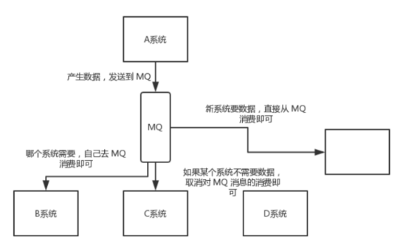
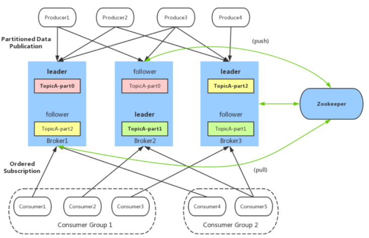

# kafka

为何使用消息系统?
场景：
1. 很多业务数据，如页面访问量（Page View）、关键字的搜索情况等内容;
   这种数据通常的处理方式是先把各种活动以日志的形式写入某种文件，然后周期性地对这些文件进行统计分析
2. 系统之间的数据传输交互
目的：解耦、异步

Eg:这样一个场景。A 系统发送数据到 BCD 三个系统，通过接口调用发送。
如果增加了一个E 系统也要这个数据呢？假如现有的C 系统现在不需要了呢？

A 系统产生一条比较关键的数据，很多系统都需要 A 系统将这个数据发送过来。
A 系统要时时刻刻考虑 BCDE 四个系统如果挂了该咋办？要不要重发，要不要把消息存起来？

解决：
如果使用 MQ，A 系统产生一条数据，发送到 MQ 里面去，哪个系统需要数据自己去 MQ 里面消费。
如果新系统需要数据，直接从 MQ 里消费即可；如果某个系统不需要这条数据了，就取消对 MQ 消息的消费即可。
这样下来，A 系统压根本不需要维护这个代码，也不需要考虑人家是否调用成功、失败超时等情况

当然引入MQ缺点也存在：
**系统可用性降低**：
   系统引入的外部依赖越多，越容易挂掉。
本来你就是 A 系统调用 BCD 三个系统的接口就好了，ABCD 四个系统好好的，没问题，加个 MQ 进来，万一 MQ 宕机了？
MQ 一挂，整套系统崩溃的，你不就完了？如何保证消息队列的高可用？
一些MQ设计就回保证高可用(如Kafka)
**系统复杂度提高**：
加个 MQ 进来，你怎么保证消息没有重复消费？怎么处理消息丢失的情况？怎么保证消息传递的顺序性？

# Kafka
1. Kafka 是一种分布式的，基于发布 / 订阅的消息系统
2. Kafka被用于构建实时数据管道和流处理。支持横向扩展，容错，极快，能够在上千台服务器上运行。
3. Kafka 是一个分布式消息队列：生产者、消费者的功能。它提供了类似于JMS的特性，但是在设计实现上完全不同，此外它并不是JMS规范的实现。

## Kafka架构
生产者消费者模式

一个典型的Kafka集群中包含若干Producer（可以是web前端产生的Page View，或者是服务器日志，系统CPU、Memory等），
若干broker（Kafka支持水平扩展，一般broker数量越多，集群吞吐率越高），
若干Consumer Group，以及一个Zookeeper集群。

**基本概念**：
* Broker：Kafka集群包含一个或多个服务器，这种服务器被称为broker
作用：接收 Producer 和 Consumer 的请求，并把 Message 持久化到本地磁盘。
* Topic：每条发布到Kafka集群的消息都有一个类别，这个类别被称为Topic。
（物理上不同Topic的消息分开存储，逻辑上一个Topic的消息虽然保存于一个或多个broker上但用户只需指定消息的Topic即可生产或消费数据而不必关心数据存于何处）
* Partition：Parition是物理上的概念，每个Topic包含一个或多个Partition.
* Producer：负责发布消息到Kafka broker
* Consumer：消息消费者，向Kafka broker读取消息的客户端。
* Consumer Group：每个Consumer属于一个特定的Consumer Group（可为每个Consumer指定group name，若不指定group name则属于默认的group）。
* Zookeeper：保存着集群broker、topic、partition等meta数据；负责broker故障发现，partition leader选举，负载均衡等功能

## Kafka设计原理
### 内部组件设计
#### Topic & Partition(存储设计原理)
1. Topic 在逻辑上可以被认为是一个 queue，每条消费都必须指定它的 Topic;
可以简单理解为必须指明把这条消息放进哪个 queue 里。为了使得 Kafka 的吞吐率可以线性提高.
2. 物理上把 Topic 分成一个或多个 Partition，每个 Partition 在物理上对应一个文件夹，
该文件夹下存储这个 Partition 的所有消息和索引文件。
注：一般建议选择 (broker num * consumer num)个分区, 这样平均每个 consumer 会同时读取broker数目个 partition , 这些 partiton 压力可以平摊到每台 broker 上。

**partition的数据文件**
* offset：offset表示Message在这个partition中的偏移量，offset不是该Message在partition数据文件中的实际存储位置，而是逻辑上一个值，可以认为offset是partition中Message的id
* MessageSize：MessageSize表示消息内容data的大小
* data：data为Message的具体内容

partition中的每条Message包含三个属性：partition的数据文件由以上格式的Message组成，按offset由小到大排列在一起。 如果一个partition只有一个数据文件，Kafka通过分段和索引来提高查找效率。

* 数据文件分段segment: partition物理上由多个segment文件组成，每个segment大小相等，顺序读写。每个segment数据文件以该段中最小的offset命名，文件扩展名为.log。这样在查找指定offset的Message的时候，用二分查找就可以定位到该Message在哪个segment数据文件中。

* 数据文件索引: 数据文件分段使得可以在一个较小的数据文件中查找对应offset的Message了，但是这依然需要顺序扫描才能找到对应offset的Message。为了进一步提高查找的效率，Kafka为每个分段后的数据文件建立了索引文件，文件名与数据文件的名字是一样的，只是文件扩展名为.index
* 

* 查找过程：
查找某个offset的消息，先二分法找出消息所在的segment文件（因为每个segment的命名都是以该文件中消息offset最小的值命名）；然后，加载对应的.index索引文件到内存，同样二分法找出小于等于给定offset的最大的那个offset记录（相对offset，position）；最后，根据position到.log文件中，顺序查找出offset等于给定offset值的消息。

**重要**：由于消息在partition的segment数据文件中是顺序读写的，且消息消费后不会删除（删除策略是针对过期的segment文件），这种顺序磁盘IO存储设计是Kafka高性能很重要的原因。

Kafka运行时很少有大量读磁盘的操作，主要是定期批量写磁盘操作，因此操作磁盘很高效。这跟Kafka文件存储中读写message的设计是息息相关的。Kafka中读写message有如下特点:

**写message(生产者)**
* 消息从java堆转入page cache(即物理内存)。
* 由异步线程刷盘,消息从page cache刷入磁盘。

**读message(消费者)**
* 消息直接从page cache转入socket发送出去。
* 当从page cache没有找到相应数据时，此时会产生磁盘IO,从磁 盘Load消息到page cache,然后直接从socket发出去

总结：Kafka高效文件存储设计特点
* Kafka把topic中一个parition大文件分成多个小文件段，通过多个小文件段，就容易定期清除或删除已经消费完文件，减少磁盘占用。
* 通过索引信息可以快速定位message和确定response的最大大小。
* 通过index元数据全部映射到memory，可以避免segment file的IO磁盘操作。
* 通过索引文件稀疏存储，可以大幅降低index文件元数据占用空间大小。

### Consumer Group

* **任何Consumer必须属于有一个Consumer Group**
    + 使用 Consumer high level API 时, 同一 Topic 的一条消息只能被同一个 Consumer Group 内的一个 Consumer 消费, 但多个 Consumer Group 可同时消费这一消息。
* 特点：Kafka 用来实现一个 Topic 消息的广播（发给所有的 Consumer）和单播（发给某一个 Consumer）的手段。一个 Topic 可以对应多个 Consumer Group。
    + 如果需要实现广播，只要每个 Consumer 有一个独立的 Group 就可以了。
    + 要实现单播只要所有的 Consumer 在同一个 Group 里。用 Consumer Group 还可以将 Consumer 进行自由的分组而不需要多次发送消息到不同的 Topic。

消费之后一般会删除已经被消费的消息，而Kafka集群会保留所有的消息，无论其被消费与否。当然，因为磁盘限制，不可能永久保留所有数据（实际上也没必要），因此Kafka提供两种策略删除旧数据。一是基于时间，二是基于Partition文件大小.

