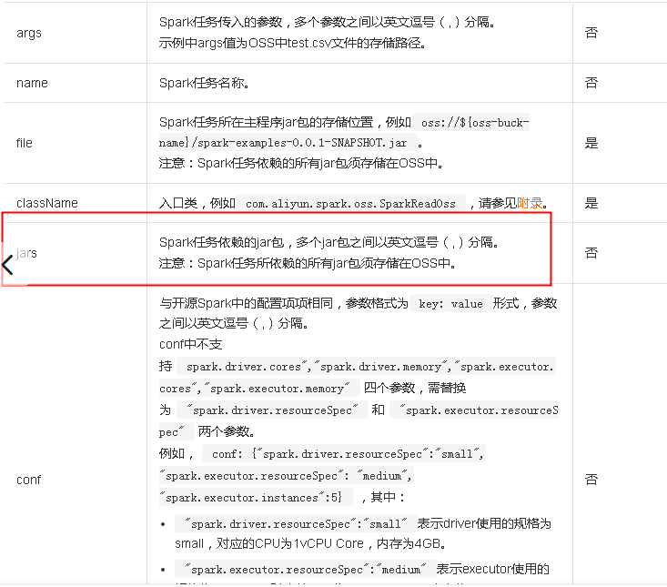
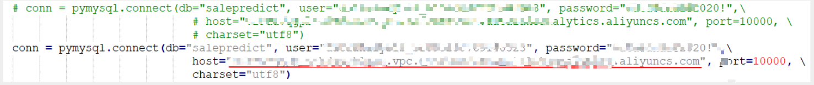
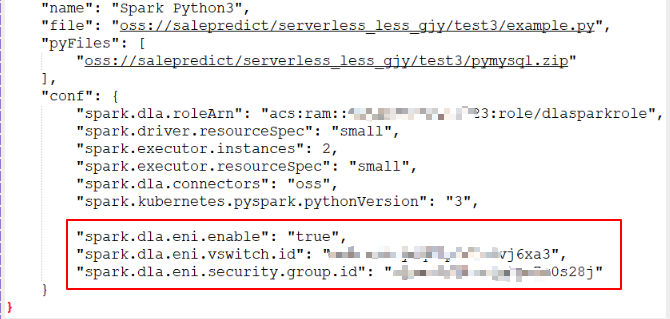

# serverless_spark

## pyspark 测试
按照如下方法配置,pyspark任务可正常执行.
[PySpark](https://help.aliyun.com/document_detail/173152.html?spm=a2c4g.11186623.6.764.38742e3c07vAfY)
测试demo:
[pyspark_test.rar](images_attachments/20210202170115117_9650/pyspark_test.rar)

## pymysql 测试
按照如下方法配置,mysql无法连接.
[mysql_test.rar](images_attachments/20210202170115117_9650/mysql_test.rar)
报错如下:
pymysql.err.OperationalError: (2003, "Can't connect to MySQL server on 'v29du7qgpb-v649kkzgojio.cn-shenzhen.datalakeanalytics.aliyuncs.com' (timed out)")
-- 需要使用VPC进行连接
[配置数据源网络](https://help.aliyun.com/document_detail/178245.html?spm=a2c4g.11186623.2.8.1fe6383aAgtsTA#section-9uo-htq-8db)
修改点: 
1. 数据库连接使用"VPC内访问链接"

2. 配置Serverless Spark能访问用户VPC网络空间中的数据
Serverless Spark进程（Driver和Executor）运行在安全容器中，安全容器可以动态挂载用户VPC空间的虚拟网卡，就如同运行在用户VPC内的ECS上一样

说明:
spark.dla.eni.enable这个参数为ture表示启用打通访问用户VPC功能，挂载用户数据源网络虚拟网卡
spark.dla.eni.vswitch.id配置为准备虚拟交换机和安全组中获取的虚拟交换机ID。
spark.dla.eni.security.group.id配置为准备虚拟交换机和安全组中获取的安全组ID。