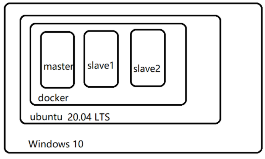
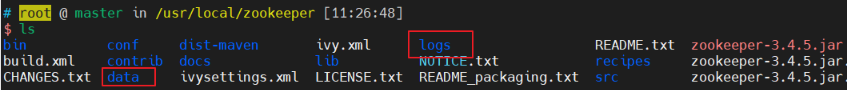

[toc]
# docker_部署Spark集群

## 将spark集群拆分
base(基础镜像)
master(主节点镜像)
worker(工作镜像)

### base(基础镜像)
#### 拉取centos镜像并安装基本工具软件
1. 拉取镜像
    docker pull centos:centos7 
    docker images
2. 用第1步中拉取的镜像启动一个container(取名为contos7)
    docker run --name centos7 -itd centos:centos7 /bin/bash
3. 进入第2步中启动的容器
    docker attach centos7
4. 在容器内安装必要软件
     4.1 yum install -y sudo net-tools which openssh-clients openssh-server iproute.x86_64 wget passwd vim
     4.2 更改root密码(passwd命令)
     4.3 开启ssh的UsePAM
         sed -i 's/UsePAM yes/UsePAM no/g' /etc/ssh/sshd_config

     ```
     mkdir /var/run/sshd
     systemctl start sshd.service # 启动的时候会报错，不用担心，正常exit即可。
     exit
     ```
5.  添加hadoop用户,并切换到hadoop用户
    ```
    # 添加用户
    adduser hadoop

    # 设置密码
    passwd hadoop

    # 添加成功后，将hadoop用户加入到 sudo用户组
    vim /etc/sudoers
    在
    root ALL=(ALL) ALL
    后面添加
    hadoop ALL=(ALL) ALL

    # 设置成功后进入该用户下
    su hadoop

    备注：所有服务器都执行以上操作
    ```
    **Note**: 
        1. 如果要用hadoop用启动集群,请确保在hadoop用户下安装集群,否则会有访问权限的问题.
        (修改文件或目录所属用户和组: chown -v -R userName:groupName fileNameOrDirName)
        2.  多看日志. ($HADOOP_HOME/logs)

5. 将修改的容器固化下来; 生成新镜像(此处取名为my-ssh-centos7)
    docker commit centos7 my-ssh-centos7
6.  用第5步中创建的镜像启动容器(取名为contos7)
    docker run -tid --privileged  --name test my-ssh-centos7 /usr/sbin/init
    (--privileged=true 和后面的 /sbin/init 必须要有，以特权模式启动容器，否则无法使用systemctl启动服务)
7. 进入上一步启动的容器; 执行下列操作，**设置ssh免密登录(为hadoop用户配置)**
    docker exec -it test /bin/bash # 进入docker终端
    cd ~; ssh-keygen -t rsa -P '' -f ~/.ssh/id_dsa; cd .ssh; cat id_dsa.pub >> authorized_keys
    创建目录: mkdir /var/software; mkdir /usr/local/java/; mkdir /usr/local/scala/; mkdir /usr/local/hadoop/; mkdir /usr/local/spark/
8. other
```
    # rm别名
    echo 'alias rm="rm -i"' >> /etc/bashrc

    # python终端tab补全
    echo "import rlcompleter, readline" > ~/.pythonstartup.py
    echo "readline.parse_and_bind('tab: complete')" >>  ~/.pythonstartup.py
    echo "export PYTHONSTARTUP=~/.pythonstartup.py" >> ~/.bashrc

    source ~/.bashrc
```
Note: 容器暂时不要退出


####  安装jdk, spark, hadoop, scala
先在本地下载好安装包再传入docker容器进行安装.
版本配套关系: [http://spark.apache.org/downloads.html](http://spark.apache.org/downloads.html)
spark-3.1.1  == hadoop3.2 == java8 == scala2.12

1. 本地下载安装包
    wget https://mirrors.bfsu.edu.cn/apache/spark/spark-3.0.2/spark-3.0.2-bin-hadoop3.2.tgz
    wget https://downloads.lightbend.com/scala/2.12.10/scala-2.12.10.tgz
    ...
2. 使用docker cp将安装包拷贝到容器里
   docker cp jdk-8u261-linux-x64.tar.gz 容器ID:/var/software
3. 在容器内安装软件
   tar -zxvf jdk-8u261-linux-x64.tar.gz -C /usr/local/java/
   tar -zxvf hadoop-3.2.2.tar.gz  -C /usr/local/hadoop/                      # 解压文件至安装目录
   tar -zxvf spark-3.0.2-bin-hadoop3.2.tgz  -C /usr/local/spark/  # 解压文件至安装目录
   
    ```python
    # 设置环境变量. ~/.bashrc中添加
    # JAVA
    export JAVA_HOME=/usr/local/java/jdk1.8.0_261
    export JRE_HOME=$JAVA_HOME/jre
    export PATH=$JAVA_HOME/bin:$PATH:$JRE_HOME/bin

    # scala
    export SCALA_HOME=/usr/local/scala/scala-2.12.10
    export PATH=$PATH:$SCALA_HOME/bin

    # hadoop
    export HADOOP_HOME=/usr/local/hadoop/hadoop-3.2.2
    export HADOOP_CONFIG_HOME=$HADOOP_HOME/etc/hadoop
    export PATH=$PATH:$HADOOP_HOME/bin:$HADOOP_HOME/sbin

    export SPARK_DIST_CLASSPATH=$(hadoop classpath)
    export SPARK_HOME=/usr/local/spark/spark-3.0.2-bin-hadoop3.2
    ```
 
#### 配置hadoop
1. 创建hadoop集群的相关目录
        cd $HADOOP_HOME;mkdir tmp;mkdir namenode;mkdir datanode;
        cd $HADOOP_CONFIG_HOME
        
2. 配置hadoop
##### **修改core-site.xml**
```xml
<configuration>
        <property>
                <!--指定namenode的地址-->
                <name>fs.default.name</name>
                <value>hdfs://master:9000</value>
                <final>true</final>
                <description>The name of the default file system. 
                A URI whose scheme and authority determine the 
                FileSystem implementation. The uri's scheme 
                determines the config property (fs.SCHEME.impl) 
                naming the FileSystem implementation class. The 
                uri's authority is used to determine the host,
                port, etc. for a filesystem.        
                </description>
        </property>
        <!--用来指定使用hadoop时产生文件的存放目录-->
        <property>
                <name>hadoop.tmp.dir</name>
                <value>file:/usr/local/hadoop/hadoop-3.2.2/tmp</value>
                <description>A base for other temporary directories.</description>
        </property>
</configuration>
```

##### **配置hdfs-site.xml**,
设置副本数和NameNode、DataNode的目录路径
```
<configuration>
    <property>
        <!--指定hdfs保存数据的副本数量-->
        <name>dfs.replication</name>
        <value>2</value>
        <final>true</final>
        <description>Default block replication.
        The actual number of replications can be specified when the file is created.
        The default is used if replication is not specified in create time.
        </description>
    </property>
    
    <!--指定hdfs中namenode的存储位置-->
    <property>
        <name>dfs.namenode.name.dir</name>
        <value>file:/usr/local/hadoop/hadoop-3.2.2/namenode</value>
        <final>true</final>
    </property>

    <!--指定hdfs中datanode的存储位置-->
    <property>
        <name>dfs.datanode.data.dir</name>
        <value>file:/usr/local/hadoop/hadoop-3.2.2/datanode</value>
        <final>true</final>
    </property>
</configuration>
```
   
##### **配置mapred-site.xml**
-- 配置MapReduce作业跟踪器(JobTracker)运行的主机和端口
[关于MapReduce作业启动和运行机制参考](../从0开始学大数据_笔记/07_08_MapReduce既是编程模型又是计算框架.md)
```
<configuration>
    <property>
        <name>mapred.job.tracker</name>
        <value>master:9001</value>
        <description>The host and port that the MapReduce job tracker runs
        at.  If "local", then jobs are run in-process as a single map
        and reduce task.
        </description>
    </property>
</configuration>
```
##### 配置workers
```
master
slave01
slave02
```

##### **格式化namenode**
hdfs namenode  -format
(hadoop namenode -format (已经不推荐使用了)


#### **配置yarn-site.xml**
```
<configuration>
    <property>
      <name>yarn.nodemanager.vmem-check-enabled</name>
      <value>false</value>
      <description>Whether virtual memory limits will be enforced for containers</description>
    </property>
    <property>
        <name>yarn.nodemanager.aux-services</name>
        <value>mapreduce_shuffle</value>
    </property>
    <property>
        <name>yarn.resourcemanager.hostname</name>
        <value>master</value>
    </property>
</configuration>
```


#### 配置spark
cd $SPARK_HOME/conf
cp spark-env.sh.template spark-env.sh
cp slaves slaves

**"~/spark-env.sh"**中添加
```
export SCALA_HOME=/usr/local/scala/scala-2.12.10
export JAVA_HOME=/usr/local/java/jdk1.8.0_261
export HADOOP_HOME=/usr/local/hadoop/hadoop-3.2.2
export HADOOP_CONFIG_DIR=$HADOOP_HOME/etc/hadoop
export SPARK_DIST_CLASSPATH=$(hadoop classpath)
SPARK_MASTER_IP=master
SPARK_LOCAL_DIR=/usr/local/spark/spark-3.0.2-bin-hadoop3.2
SPACK_DRIVER_MEMORY=1G
```

**"slaves"**中添加
```
slave01
slave02
```


#### 保存镜像
exit # 退出容器
docker commit -m "centos7 with spark3.0.2 hadoop3.2.2" test centos7:with-spark-hadoop


#### 配置集群
| 主机(节点) |     IP     |
| ---------- | ---------- |
| master     | 172.20.0.6 |
| slave01    | 172.20.0.7 |
| slave02    | 172.20.0.8 |

```
1. 固定IP. 需要先创建一个网络
docker network create --subnet=172.17.0.0/24 hadoop-network

2. 通过'--network'指定网络,'--ip'固定ip
docker run -itd -P -p 50070:50070 -p 8088:8088 -p 8080:8080 --privileged --name master -h master --network hadoop-network --ip 172.20.0.6 --add-host slave01:172.20.0.7 --add-host slave02:172.20.0.8 centos7:with-spark-hadoop /usr/sbin/init

docker run -itd -P --privileged --name slave01 -h slave01 --network hadoop-network --ip 172.20.0.7 --add-host master:172.20.0.6 --add-host slave02:172.20.0.8  centos7:with-spark-hadoop /usr/sbin/init

docker run -itd -P --privileged --name slave02 -h slave02 --network hadoop-network --ip 172.20.0.8 --add-host master:172.20.0.6 --add-host slave01:172.20.0.7  centos7:with-spark-hadoop /usr/sbin/init
```
**docker run参数说明**:
-P(--publish-all): 将所有公开的端口发布到随机端口
-p(--publish): 将容器的端口发布给主机
--privileged: 给这个容器扩展权限
--name: 为容器分配一个名称
-h(--hostname): 容器主机名 -- 会设置到"/etc/hostname"文件
--add-host: 添加自定义主机到ip的映射 (host:ip) -- 会设置到"/etc/hosts文"件
--network: 指定网络
--ip: IPV4地址
**Note**: 
    1. 要固定容器的IP需要先创建一个网络
       (docker network create --subnet=172.17.0.0/24 hadoop-network)


#### 进入master节点,启动HDFS集群

```
# 启动hadoop
docker exec -it master /bin/bash # 进入docker终端
su hadoop # 切换到hadoop用户
$HADOOP_HOME/sbin/start-all.sh # 启动集群

# $HADOOP_HOME/sbin/stop-all.sh # 停止集群
```

#### 测试wordcount
##### hdfs测试
1. 创建目录,并上传文件
cd /var/tmp/test.txt
vim test.txt
```
hello hadoop
hello spark
hello flink
```
hdfs dfs -mkdir /text
hdfs dfs -put /var/tmp/test.txt /test

2. 执行一个wordcount任务
cd $HADOOP_HOME/share/hadoop/mapreduce/
hadoop jar hadoop-mapreduce-examples-3.2.2.jar wordcount /test/text.txt /test/out

3. 查看结果
hdfs dfs -ls /test/out
hdfs dfs -cat /test/out/part-r-00000

##### spark测试
1. 启动spark集群
    $SPARK_HOME/sbin/start-all.sh
2. 进行pyspark测试
    pyspark --master "spark://master:7077"
    ```
  rdd = sc.textFile("hdfs://master:9000/test/test.txt")\
          .flatMap(lambda row:row.split(" "))\
          .map(lambda x:(x,1))\
          .reduceByKey(lambda v1,v2:v1+v2)
  rdd.collect()
    ```

## master(主节点镜像) & worker(工作镜像) 保存
将 [base基础镜像] ==> [配置集群] 中启动的集群容器分别保存成镜像
```
docker commit master master:v1.0
docker commit slave01 slave01:v1.0
docker commit slave02 slave02:v1.0
```


## 问题
### ERROR: Unable to write in /usr/local/hadoop/hadoop-3.2.2/logs Aborting.
    原因: 权限不够
    解决方法: 
    1.检查启动hadoop的用户,是否与hadoop-3.2.2目录的用户和组一致
    2. 修改目录的所属用户和组(chowd -v -R userName:groupName fileOrDir)
         或直接修改logs目录权限: sduo chmod -R 777 /usr/local/hadoop/hadoop-3.2.2/logs
    -- 集群的其他机器上也要执行该命令

### Spark集群通过内网通信,但Spark UI需要通过公网访问时
    1.  配置Spark集群通过内网通信
         * "/etc/hosts" 配置主机名与内网IP映射
         * "$SPARK_HOME/conf/slaves" 配置spark主机名
    2. 配置Spark UI 可通过公网访问("$SPARK_HOME/conf/spark-env.sh")
        * master配置
        ```
    export SPARK_MASTER_IP=公网IP
    export SPARK_MASTER_HOST=内网IP
    export SPARK_PUBLIC_DNS=master公网IP
        ```
        * slave配置:
        ```
    export SPARK_MASTER_IP=公网IP
    export SPARK_MASTER_HOST=内网IP
    export SPARK_PUBLIC_DNS=slave公网IP
        ```
    参考: [http://spark.apache.org/docs/latest/spark-standalone.html](http://spark.apache.org/docs/latest/spark-standalone.html)
        **Note**: master和slave需要配置SPARK_PUBLIC_DNS,否则在spark UI跳转到worker节点时,将使用内网地址进行跳转.

### Win10==>WSL==>docker:部署spark集群,如何使在window通过spark webUI查看spark任务.
我的环境是Win10 ==> WSL ==> docker : 在docker中运行集群. 结构如下:

在不进行任何配置的情况下.
    * WSL是可以ping通master
    * Win10可以ping通WSL
    * master可以ping通win10
    *  但win10不能ping通master
那么如何使win10能通过spark webUI访问spark呢?
解决方法:使用docker的端口映射.
说明：
在启动docker容器时通过端口映射(如"-p WSLPort:容器Port"),可以将对宿主机端口(WSL)的访问转发到对应的容器端口上.
WSL IP是会变的, 微软在windwos 10中已经提供了通过宿主机localhost就能访问wsl 中的linux; docker配置了端口映射后可以通过"http://localhost:WSL端口/"访问容器Port提供的服务.
参考文档:
[https://my.oschina.net/u/2473610/blog/4308035](https://my.oschina.net/u/2473610/blog/4308035)
[http://spark.apache.org/docs/latest/spark-standalone.html](http://spark.apache.org/docs/latest/spark-standalone.html)

1. 由于集群有多个work节点(多个容器)，它们需要映射到不同的WSL端口; 但他们都是通过WSL转发，所以SPARK_PUBLIC_DNS配置为localhost。
master配置(conf/spark-env.sh)
```
export SPARK_PUBLIC_DNS=localhost
export SPARK_WORKER_WEBUI_PORT=8081
```

slave01配置(conf/spark-env.sh)
```
export SPARK_PUBLIC_DNS=localhost
export SPARK_WORKER_WEBUI_PORT=18081
```

2. 启动容器时，指定端口映射

```
docker run -itd -P -p 50070:50070 -p 8088:8088 -p 8080:8080 -p 8081:8081 \
--privileged --name master -h master --network hadoop-network --ip 172.20.0.6 \
--add-host slave01:172.20.0.7 --add-host slave02:172.20.0.8  master:v1.0 /usr/sbin/init

docker run -itd -P -p 18081:18081 --privileged --name slave01 -h slave01 \
--network hadoop-network --ip 172.20.0.7 \
--add-host master:172.20.0.6 --add-host slave02:172.20.0.8  slave01:v1.0 /usr/sbin/init
```

## zookeeper搭建高可用集群
为了spark集群的高可用性，使用zookeeper来实现。
1. 下载zookeeper，https://archive.apache.org/dist/zookeeper/zookeeper-3.4.5/。在master机器上操作2-5步骤
2. 解压到/usr/local/zookeeper下。
3. 创建2个目录，一个data目录，一个日志目录


4. 配置
进入conf目录下， 复制zoo_sample.cfg一份改名zoo.cfg, 并添加下面内容：
```
dataDir=/usr/local/zookeeper/data
server.0=master:2888:3888
server.1=slave01:2888:3888
server.2=slave02:2888:3888
```
5. 切换到/usr/local/zookeeper/data目录下，创建myid文件，并在文件内写0
```
cd /usr/local/zookeeper/data
echo 0 >> myid
```
6. 将/usr/local/zookeeper整个目录复制到slave01、slave02
7. 登录slave01、slave02节点，修改 /usr/local/Zookeeper/zookeeper/data/myid的值，分别改为1,2

```
#  slave01上
cd /usr/local/Zookeeper/zookeeper/data/
echo 1 >> myid

# slave02上
cd /usr/local/Zookeeper/zookeeper/data/
echo 2 >> myid
```
8. 分别在三个节点上启动zookeeper
```
cd /usr/local/Zookeeper/zookeeper/
bin/zkServer.sh start
```
9. 分别在终端输入jps查看进程是否启动成功，如果有QuorumPeerMain就成功

10. zookeeper安装启动成功，下面配置spark。
```
export JAVA_HOME=/usr/local/jdk1.8.0_261
export HADOOP_CONF_DIR=/usr/local/hadoop-3.2.2/etc/hadoop
export SPARK_DAEMON_JAVA_OPTS="-Dspark.deploy.recoveryMode=ZOOKEEPER Dspark.deploy.zookeeper.url=master:2181,slave01:2181,slave02:2181 -Dspark.deploy.zookeeper.dir=/usr/local/zookeeper/data"
export SPARK_DAEMON_MEMORY=512m
export SPARK_WORKER_OPTS="-Dspark.worker.cleanup.enabled=true -Dspark.worker.cleanup.appDataTtl=259200"
```
备注：1. Dspark.deploy.zookeeper.url的master:2181,slave01:2181,slave02:2181，分别配置成你集群计算机名称的地址；
           2. 因为zookeeper已经配置了spark的ip，因此 spark-env.sh的SPARK_MASTER_IP、SPARK_MASTER_HOST注释掉
```
#export SPARK_MASTER_IP=xxxx01
#export SPARK_MASTER_HOST=xxxx01
```

11. 启动spark集群
在master上进入spark目录
```
cd /usr/local/spark-3.0.2-bin-hadoop3.2
#先关闭spark服务
./sbin/stop-all.sh
#启动spark服务
./sbin/start-master.sh
./sbin/start-slaves.sh
```
然后在slave01上启动一个备用spark master
```
cd /usr/local/spark-3.0.2-bin-hadoop3.2
./sbin/start-master.sh
```

## 其他
启动成功后，可以在sparkui页面上查看集群状态信息。
url是xxxx0:7077.  ip是master服务器ip，端口默认7077
如果是阿里云服务器， ip对应的是master服务器的公网ip，端口默认8080

输入上面地址就能查看sparkui页面

### 常用端口【默认】
50070：HDFSwebUI的端口号
8485:journalnode默认的端口号
9000：非高可用访问数rpc端口
8020：高可用访问数据rpc
8088：yarn的webUI的端口号
8080：master的webUI，Tomcat的端口号
7077：spark基于standalone的提交任务的端口号
8081：worker的webUI的端口号
18080：historyServer的webUI的端口号
4040：application的webUI的端口号
2181：zookeeper的rpc端口号
9083：hive的metastore的端口号
60010：Hbase的webUI的端口号
6379：Redis的端口号
8080：sparkwebUI的端口号


## Dockerfile
<span id="base_dockerfile">base Dockerfile</span>

```
# base Dockerfile
# 基础镜像
FROM centos:centos7

# 维护者信息
MAINTAINER helloWorld

# 设置环境变量
ENV PATH /usr/local/nginx/sbin:$PATH

# 文件放在当前目录下, 拷过去会自动解压
ADD nginx-1.8.0.tar.gz /usr/local/  
ADD epel-release-latest-7.noarch.rpm /usr/local/  

# 执行以下命令 
RUN rpm -ivh /usr/local/epel-release-latest-7.noarch.rpm
RUN yum install -y wget lftp gcc gcc-c++ make openssl-devel pcre-devel pcre && yum clean all
RUN useradd -s /sbin/nologin -M www

# 工作目录
WORKDIR /usr/local/nginx-1.8.0 
RUN ./configure --prefix=/usr/local/nginx --user=www --group=www --with-http_ssl_module --with-pcre && make && make install
RUN echo "daemon off;" >> /etc/nginx.conf

# 映射端口
EXPOSE 80

# 运行以下命令
CMD ["nginx"]
```

<span id="base_dockerfile">master Dockerfile</span>
```

```
