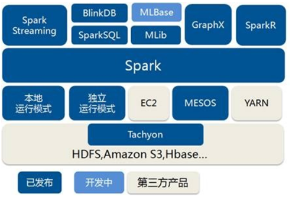
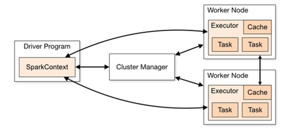
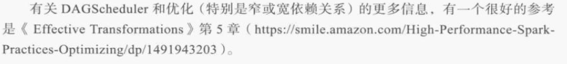

**learningPySpark**
**利用Python和Spark构建数据密集型应用并规模化部署**

# spark技术和作业的组织

## job, task, stage等的划分

## SparkSession
*以前使用SparkConf,SparkContext,SQLContext和HiveContext来分别执行配置,Spark环境,SQL环境和Hive环境的各种Spark查询*．
**但现在SparkSession是读取数据，处理元数据，配置会话和管理集群资源的入口．**

# RDD,基本原理,PySpark中可用的非模式化数据结构

# DataFrame

# Spark环境中的数据清理和转换

# 适用于RDD的机器学习库(MLlib)

# 机器学习库(ML包)

# 利用图解决问题的结构

# Spark和张量流(TensorFlow)领域中深度学习的连接桥梁

# Blaze如何跟Spark核搭配使用

# PySpark中可用的流工具

# 使用CLI完成代码模块化并提交到spark执行

# TODO: 计划 & 进阶

