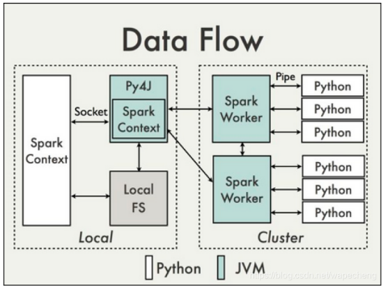

# pyspark


## 原理简介




在Spark2.0之前， SparkContext 是所有 Spark 功能的结构， 驱动器（driver） 通过SparkContext 连接到集群 （通过resource manager）， 因为在2.0之前， RDD就是Spark的基础。如果需要建立SparkContext，则需要SparkConf，通过Conf来配置SparkContext的内容。

```python
from pyspark import SparkConf, SparkContext
conf = SparkConf().setAppName('test_spark').setMaster('local[*]')
sc = SparkContext(conf=conf)
```

在Spark2.0之后，Spark Session也是Spark 的一个入口， 为了引入dataframe和dataset的API， 同时保留了原来SparkContext的functionality， 如果想要使用 HIVE，SQL，Streaming的API， 就需要Spark Session作为入口。-- 建议使用Spark Session作为统一入口.

```python
spark = SparkSession.builder.appName('test_spark')\
                    .config('spark.some.config.option','some-value')\
                    .getOrCreate()
sc = spark.sparkContext
```

### **RDD的基本操作**
Spark的核心是RDD（Resilient Distributed Dataset）即弹性分布式数据集，
属于一种分布式的内存系统的数据集应用. RDD是不可变元素.

**要对这些RDD进行操作，有两种方法**:

* Transformation
    转换 - 这些操作应用于RDD以创建新的RDD。Filter，groupBy和map是转换的示例。

* Action
    操作 - 这些是应用于RDD的操作，它指示Spark执行计算并将结果发送回驱动程序。
注： 怎么判断一个算子是不是Transformation算子?
    -- Transformation算子的返回类型是RDD; 如果一个算子的返回类型不是RDD则它是Action算子.


## 文件操作
```python
# 读取一个文本文件. 文件的每一行作为RDD的一个元素 [row1, row2, ...]
# sc.textFile(textfile) 

# 可读取一个目录下的所有文本文件. (文件路径,文件内容)作为RDD的一个元素. [(file1path, file1context), ...]
# sc.wholeTextFiles(textfile_dir)

datafile_dir_pattern = os.path.join(textfile_dir, '*.txt') # 读取目录下匹配指定模式的文件
path_data_rdd = sc.wholeTextFiles(datafile_dir_pattern)
```


