# spark_学习

## Spark运行环境配置
[pyspark基本运行环境参考＿spark_开发测试.ipynb](file:///D:/myProject/JupyterWKS/LearningPySpark_Note/spark_开发测试.ipynb)

## spark与MR的对比
pass

##
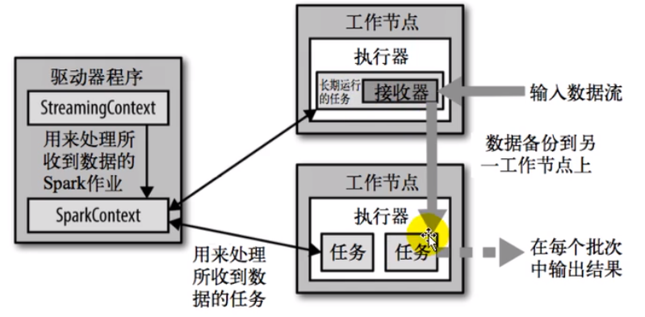

## 宽窄依赖
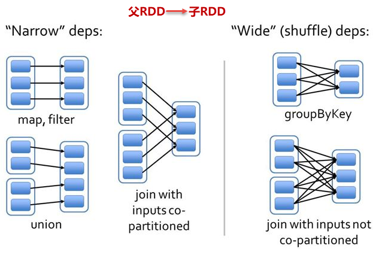

### 区分宽依赖与窄依赖
是宽依赖还是窄依赖取决与上游(父)RDD中的每个分区是否被分发到下游(子)RDD中的多个分区.
窄依赖: 父RDD中的每个分区只被分发到子RDD中的单个分区,不会有shuffle产生
宽依赖: 父RDD中的每个分区被分发到子RDD中的多个分区,会有shuffle产生
每个RDD有多个分区

简单来说: 
    窄依赖:一个RDD的某个分区只流向另一个RDD中的某一个分区
    宽依赖:一个RDD的某个分区流向另一个RDD中的多个分区

## Stage划分
Spark任务会根据RDD之间的依赖关系，形成一个DAG有向无环图，DAG会提交给DAGScheduler.
**DAGScheduler会把DAG划分成互相依赖的多个stage,划分stage的依据就是RDD之间的宽窄依赖,遇到宽依赖就划分stage**。每个stage包含一个或多个task任务，然后将这些task以taskSet的形式提交给TaskScheduler运行。

stage切割规则：从后往前，遇到宽依赖就切割stage
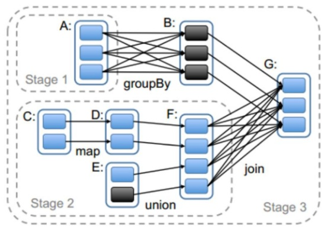


## shuffle
可能会触发shuffle操作的算子：distinct、groupByKey、reduceByKey、aggregateByKey、join、cogroup、repartition等。


## 数据倾斜时怎么处理
数据倾斜指的是，并行处理的数据集中，某一部分（如Spark或Kafka的一个Partition）的数据显著多于其它部分，从而使得该部分的处理速度成为整个数据集处理的瓶颈。
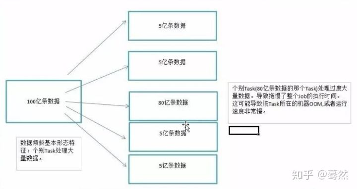


## 算子
### map
一个RDD转换成另一个RDD, 元素间一一对应.
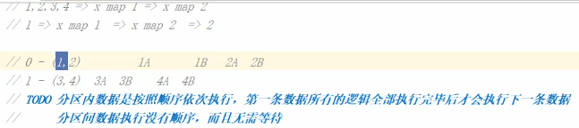


### RDD只保存了逻辑,不保存数据.

DD任务切分中间分为：Application、Job、Stage和Task
* Application：初始化一个SparkContext即生成一个Application；
* Job：一个Action算子就会生成一个Job；
* Stage：Stage等于宽依赖(ShuffleDependency)的个数加1；
* Task：每个Stage的最后一个RDD的分区个数之和就是Task的个数。
注意：Application->Job->Stage->Task每一层都是1对n的关系(一个Application多个Job,一个Job多个...)。 


## 分布式结构执行
### Active算子中的操作是分发到Executor中执行的．
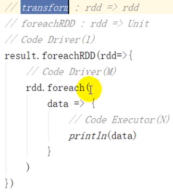


## RDD
创建环境对象
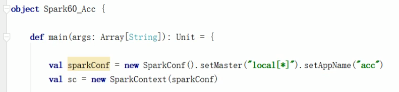


## SparkSQL
创建环境对象:
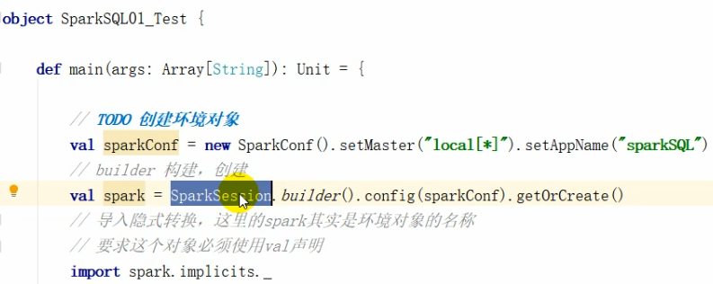

RDD
DataFrame
DataSet
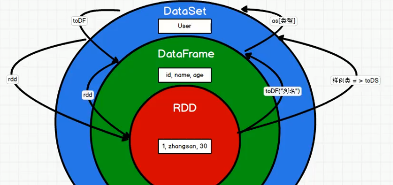


# Spark SQL
**两个抽象 DataFrame & DataSet --与RDD一样也是懒执行的**

## DataFrame
DataFrame是一种以RDD为基础的分布式数据集，类似于传统数据库中的二维表格。
DataFrame与RDD的主要区别在于, DataFrame带有schema元信息
DataFrame是为数据提供了Schema的视图。可以把它当做数据库中的一张表来对待.

### 统一的数据访问(使用相同的方式连接不同的数据源)
### 创建DataFrame
在Spark SQL中SparkSession是创建DataFrame和执行SQL的入口;
创建DataFrame有三种方式：
1. 通过Spark的数据源进行创建；
2. 从一个存在的RDD进行转换；
3. 还可以从Hive Table进行查询返回。


查看Spark支持创建文件的数据源格式
```
>>> spark.read.
spark.read.csv(     spark.read.json(    spark.read.options( spark.read.schema(
spark.read.format(  spark.read.load(    spark.read.orc(     spark.read.table(
spark.read.jdbc(    spark.read.option(  spark.read.parquet( spark.read.text(
```

### SQL语法
```
# 读取JSON文件创建DataFrame
df = spark.read.json("data/user.json")


# 从DataFrame创建一张临时表:
df.createOrReplaceTempView("user_info_tmp_table")

# 从DataFrame创建一张全局临时表
# df.createGlobalTempView("user_info_global_tmp_table")

# 查询 -- transformation
sqlDf = spark.sql("SELECT * FROM user_info_tmp_table")

# 结果展示 -- action
sqlDf.show
```

### DSL语法
DataFrame提供一个特定领域语言(domain-specific language, DSL)去管理结构化的数据.
使用 DSL 语法风格不必去创建临时视图了.
```
df = spark.read.json("data/user.json")
df.select("username").show()

# 查看"username"列数据以及"age+1"数据 
# 注意: 涉及到运算的时候, 每列都必须使用$, 或者采用引号表达式:单引号+字段名
df.select($"username", $"age" + 1).show
df.select('username, 'age + 1).show()
```

### RDD <==> DataFrame
RDD ==> DataFrame
实际开发中，一般通过样例类将RDD转换为DataFrame
class User(name:String, age:Int)
df = sc.makeRDD(List(("zhangsan",30), ("lisi",40))).map(t=>User(t._1, t._2)).toDF.show
rdd = df.rdd

## DataSet--pyspark不支持DataSet API
DataSet是DataFrame API的一个扩展,是SparkSQL最新的数据抽象;具有DataFrame的schema信息,同时又是强类型的.

DataSet[T] -- 类型化API,与强类型T绑定．
DataFrame = DataSet[Row]　DataFrame其实是DataSet在Row(一个通用的非类型化的JVM对象)对象上的一个别名．
由于python缺乏类型增强的优势，所以pyspark不支持DataSet API.


SparkSession是Spark最新的SQL查询起始点,实质上是SQLContext和HiveContext的组合,所以在SQLContex和HiveContext上可用的API在SparkSession上同样是可以使用的。
SparkSession内部封装了SparkContext，所以计算实际上是由sparkContext完成的

```
# 创建DataSet
class Person(name: String, age: Long)
caseClassDS = Seq(Person("zhangsan",2)).toDS()

# RDD ==> DataSet
ds = rdd.toDS

# DataSet ==> RDD
rdd = ds.rdd

# DataFrame和DataSet转换. DataFrame其实是DataSet的特例
# DataFrame ==> DataSet
ds = df.as[UserType]

# DataSet ==> DataFrame
df = ds.toDF
```

## RDD、DataFrame、DataSet三者的比较
### RDD、DataFrame、DataSet三者的共性
1. RDD、DataFrame、DataSet全都是spark平台下的分布式弹性数据集，为处理超大型数据提供便利;
2. 三者都有惰性机制，在进行创建、转换，如map方法时，不会立即执行，只有在遇到Action如foreach时，三者才会开始遍历运算;
3. 三者有许多共同的函数，如filter，排序等;
4. 三者都会根据 Spark 的内存情况自动缓存运算，这样即使数据量很大，也不用担心会内存溢出
5. 三者都有partition的概念
6. DataFrame和DataSet均可使用模式匹配获取各个字段的值和类型
### 三者的区别
1.	RDD
	* RDD一般和spark mlib同时使用
	* RDD不支持sparksql操作
2.	DataFrame
	* 与RDD和Dataset不同，DataFrame每一行的类型固定为Row，每一列的值没法直接访问，只有通过解析才能获取各个字段的值
	* DataFrame与DataSet一般不与 spark mlib 同时使用
	* DataFrame与DataSet均支持 SparkSQL 的操作，比如select，groupby之类，还能注册临时表/视窗，进行 sql 语句操作
	* DataFrame与DataSet支持一些特别方便的保存方式，比如保存成csv，可以带上表头，这样每一列的字段名一目了然
3.	DataSet
	* Dataset和DataFrame拥有完全相同的成员函数，区别只是每一行的数据类型不同。 DataFrame其实就是DataSet的一个特例  type DataFrame = Dataset[Row]
	* DataFrame也可以叫Dataset[Row],每一行的类型是Row，不解析，每一行究竟有哪些字段，各个字段又是什么类型都无从得知，只能用上面提到的getAS方法或者共性中的第七条提到的模式匹配拿出特定字段。而Dataset中，每一行是什么类型是不一定的，在自定义了case class之后可以很自由的获得每一行的信息


## UDF &　UDAF
### UDF
```
# 创建DataFrame
df = spark.read.json("data/user.json")
# 注册UDF
spark.udf.register("modName", (name:String)=>lower(name))
# 创建临时表people
df.createOrReplaceTempView("people")
# 应用UDF
spark.sql("Select modName(name),age from people").show() #这里name为people表中的列名
```

### UDAF(用户自定义聚合函数:UserDefinedAggregateFunction)
计算平均工资
**实现方式-- UDAF - 弱类型**
```
# scala代码
/*
  定义类继承UserDefinedAggregateFunction，并重写其中方法
*/
class MyAveragUDAF extends UserDefinedAggregateFunction {

  // 聚合函数输入参数的数据类型
  def inputSchema: StructType = StructType(Array(StructField("age",IntegerType)))

  // 聚合函数缓冲区中值的数据类型(age,count)
  def bufferSchema: StructType = {
    StructType(Array(StructField("sum",LongType),StructField("count",LongType)))
  }

  // 函数返回值的数据类型
  def dataType: DataType = DoubleType

  // 稳定性：对于相同的输入是否一直返回相同的输出。
  def deterministic: Boolean = true

  // 函数缓冲区初始化
  def initialize(buffer: MutableAggregationBuffer): Unit = {
    // 存年龄的总和
    buffer(0) = 0L
    // 存年龄的个数
    buffer(1) = 0L
  }

  // 更新缓冲区中的数据
  def update(buffer: MutableAggregationBuffer,input: Row): Unit = {
    if (!input.isNullAt(0)) {
      buffer(0) = buffer.getLong(0) + input.getInt(0)
      buffer(1) = buffer.getLong(1) + 1
    }
  }

  // 合并缓冲区
  def merge(buffer1: MutableAggregationBuffer,buffer2: Row): Unit = {
    buffer1(0) = buffer1.getLong(0) + buffer2.getLong(0)
    buffer1(1) = buffer1.getLong(1) + buffer2.getLong(1)
  }

  // 计算最终结果
  def evaluate(buffer: Row): Double = buffer.getLong(0).toDouble / buffer.getLong(1)
}

...
//创建聚合函数
var myAverage = new MyAveragUDAF

//在spark中注册聚合函数
spark.udf.register("avgAge",myAverage)

spark.sql("select avgAge(age) from user").show()

```


**实现方式 - UDAF - 强类型**
```
# scala代码
//输入数据类型
case class User01(username:String,age:Long)
//缓存类型
case class AgeBuffer(var sum:Long,var count:Long)

/**
  * 定义类继承org.apache.spark.sql.expressions.Aggregator
  * 重写类中的方法
  */
class MyAveragUDAF1 extends Aggregator[User01,AgeBuffer,Double]{
  override def zero: AgeBuffer = {
    AgeBuffer(0L,0L)
  }

  override def reduce(b: AgeBuffer, a: User01): AgeBuffer = {
    b.sum = b.sum + a.age
    b.count = b.count + 1
    b
  }

  override def merge(b1: AgeBuffer, b2: AgeBuffer): AgeBuffer = {
    b1.sum = b1.sum + b2.sum
    b1.count = b1.count + b2.count
    b1
  }

  override def finish(buff: AgeBuffer): Double = {
    buff.sum.toDouble/buff.count
  }
  //DataSet默认额编解码器，用于序列化，固定写法
  //自定义类型就是produce   自带类型根据类型选择
  override def bufferEncoder: Encoder[AgeBuffer] = {
    Encoders.product
  }

  override def outputEncoder: Encoder[Double] = {
    Encoders.scalaDouble
  }
}

...
//封装为DataSet
val ds: Dataset[User01] = df.as[User01]

//创建聚合函数
var myAgeUdaf1 = new MyAveragUDAF1
//将聚合函数转换为查询的列
val col: TypedColumn[User01, Double] = myAgeUdaf1.toColumn

//查询
ds.select(col).show()

```


## 通用的加载和保存方式
### 通用的加载方式
使用相同的API，根据不同的参数读取和保存不同格式的数据，SparkSQL默认读取和保存的文件格式为parquet.
spark.read.load 是加载数据的通用方法,并可以根据配置来加载不同的格式.
spark.read.format("...")[.option("...")].load("...")
* format("…")：指定加载的数据类型，包括"csv"、"jdbc"、"json"、"orc"、"parquet"和"textFile"。
* load("…")：在"csv"、"jdbc"、"json"、"orc"、"parquet"和"textFile"格式下需要传入加载数据的路径。
* option("…")：在"jdbc"格式下需要传入JDBC相应参数，url、user、password和dbtable

### 保存数据
df.write.save 是保存数据的通用方法,并可以根据配置来保存不同的格式
df.write[.mode("...")].format("…")[.option("…")].save("…")
保存操作可以使用 SaveMode, 用来指明如何处理数据，使用mode()方法来设置。
有一点很重要: 这些 SaveMode 都是没有加锁的, 也不是原子操作。
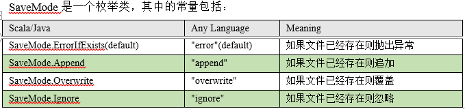


```
# Spark SQL的默认数据源为Parquet格式
df = spark.read.load("examples/src/main/resources/users.parquet")
...
df.write.mode("append").save("/opt/module/data/output")

# 注意：Spark读取的JSON文件不是传统的JSON文件，每一行都应该是一个JSON串
path = "/opt/module/spark-local/people.json"
peopleDF = spark.read.json(path)

# csv
spark.read.format("csv")\
          .option("sep", ";")\
          .option("inferSchema", "true")\
          .option("header", "true")\
          .load("data/user.csv")

```


## Spark Streaming
### 无状态统计
### 有状态统计 -- 滑动窗口

**窗口大小和滑动步长都应该采集周期的整数倍.**
reduceByKeyAndWindow方法一般在窗口长度大于滑动步长时使用(此时滑窗移动时重复数据较多)
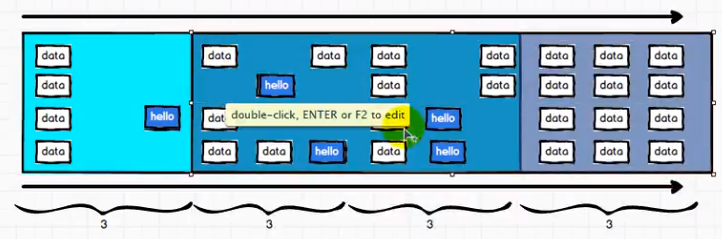


# Spark内核
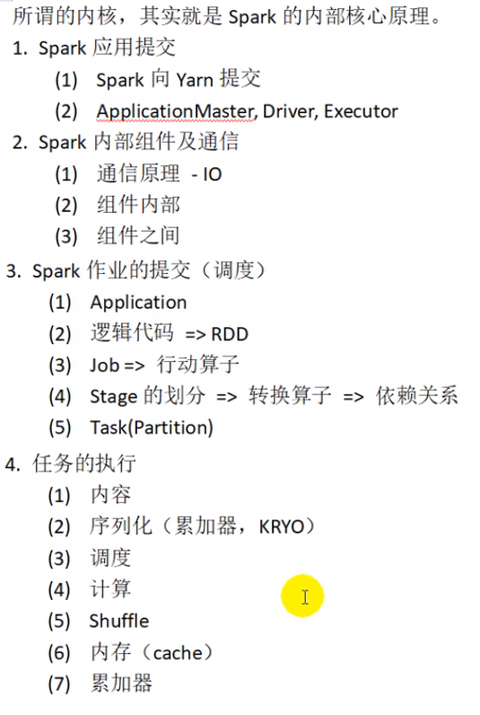


  


