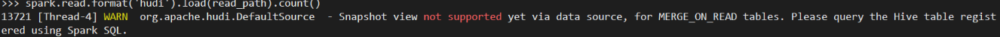

# spark启动配置

## 集群启动配置

```
pyspark --master "spark://10.0.2.222:7077" \
--conf "spark.driver.memory"="8g" \
--conf "spark.executor.memory"="8g" \
--conf "spark.driver.maxResultSize"="8g" \
--conf "spark.driver.memoryOverhead"="20g" \
--conf "spark.executor.cores"="2" \
--conf "spark.cores.max"="2" \
--conf "spark.default.parallelism"=32 \
--conf "spark.sql.shuffle.partitions"=32 \
--conf "spark.executor.extraJavaOptions"="-Xss64M -XX:ReservedCodeCacheSize=2048M" \
--conf "spark.driver.extraJavaOptions"="-Xss64M -XX:ReservedCodeCacheSize=2048M"
```
说明:
0. 相关的jar包直接拷贝到'$SPARK_HOME/jars'下, 就可以不用配置包路径了.

### spark集群模式OSS相关配置
```
--conf "spark.hadoop.fs.oss.impl"="org.apache.hadoop.fs.aliyun.oss.AliyunOSSFileSystem" \
--conf "spark.hadoop.fs.oss.accessKeyId"="XXXXX" \
--conf "spark.hadoop.fs.oss.accessKeySecret"="YYYYYYYYYYY" \
--conf "spark.hadoop.fs.oss.endpoint"="oss-cn-shenzhen.XXXX.com" \
```

## 单机启动配置
```
pyspark  \
--conf "spark.driver.memory"="8g" \
--conf "spark.executor.memory"="8g" \
--conf "spark.driver.maxResultSize"="8g" \
--conf "spark.driver.memoryOverhead"="10g" \
--conf "spark.executor.cores"="2" \
--conf "spark.cores.max"="2" \
--conf "spark.default.parallelism"=32 \
--conf "spark.sql.shuffle.partitions"=32 \
--conf "spark.executor.extraJavaOptions"="-Xss32M -XX:ReservedCodeCacheSize=2048M" \
--conf "spark.driver.extraJavaOptions"="-Xss32M -XX:ReservedCodeCacheSize=2048M" 
```

### spark local模式OSS相关配置
```
--conf "fs.oss.core.dependency.path"="/jars/*" \
--conf "spark.driver.extraClassPath"="/jars/*" \
--conf "spark.hadoop.fs.oss.impl"="com.aliyun.fs.oss.nat.NativeOssFileSystem" \
--conf "spark.hadoop.fs.oss.accessKeyId"="XXXXXXXXXXXX" \
--conf "spark.hadoop.fs.oss.accessKeySecret"="YYYYYY" \
--conf "spark.hadoop.fs.oss.endpoint"="oss-cn-shenzhen-ZZZZ.aliyuncs.com" \
```


## 使用Hudi格式文件的配置
```
--packages org.apache.hudi:hudi-spark-bundle_2.12:0.5.2-incubating,org.apache.spark:spark-avro_2.12:3.0.2 \
--conf "spark.serializer"="org.apache.spark.serializer.KryoSerializer" 
```
**Note**: 
1. '--packages'参数以Maven Coordinates的方式指定jar, 格式为 'groupId:artifactId:version'.
2. hudi-spark-bundle 与 spark-avro 包的版本. 如果jar包已经放到"$SPARK_HOME/jars"目录下,则不需要再指定packages参数.

## 问题
1. 出现如下关于时间戳的报错时,可通过配置解决

```
--conf "spark.sql.legacy.parquet.datetimeRebaseModeInRead"="LEGACY"
```


## 基本操作
### 读取OSS数据(parquet文件)
```
bucket_name = "xxxx"
endpoint = "oss-cn-shenzhen.yyyy.com"

basePath = f"oss://{bucket_name}.{endpoint}/"
oss_uri_list = [f"oss://{bucket_name}.{endpoint}/ad.parquet/collect_date=2020-10-24",
                f"oss://{bucket_name}.{endpoint}/ad.parquet/collect_date=2020-10-25"]
spark_df = spark.read.format('parquet').options(basePath=basePath).load(oss_uri_list)
```


### 读取OSS数据(hudi文件)
```
read_path = "oss://{bucket_name}/XXX/YYY/order_product/"
spark.read.format('hudi').load(read_path).head(5)
```




或者
```
basePath = "oss://datalakeanalytics/xxxx/order_product/"
tripsSnapshotDF = spark. \
     read. \
     format("hudi"). \
     load(basePath)

tripsSnapshotDF.createOrReplaceTempView("hudi_trips_snapshot")
spark.sql("select count(*) from  hudi_trips_snapshot").show()
```


## spark配置
```
from pyspark import SparkConf
from pyspark.sql import SparkSession
import os
from time import time


os.environ['JAVA_HOME'] = "/usr/java/jdk1.8.0_181-cloudera"
os.environ["PYSPARK_PYTHON"] = "/data/data07/modules/miniconda3/envs/alpha_env/bin/python"
os.environ["HADOOP_CONF_DIR"] = "/etc/hadoop/conf"


conf = SparkConf() 


config = (
            ("spark.sql.warehouse.dir", "hdfs://ns1/user/hive/warehouse"),
            ("hive.metastore.uris","thrift://node0001:9083"),


            ("spark.app.name", 'spark_join_test'),  # 设置启动的spark的app名称，没有提供，将随机产生一个名称
            ("spark.master", 'yarn'),  # spark master的地址

            # ("spark.sql.crossJoin.enabled","true"),

            ("spark.speculation","true"),

            ("spark.shuffle.service.enabled","true"),
            ("spark.dynamicAllocation.enabled","true"),
            ("spark.dynamicAllocation.maxExecutors",40),
            ("spark.dynamicAllocation.initialExecutors",10),
            # ("spark.executor.memory", '3g'),  # 设置该app启动时占用的内存用量，默认2g
            # ("spark.executor.memoryOverhead", '1g'),
            # ("spark.executor.cores", 1),  # 设置spark executor使用的CPU核心数，默认是1核心
            # ("spark.executor.instances", 20),
            # ("spark.driver.cores",1),
            # ("spark.driver.memory",'2g'),

            ("spark.sql.shuffle.partitions",1200),
            ("spark.default.parallelism",1200),

            ("spark.io.compression.codec", "snappy"),
            ("hive.exec.compress.output","true"),
            ("mapred.output.compression.codec","org.apache.hadoop.io.compress.GzipCodec"),
        )


conf.setAll(config)
spark = SparkSession.builder.config(conf=conf).enableHiveSupport().getOrCreate()
# spark.stop()

#kill app in Linux terminal
#yarn application -kill application_1594497091372_0005


spark.sql('show databases').show()
spark.sql('use ccas')
spark.sql('show tables').show(truncate=False)

spark.sql('select * from fact_gamingtablerating_orc limit 5').show()
```


