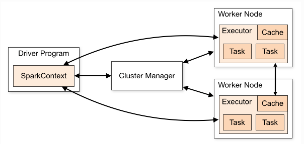

## 组件

我们的main程序创建SparkContext(即driver program)  ==> 连接到Cluster Manager (可以是Spark自己的Standlone, 或者Meson,或者Yarn) ==> Cluster Manager分配资源 ==> 任务会被分配到Executor执行.

**Note**: 每个应用持有其自己的task和Executor. 不同应用的task运行在不同的JVM中; 如果需要在不同spark应用之间共享数据的话,需要将数据写到外部的存储系统中.

## 监控

每个 driver 都有一个 Web UI，通常在端口 4040 上，可以显示有关正在运行的 task，executor，和存储使用情况的信息。 只需在 Web 浏览器中的`http://<driver-node>:4040` 中访问此 UI。[监控指南](http://doc.codingdict.com/spark/12/monitoring.html) 中还介绍了其他监控选项

## Job 调度

Spark 即可以在应用间（Cluster Manager 级别），也可以在应用内（如果多个计算发生在相同的 SparkContext 上时）控制资源分配。 在 [任务调度概述](http://doc.codingdict.com/spark/12/job-scheduling.html) 中更详细地描述了这一点。

## 术语

| Term（术语）    | Meaning（含义）                                              |
| --------------- | ------------------------------------------------------------ |
| Application     | 用户构建在 Spark 上的程序。由集群上的一个 driver 程序和多个 executor 组成。 |
| Application jar | 一个包含用户 Spark 应用的 Jar。有时候用户会想要去创建一个包含他们应用以及它的依赖的 “uber jar”。用户的 Jar 应该没有包括 Hadoop 或者 Spark 库，然而，它们将会在运行时被添加。 |
| Driver program  | 该进程运行应用的 main() 方法并且创建了 SparkContext。        |
| Cluster manager | 一个外部的用于获取集群上资源的服务。（例如，Standlone Manager，Mesos，YARN） |
| Deploy mode     | 根据 driver 程序运行的地方区别。在 “Cluster” 模式中，框架在群集内部启动 driver。在 “Client” 模式中，submitter（提交者）在 Custer 外部启动 driver。 |
| Worker node     | 任何在集群中可以运行应用代码的节点。                         |
| Executor        | 一个为了在 worker 节点上的应用而启动的进程，它运行 task 并且将数据保持在内存中或者硬盘存储。每个应用有它自己的 Executor。 |
| Task            | 一个将要被发送到 Executor 中的工作单元。                     |
| Job             | 一个由多个任务组成的并行计算，并且能从 Spark action 中获取响应（例如 `save`, `collect`）; 您将在 driver 的日志中看到这个术语。 |
| Stage           | 每个 Job 被拆分成更小的被称作 stage（阶段） 的 task（任务） 组，stage 彼此之间是相互依赖的（与 MapReduce 中的 map 和 reduce stage 相似）。您将在 driver 的日志中看到这个术语。 |

