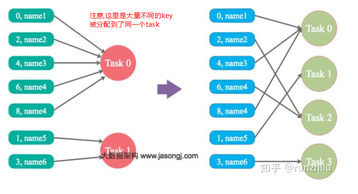
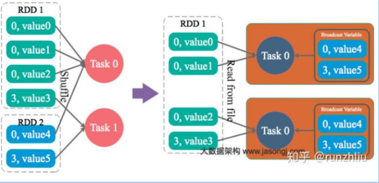
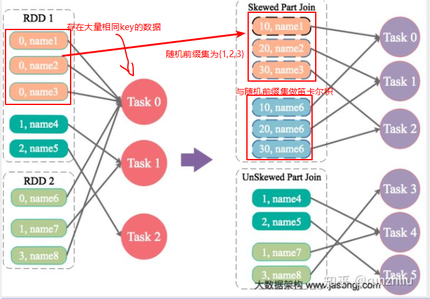
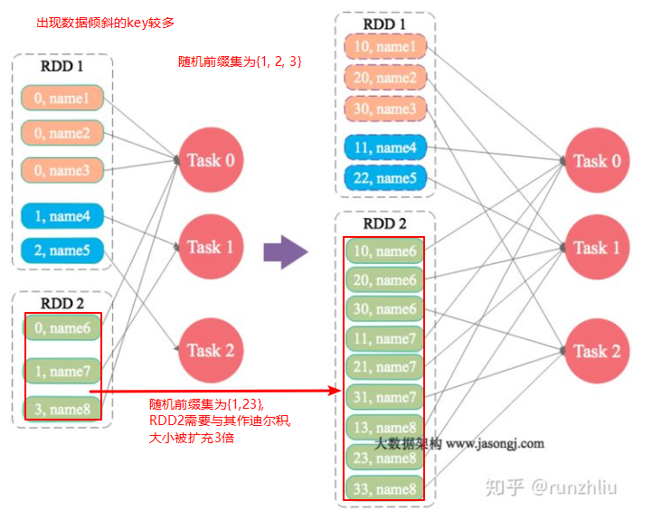
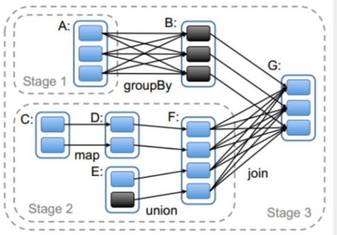

# 面试题
[https://zhuanlan.zhihu.com/p/49169166](https://zhuanlan.zhihu.com/p/49169166)
## 对于 Spark 中的数据倾斜问题你有什么好的方案
[一篇好文](http://www.jasongj.com/spark/skew/)
Spark 数据倾斜的几种解决方案:避免数据源倾斜，调整并行度，使用自定义 Partitioner，使用Map侧Join代替Reduce侧 Join(内存表合并), 给倾斜 Key 加上随机前缀等。

### 数据倾斜是如何造成的
在Spark中，同一个 Stage 的不同 Partition 可以并行处理，而具有依赖关系的不同 Stage 之间是串行处理的。
一个Stage包含N个Task,它所耗费的时间,主要由最慢的那个 Task 决定.
在排除不同计算节点计算能力差异的前提下，不同 Task 之间耗时的差异主要由该 Task 所处理的数据量决定。

### 具体解决方案 
#### 调整并行度分散同一个 Task 的不同 Key

Spark 在做 Shuffle 时，默认使用 HashPartitioner 对数据进行分区。如果并行度设置的不合适，可能造成大量
**不相同的 Key** 对应的数据被分配到了同一个 Task 上，造成该 Task 所处理的数据远大于其它 Task，从而造成数据倾斜.

-- 该方法适用于: 大量不同的key被分配到同一个Task任务的情况.

#### 自定义Partitioner
使用自定义的 Partitioner，将原本被分配到同一个 Task 的**不同 Key **分配到不同 Task.
-- 该方法适用于: 大量不同的key被分配到同一个Task任务的情况.

#### 将 Reduce side（侧） Join 转变为 Map side（侧） Join
通过 Spark 的 Broadcast 机制，将 Reduce 侧 Join 转化为 Map 侧 Join，
避免 Shuffle 从而完全消除 Shuffle 带来的数据倾斜。可以看到 RDD2 被加载到内存中了。

-- 该方法适用于: 某个RDD较小的情况

#### 为 skew 的 key 增加随机前/后缀
为数据量特别大的增加随机前/后缀，使得原来 **Key 相同的数据变为 Key 不相同** 的数据，从而使倾斜的数据集分散到不同的 Task 中，彻底解决数据倾斜问题。Join 另一则的数据中，与倾斜 Key 对应的部分数据，与随机前缀集作笛卡尔乘积，从而保证无论数据倾斜侧倾斜 Key 如何加前缀，都能与之正常 Join。

-- 该方法适用于: 数据倾斜是少量'具有大量数据的Key'引起的情况.

#### 大表随机添加 N 种随机前缀，小表扩大 N 倍
如果出现数据倾斜的 Key 比较多，上一种方法将这些大量的倾斜 Key 分拆出来，意义不大（很难一个 Key 一个 Key 都加上后缀）。此时更适合直接对存在数据倾斜的数据集全部加上随机前缀，然后对另外一个不存在严重数据倾斜的数据集整体与随机前缀集作笛卡尔乘积（即将数据量扩大 N 倍），可以看到 RDD2 扩大了 N 倍了，再和加完前缀的大数据做笛卡尔积。

-- RDD2为什么要与随机前缀集做迪卡尔积:
因为对于原来key为'0'的所有数据而言, 它们都将被分配到同一个Task0, 但对这些数据的key添加随机前缀后它们将可能会被分配到不同的Task中(新的Task数目<=随机前缀数 --- 具体得看Partitioner如何实现).为了让RDD2能正常跟添加随机前缀后的数据关联,因此需要将其与'随机前缀集'做迪卡尔积,以保证结果一致.
'
-- 该方法适用于: 数据倾斜是大量'具有大量数据的Key'引起的情况.

## RDD, DAG, Stage怎么理解？
### DAG
Spark 中使用 DAG 对 RDD 的关系进行建模，描述了 RDD 的依赖关系，这种关系也被称之为 lineage（血缘），RDD 的依赖关系使用 Dependency 维护。DAG 在 Spark 中的对应的实现为 DAGScheduler。

### RDD 
RDD 是 Spark 的灵魂，也称为弹性分布式数据集。
一个 RDD 代表一个可以被分区的只读数据集。
RDD 内部可以有许多分区(partitions)，每个分区又拥有大量的记录(records)。
**Rdd的五个特征：** 
1. dependencies: 建立 RDD 的依赖关系，主要 RDD 之间是宽窄依赖的关系，具有窄依赖关系的 RDD 可以在同一个 stage 中进行计算。 
2. partition: 一个 RDD 会有若干个分区，分区的大小决定了对这个 RDD 计算的粒度，每个 RDD 的分区的计算都在一个单独的任务中进行。 
3. preferedlocations: 按照“移动数据不如移动计算”原则，在 Spark 进行任务调度的时候，优先将任务分配到数据块存储的位置。 
4. compute: Spark 中的计算都是以分区为基本单位的，compute 函数只是对迭代器进行复合，并不保存单次计算的结果。 
5. partitioner: 只存在于（K,V）类型的 RDD 中，非（K,V）类型的 partitioner 的值就是 None。

RDD 的算子主要分成2类: transformation和action。这里的算子概念，可以理解成就是对数据集的变换。
action 会触发真正的作业提交，而 transformation 算子是不会立即触发作业提交的。
每一个 transformation 方法返回一个新的 RDD。只是某些 transformation 比较复杂，会包含多个子 transformation，因而会生成多个 RDD。这就是实际 RDD 个数比我们想象的多一些 的原因。
通常是，当遇到 action 算子时会触发一个job的提交.

### Stage 
Spark任务会根据RDD之间的依赖关系，形成一个DAG有向无环图，DAG会提交给DAGScheduler.
DAGScheduler会把DAG划分成互相依赖的多个stage,划分stage的依据就是RDD之间的宽窄依赖,遇到宽依赖就划分stage。每个stage包含一个或多个task任务，然后将这些task以taskSet的形式提交给TaskScheduler运行。

stage切割规则：从后往前，遇到宽依赖就切割stage

RDD任务切分中间分为：Application、Job、Stage和Task

Application：初始化一个SparkContext即生成一个Application；
Job：一个Action算子就会生成一个Job；
Stage：Stage等于宽依赖(ShuffleDependency)的个数加1；
Task：每个Stage的最后一个RDD的分区个数之和就是Task的个数。
注意：Application->Job->Stage->Task每一层都是1对n的关系(一个Application多个Job,一个Job多个...)。

## Map侧预聚合 & shuffle
**map侧预聚合**, 是指在每个节点本地对相同的key进行一次聚合操作,map-side预聚合之后，每个节点就只会有一条相同的key;shuffle时，节点间拉取其他节点上的相同key时，就会大大减少需要拉取的数据量，从而也就减少了磁盘IO以及网络开销。
对应到算子,建议使用reduceByKey或者aggregateByKey算子来代替groupByKey算子。
因为reduceByKey和aggregateByKey算子都会使用用户自定义的函数对每个节点本地的相同key进行预聚合。而groupByKey算子是不会进行预聚合的，全量的数据会在集群的各个节点之间分发和传输，性能相对较差。

## Spark Shuffle实现方式
[参考文档](https://zhuanlan.zhihu.com/p/70331869)

