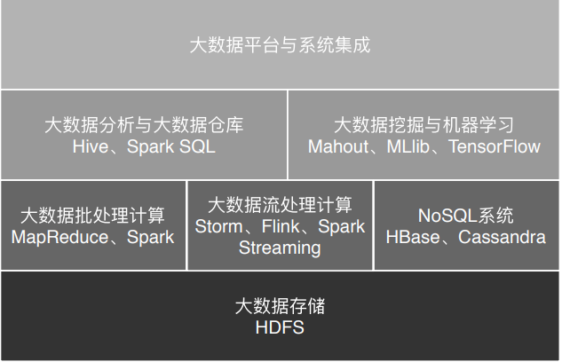

# 0_前世今生

## 大数据发展历程
不管是学习某门技术，还是讨论某个事情，最好的方式一定不是一头扎到具体细节里，而是应该从时空的角度先了解它的来龙去脉.

大数据技术:
起源于Google在2004年前后发表的三篇论文(三驾马车) [GFS,MapReduce,BigTable]
==> Doug Cutting开发的Nutch ==> 演变为Hadoop 
==> + Pig(使用类SQL进行大数据处理的脚本语言,转化成MapReduce在Hadoop上运行) 
==> + Hive(支持使用SQL语法来进行大数据计算, 转化成MapReduce在Hadoop上运行)
==> + Sqoop(将关系数据库中的数据导入导出到Hadoop平台的工具)
==> + Flume(针对大规模日志进行分布式收集,聚合和传输的工具)
==> + Spark(基于内存的大数据离线处理框架)
==> + Storm, Flink, Spark Streaminig(基于内存的大数据实时计算框架)
==> + NoSQL(HBase -- 基于HDFS的NoSQL系统)

Hadoop大数据平台:

## 大数据应用发展史

搜索引擎时代 ==> 数据仓库时代 ==> 数据挖掘时代 ==> 机器学习时代

## 大数据应用领域
* 医疗健康领域的应用
    + 医学影像智能识别
    + 病历大数据智能诊疗
* 教育领域的应用
* 社交媒体领域的应用
* 金融领域的应用
    + 大数据风控
        利用股票、外汇等历史交易记录，分析交易规律，结合当前的新闻热点、舆论倾向、
        财经数据构建交易模型，进行自动化交易，这就是金融领域的量化交易
* 新零售领域的应用
* 交通领域的应用

