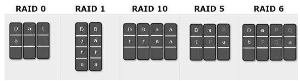
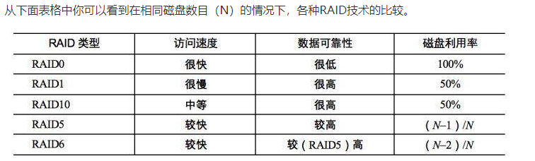

# 05_垂直伸缩&水平伸缩

如果一个文件的大小超过了一张磁盘的大小，你该如何存储？
-- 单机时代，主要的解决方案是RAID；分布式时代，主要解决方案是分布式文件系统。

## 大规模数据存储都需要解决几个核心问题

RAID（独立磁盘冗余阵列）技术是将多块普通磁盘组成一个阵列，共同对外提供服务。主要是为了改善磁盘的存储容量、读写速度，增强磁盘的可用性和容错能力。

首先，我们先假设服务器有N块磁盘.
RAID 0是数据在从内存缓冲区写入磁盘时，根据磁盘数量将数据分成N份，这些数据同时并发写入N块磁盘，使得数据整体写入速度是一块磁盘的N倍(一般达不到N倍)；读取的时候也一样，因此RAID 0具有极快的数据读写速度。但是RAID 0不做数据备份，N块磁盘中只要有一块损坏，数据完整性就被破坏，其他磁盘的数据也都无法使用了。

RAID 1是数据在写入磁盘时，将一份数据同时写入两块磁盘，这样任何一块磁盘损坏都不会导致数据丢失，插入一块新磁盘就可以通过复制数据的方式自动修复，具有极高的可靠性.

RAID可以看作是一种垂直伸缩，一台计算机集成更多的磁盘实现数据更大规模、更安全可靠的存储以及更快的访问速度。而HDFS则是水平伸缩，通过添加更多的服务器实现数据更大、更快、更安全存储与访问。

水平伸缩，在一个系统中不断添加计算机，以满足不断增长的用户和数据对计算资源的需求。这就是最近十几年引导技术潮流的分布式与大数据技术。

