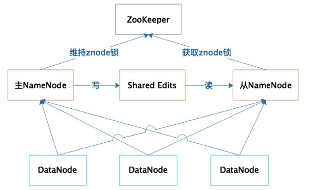

# 06_HDFS依然是存储的王者

## HDFS是如何实现大数据高速、可靠的存储和访问的?

**HDFS架构图**

HDFS的关键组件有两个:
* DataNode
    DataNode负责文件数据的存储和读写操作, HDFS将文件数据分割成若干数据块(Block),
    每个DataNode存储一部分数据块,这样文件就分布存储在整个HDFS服务器集群中(数据块是冗余存储的).
* NameNode。
    NameNode负责整个分布式文件系统的元数据(MetaData)管理. 也就是文件路径名、数据块的ID以及存储位置等信息.

-- HDFS为了保证数据的高可用, 会将一个数据块复制为多份(缺省情况为3份), 并将多份相同的数据块存储在不同的服务器上，甚至不同的机架上。这样当有磁盘损坏，或者某个DataNode服务器宕机，甚至某个交换机宕机，导致其存储的数据块不能访问的时候，客户端会查找其备份的数据块进行访问。

## HDFS的高可用设计
1. 数据存储故障容错
    对于存储在DataNode上的数据块，计算并存储校验和(CheckSum)。在读取数据的时候，重新计算读取出来的数据的校验和，如果校验不正确就抛出异常，应用程序捕获异常后就到其他DataNode上读取备份数据。

2. 磁盘故障容错
    如果DataNode监测到本机的某块磁盘损坏，就将该块磁盘上存储的所有BlockID报告给NameNode，NameNode检查这些数据块还在哪些DataNode上有备份，通知相应的DataNode服务器将对应的数据块复制到其他服务器上，以保证数据块的备份数满足要求。

3. DataNode故障容错
    DataNode会通过心跳和NameNode保持通信，如果DataNode超时未发送心跳，NameNode就会认为这个DataNode已经宕机失效，立即查找这个DataNode上存储的数据块有哪些，以及这些数据块还存储在哪些服务器上，随后通知这些服务器再复制一份数据块到其他服务器上，保证HDFS存储的数据块备份数符合用户设置的数目，即使再出现服务器宕机，也不会丢失数据。

4. NameNode故障容错
    NameNode是整个HDFS的核心，记录着HDFS文件分配表信息，所有的文件路径和数据块存储信息都保存在NameNode，如果NameNode故障，整个HDFS系统集群都无法使用；如果NameNode上记录的数据丢失，整个集群所有DataNode存储的数据也就没用了。
    -- 需要注意的是: SecondaryNameNode并不是NameNode的热备进程.SecondaryNameNode是HDFS架构中的一个组成部分。它并不是元数据节点出现问题时的备用节点，它和元数据节点负责不同的事情(SecondaryNameNode节点的主要功能是周期性将元数据节点的命名空间镜像文件和修改日志进行合并，以防日志文件过大).

**NameNode采用主从热备的方式提供高可用服务**

**在各种可能的故障情况下，如何保证整个软件系统依然是可用的**:
一般说来，常用的保证系统可用性的策略有冗余备份、失效转移和降级限流。
**失效转移你应该注意的是失效的鉴定**, 像NameNode这样主从服务器管理同一份数据的场景，如果从服务器错误地以为主服务器宕机而接管集群管理, 会出现主从服务器一起对DataNode发送指令，进而导致集群混乱，也就是所谓的“脑裂”。

