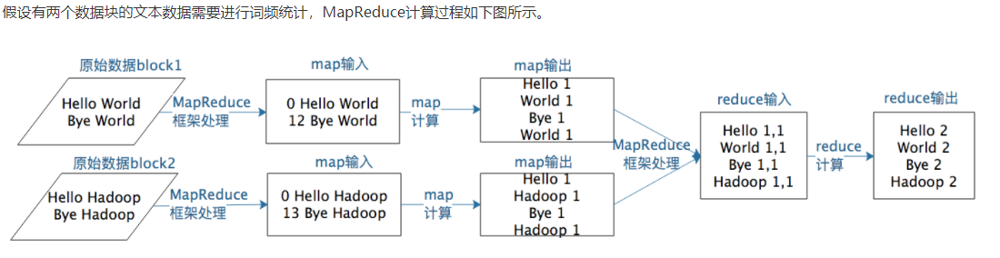
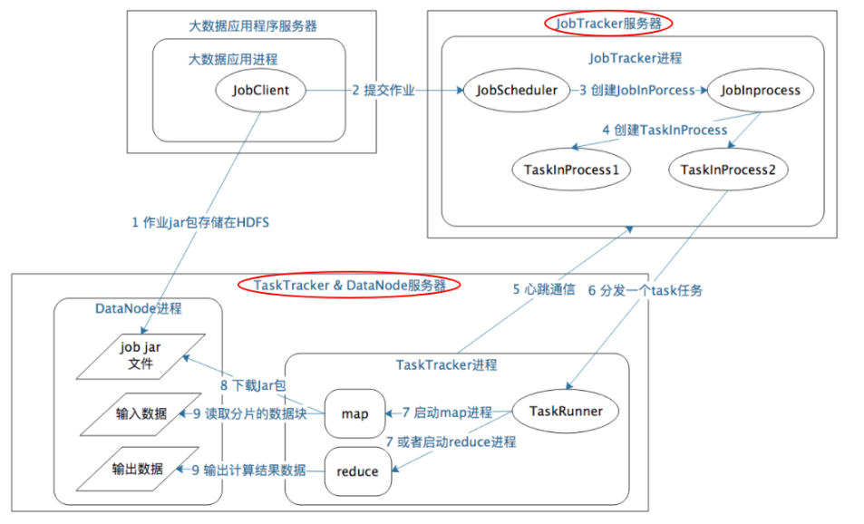
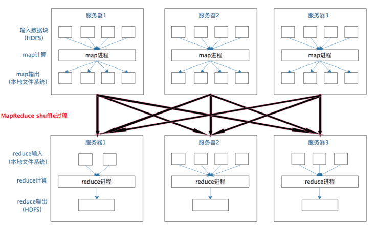
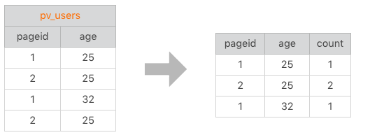
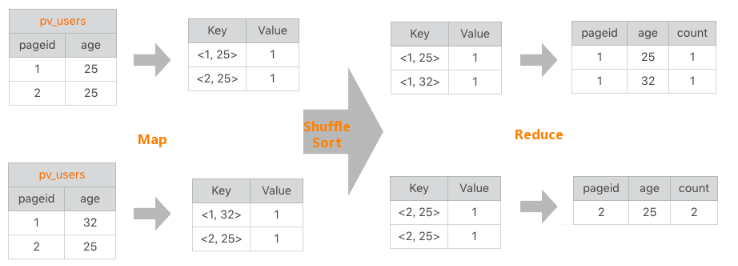

# 07_MapReduce既是编程模型又是计算框架

## MapReduce编程模型
开发人员必须基于MapReduce编程模型进行编程开发, 然后将程序通过MapReduce计算框架分发到Hadoop集群中运行。我们先看一下作为编程模型的MapReduce。

MapReduce编程模型只包含Map和Reduce两个过程; 
map的主要输入是一对<Key, Value>值, 经过map计算后输出一对<Key, Value>值；
然后将相同Key合并, 形成<Key, Value集合>；
再将这个<Key, Value集合>输入reduce，经过计算输出零个或多个<Key, Value>对。




## MapReduce计算框架是如何运作的
MapReduce编程模型将大数据计算过程切分为Map和Reduce两个阶段; 在Map阶段为每个数据块分配一个Map计算任务; 然后将所有map输出的Key进行合并，相同的Key及其对应的Value发送给同一个Reduce任务去处理。通过这两个阶段，工程师只需要遵循MapReduce编程模型就可以开发出复杂的大数据计算程序。

**在实践中，这个过程有两个关键问题需要处理**:
* 如何为每个数据块分配一个Map计算任务, 也就是代码是如何发送到数据块所在服务器的, 发送后是如何启动的，启动以后如何知道自己需要计算的数据在文件什么位置（BlockID是什么）。

* 处于不同服务器的map输出的<Key, Value> ，如何把相同的Key聚合在一起发送给Reduce任务进行处理。


### MapReduce作业启动和运行机制
我们以Hadoop1.x为例，MapReduce运行过程涉及三类关键进程:
1. **大数据应用进程**: 由用户启动的MapReduce程序进程(比如WordCount程序)。
    这类进程是启动MapReduce程序的主入口，主要是指定Map和Reduce类、输入输出文件路径等，并提交作业给Hadoop集群(JobTracker进程)。

2. **JobTracker进程**: 管理整个作业生命周期的任务调度和监控. 
    这类进程根据要处理的输入数据量，命令TaskTracker进程启动相应数量的Map和Reduce进程任务,并管理整个作业生命周期的任务调度和监控。
    这是Hadoop集群的常驻进程. 需要注意的是，JobTracker进程在整个Hadoop集群全局唯一。

3. **TaskTracker进程**: 这个进程负责启动和管理Map进程以及Reduce进程。
    因为需要每个数据块都有对应的map函数, TaskTracker进程通常和HDFS的DataNode进程启动在同一个服务器(也就是说，Hadoop集群中绝大多数服务器同时运行DataNode进程和TaskTracker进程)。

JobTracker进程和TaskTracker进程是主从关系，主服务器通常只有一台（或者另有一台备机提供高可用服务，但运行时只有一台服务器对外提供服务，真正起作用的只有一台），从服务器可能有几百上千台，所有的从服务器听从主服务器的控制和调度安排。主服务器负责为应用程序分配服务器资源以及作业执行的调度，而具体的计算操作则在从服务器上完成。



如果我们把这个计算过程看作一次小小的旅行，这个旅程可以概括如下：
1. 应用进程JobClient将用户作业JAR包存储在HDFS中，将来这些JAR包会分发给Hadoop集群中的服务器执行MapReduce计算。
2. 应用程序提交job作业给JobTracker。
3. JobTracker根据作业调度策略创建JobInProcess树，每个作业都会有一个自己的JobInProcess树。
4. JobInProcess根据输入数据分片数目（通常情况就是数据块的数目）和设置的Reduce数目创建相应数量的TaskInProcess。
5. TaskTracker进程和JobTracker进程进行定时通信。
6. 如果TaskTracker有空闲的计算资源（有空闲CPU核心），JobTracker就会给它分配任务。分配任务的时候会根据TaskTracker的服务器名字匹配在同一台机器上的数据块计算任务给它，使启动的计算任务正好处理本机上的数据，以实现我们一开始就提到的“移动计算比移动数据更划算”。
7. TaskTracker收到任务后根据任务类型（是Map还是Reduce）和任务参数（作业JAR包路径、输入数据文件路径、要处理的数据在文件中的起始位置和偏移量、数据块多个备份的DataNode主机名等），启动相应的Map或者Reduce进程。
8. Map或者Reduce进程启动后，检查本地是否有要执行任务的JAR包文件，如果没有，就去HDFS上下载，然后加载Map或者Reduce代码开始执行。
9. 如果是Map进程，从HDFS读取数据（通常要读取的数据块正好存储在本机）；如果是Reduce进程，将结果数据写出到HDFS。

### MapReduce数据合并与连接机制
MapReduce计算真正产生奇迹的地方是数据的合并与连接。

在map输出与reduce输入之间, MapReduce计算框架处理数据合并与连接操作,这个操作有个专门的词汇叫shuffle.



**Note**: 每个Map任务的计算结果都会写入到本地文件系统，等Map任务快要计算完成的时候，MapReduce计算框架会启动shuffle过程，在Map任务进程调用一个Partitioner接口，对Map产生的每个<Key, Value>进行Reduce分区选择，然后通过HTTP通信发送给对应的Reduce进程。这样不管Map位于哪个服务器节点，相同的Key一定会被发送给相同的Reduce进程。Reduce任务进程对收到的<Key, Value>进行排序和合并，相同的Key放在一起，组成一个<Key, Value集合>传递给Reduce执行。

**分布式计算需要将不同服务器上的相关数据合并到一起进行下一步计算，这就是shuffle。**

shuffle也是整个MapReduce过程中最难、最消耗性能的地方.


## 问题

使用MapReduce实现如下SELECT功能:
SELECT pageid, age, count(1) FROM pv_users GROUP BY pageid, age;



```python
rdd = sc.textFile('./text.txt')
rdd.map(lambda row:row.split(','))\
   .map(lambda x: ((x[0], x[1]), 1))\
   .reduceByKey(lambda v1, v2: v1+v2).collect()
```


