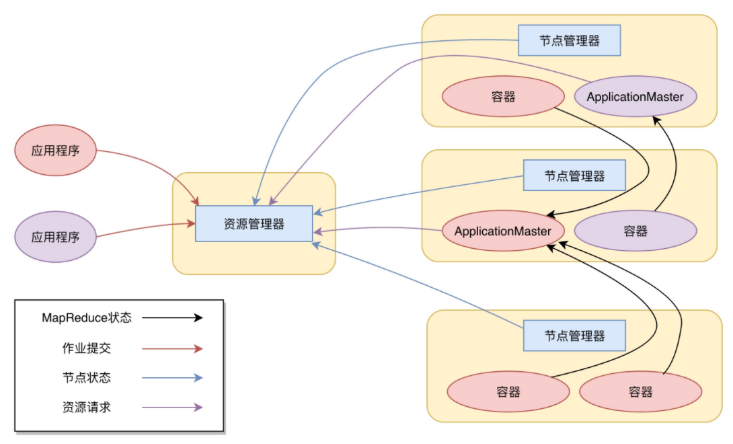

# 09_Yarn资源调度框架

Hadoop主要是由三部分组成,: 分布式文件系统HDFS、分布式计算框架MapReduce，分布式集群资源调度框架Yarn。

在Hadoop1.x中，在MapReduce应用程序的启动过程中，任务的分配和资源的调度过程主要是通过TaskTracker和JobTracker通信来完成。这种架构方案的主要缺点是，服务器集群资源调度管理和MapReduce执行过程耦合在一起，如果想在当前集群中运行其他计算任务，比如Spark或者Storm，就无法统一使用集群中的资源了。

**Yarn的架构**

**Yarn包括两个部分(也是Yarn的两种主要进程)**：
* 资源管理器(Resource Manager)
    负责整个集群的资源调度管理，通常部署在独立的服务器上.
    资源管理器又包括两个主要组件：
        + 调度器
            调度器其实就是一个资源分配算法. Yarn进行资源分配的单位是容器(Container)，容器由NodeManager进程启动和管理, NodeManger进程会监控本节点上容器的运行状况并向ResourceManger进程汇报。
        + 应用程序管理器
            应用程序管理器负责应用程序的提交、监控应用程序运行状态等。应用程序启动后需要在集群中运行一个ApplicationMaster; ApplicationMaster也需要运行在容器里面。每个应用程序启动后都会先启动自己的ApplicationMaster, 由ApplicationMaster根据应用程序的资源需求进一步向ResourceManager进程申请容器资源，得到容器以后就会分发自己的应用程序代码到容器上启动，进而开始分布式计算。
* 节点管理器(Node Manager)
    负责具体服务器上的资源和任务管理,在集群的每一台计算服务器上都会启动,基本上跟HDFS的DataNode进程一起出现。

**我们以一个MapReduce程序为例，来看一下Yarn的整个工作流程**:
1. 我们向Yarn提交应用程序; 包括MapReduce ApplicationMaster、我们的MapReduce程序，以及MapReduce Application启动命令。

2. ResourceManager进程和NodeManager进程通信，根据集群资源，为用户程序分配第一个容器，并将MapReduce ApplicationMaster分发到这个容器上面，并在容器里面启动MapReduce ApplicationMaster。

3. MapReduce ApplicationMaster启动后立即向ResourceManager进程注册，并为自己的应用程序申请容器资源。

4. MapReduce ApplicationMaster申请到需要的容器后，立即和相应的NodeManager进程通信，将用户MapReduce程序分发到NodeManager进程所在服务器，并在容器中运行，运行的就是Map或者Reduce任务。

5. Map或者Reduce任务在运行期和MapReduce ApplicationMaster通信，汇报自己的运行状态，如果运行结束，MapReduce ApplicationMaster向ResourceManager进程注销并释放所有的容器资源。

大数据计算框架需要开发遵循Yarn规范的ApplicationMaster，才可以在Yarn集群中使用Yarn的统一资源调度管理。

