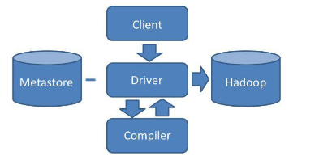
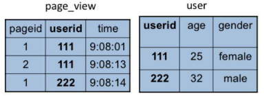
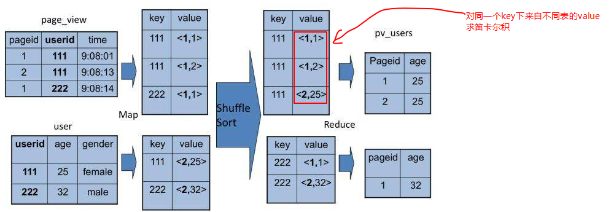

# 11_Hive是如何让MapReduce实现SQL操作的
Hive能够直接处理我们输入的SQL语句（Hive的SQL语法和数据库标准SQL略有不同），调用MapReduce计算框架完成数据分析操作。

## Hive的架构

我们通过Hive的Client（Hive的命令行工具，JDBC等）向Hive提交SQL命令。
如果是创建数据表的DDL(数据定义语言)，Hive就会通过执行引擎Driver将数据表的信息记录在Metastore元数据组件中，这个组件通常用一个关系数据库实现，记录表名、字段名、字段类型、关联HDFS文件路径等这些数据库的Meta信息（元信息）。

如果我们提交的是查询分析数据的DQL（数据查询语句），Driver就会将该语句提交给自己的编译器Compiler进行语法分析、语法解析、语法优化等一系列操作，最后生成一个MapReduce执行计划。然后根据执行计划生成一个MapReduce的作业，提交给Hadoop MapReduce计算框架处理。

## Hive如何实现join操作

这两张表都有一个相同的字段userid，根据这个字段可以将两张表连接起来，生成前面例子的pv_users表，SQL命令是
SELECT pv.pageid, u.age FROM page_view pv JOIN user u ON (pv.userid = u.userid);
同样，这个SQL命令也可以转化为MapReduce计算，连接的过程如下图所示。

从图上看，join的MapReduce计算过程和前面的group by稍有不同，因为join涉及两张表，来自两个文件（夹），所以需要在map输出的时候进行标记，比如来自第一张表的输出Value就记录为<1, X>(这里的1表示数据来自第一张表)。这样经过shuffle以后，相同的Key被输入到同一个reduce函数，就可以根据表的标记对Value数据求笛卡尔积，用第一张表的每条记录和第二张表的每条记录连接，输出就是join的结果。
我们如果打开Hive的源代码，看join相关的代码，会看到一个两层for循环，对来自两张表的记录进行连接操作。

