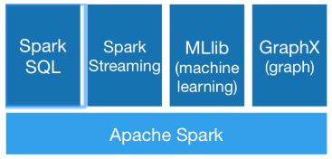

# 12_Spark的出现让MapReduce显得速度慢

我们常常意识不到问题的存在，直到有人解决了这些问题。

RDD作为Spark的编程模型。
大数据计算就是在大规模的数据集上进行一系列的数据计算处理。
MapReduce针对输入数据，将计算过程分为两个阶段; 一个Map阶段，一个Reduce阶段，可以理解成是面向过程的大数据计算。在用MapReduce编程的时候，思考的是，如何将计算逻辑用Map和Reduce两个阶段实现，map和reduce函数的输入和输出是什么。

而Spark则直接针对数据进行编程，将大规模数据集合抽象成一个RDD对象，然后在这个RDD上进行各种计算处理，得到一个新的RDD，继续计算处理，直到得到最后的结果数据。所以Spark可以理解成是面向对象的大数据计算。我们在进行Spark编程的时候，思考的是一个RDD对象需要经过什么样的操作，转换成另一个RDD对象，思考的重心和落脚点都在RDD上。

## RDD上定义的函数分两种
一种是转换（transformation）函数，这种函数的返回值还是RDD；
另一种是执行（action）函数，这种函数不再返回RDD。

跟MapReduce一样，Spark也是对大数据进行分片计算; Spark分布式计算的数据分片、任务调度都是以RDD为单位展开的，每个RDD分片都会分配到一个执行进程去处理。

## RDD上的转换操作又分成两种:
**一种转换操作产生的RDD不会出现新的分片**; 比如map、filter等.
RDD1 ==map/filter==>RDD2, RDD1与RDD2的分片是一样的(即所有的key经过转换后分区的排布与原来一致)。实际上，Spark并不是按照代码写的操作顺序去生成RDD，比如rdd2 = rdd1.map(func)这样的代码并不会在物理上生成一个新的RDD。物理上，Spark只有在产生新的RDD分片时候，才会真的生成一个RDD，Spark的这种特性也被称作惰性计算。

**另一种转换操作产生的RDD则会产生新的分片**; 比如reduceByKey，来自不同分片的相同Key必须聚合在一起进行操作，这样就会产生新的RDD分片。实际执行过程中，是否会产生新的RDD分片，并不是根据转换函数名就能判断出来的。

Note: Spark应用程序代码中的RDD和Spark执行过程中生成的物理RDD不是一一对应的，RDD在Spark里面是一个非常灵活的概念。

