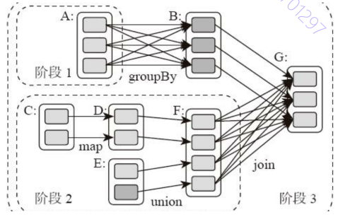
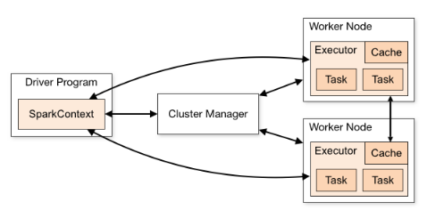

[toc]
# 13_Spark架构原理
Spark可以根据应用的复杂程度, 分割成更多的计算阶段（stage），这些计算阶段组成一个有向无环图DAG，Spark任务调度器可以根据DAG的依赖关系执行计算阶段。

下面这张图描述了一个典型的Spark运行DAG的不同阶段

负责Spark应用DAG生成和管理的组件是DAGScheduler，DAGScheduler根据程序代码生成DAG，然后将程序分发到分布式计算集群，按计算阶段的先后关系调度执行。

## Spark划分计算阶段的依据是什么呢
一个数据集中的多个数据分片需要进行分区传输，写入到另一个数据集的不同分片中，这种数据分区交叉传输的操作就是shuffle过程(即父RDD中分区的数据被传输到了子RDD中的多个分区).
**计算阶段划分的依据是shuffle**.
Spark也需要通过shuffle将数据进行重新组合，相同Key的数据放在一起，进行聚合、关联等操作，因而每次shuffle都产生新的计算阶段。这也是为什么计算阶段会有依赖关系，它需要的数据来源于前面一个或多个计算阶段产生的数据，必须等待前面的阶段执行完毕才能进行shuffle，并得到数据。

**宽依赖&窄依赖**
不需要进行shuffle的依赖，在Spark里被称作窄依赖. 如上图中的 C==>D 或 B==>G
需要进行shuffle的依赖，被称作宽依赖. 如上图中的 A==>B 或 F==>G

Spark可以算作是一种MapReduce计算模型的不同实现, 它将前一个的Reduce和后一个的Map连接起来，当作一个阶段持续计算. 这种多个计算阶段依赖执行的方案可以有效减少对HDFS的访问，减少作业的调度执行次数，因此执行速度也更快。
另外Hadoop MapReduce主要使用磁盘存储shuffle过程中的数据，Spark优先使用内存进行数据存储。

## Spark的作业管理

Spark里面的RDD函数有两种:
一种是转换函数，调用以后得到的还是一个RDD，RDD的计算逻辑主要通过转换函数完成
另一种是action函数，调用以后不再返回RDD

Spark的DAGScheduler在遇到shuffle的时候，会生成一个计算阶段，在遇到action函数的时候，会生成一个作业（job）。

## Spark的执行过程

1. Spark应用程序启动在自己的JVM进程里，即Driver进程，启动后调用SparkContext初始化执行配置和输入数据。SparkContext启动DAGScheduler构造执行的DAG图，切分成最小的执行单位也就是计算任务。

2. Driver向Cluster Manager请求计算资源，用于DAG的分布式计算。Cluster Manager收到请求以后，将Driver的主机地址等信息通知给集群的所有计算节点Worker。

3. Worker收到信息以后，根据Driver的主机地址，跟Driver通信并注册，然后根据自己的空闲资源向Driver通报自己可以领用的任务数。Driver根据DAG图开始向注册的Worker分配任务。

4. Worker收到任务后，启动Executor进程开始执行任务。Executor先检查自己是否有Driver的执行代码，如果没有，从Driver下载执行代码，通过Java反射加载后开始执行。

