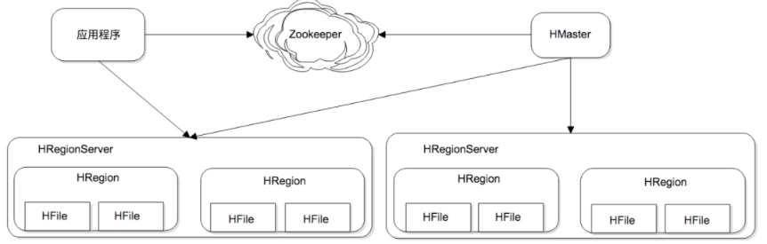
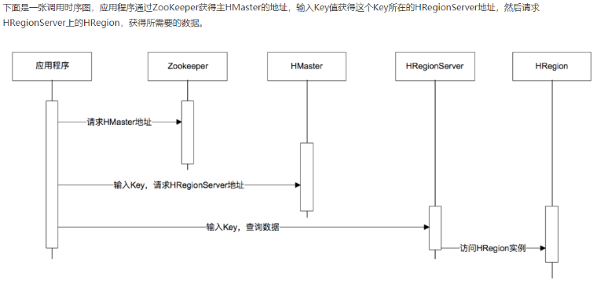

# 14_HBase
[toc]

Base为可伸缩海量数据储存而设计，实现面向在线业务的实时数据访问延迟。

## HBase可伸缩架构
HBase的伸缩性主要依赖其可分裂的HRegion及可伸缩的分布式文件系统HDFS实现。

HRegion是HBase负责数据存储的主要进程，应用程序对数据的读写操作都是通过和HRegion通信完成。数据以HRegion为单位进行管理，应用程序如果想要访问一个数据，必须先找到HRegion，然后将数据读写操作提交给HRegion，由 HRegion完成存储层面的数据操作。

RegionServer是物理服务器，每个HRegionServer上可以启动多个HRegion实例。当一个 HRegion中写入的数据太多，达到配置的阈值时，一个HRegion会分裂成两个HRegion，并将HRegion在整个集群中进行迁移，以使HRegionServer的负载均衡。

每个HRegion中存储一段Key值区间[key1, key2)的数据; 所有HRegion的信息，包括存储的Key值区间、所在HRegionServer地址、访问端口号等，都记录在HMaster服务器上。
为了保证HMaster的高可用，HBase会启动多个HMaster，并通过ZooKeeper选举出一个主服务器。

基于列族的数据结构设计的可扩展数据模型.
架构上通过数据分片的设计配合HDFS，实现了数据的分布式海量存储；数据结构上通过列族的设计，实现了数据表结构可以在运行期自定义；存储上通过LSM树的方式，使数据可以通过连续写磁盘的方式保存数据，极大地提高了数据写入性能。

