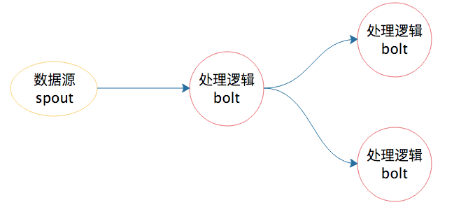
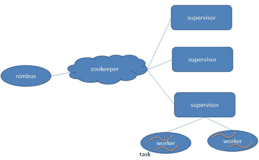
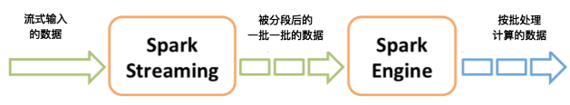
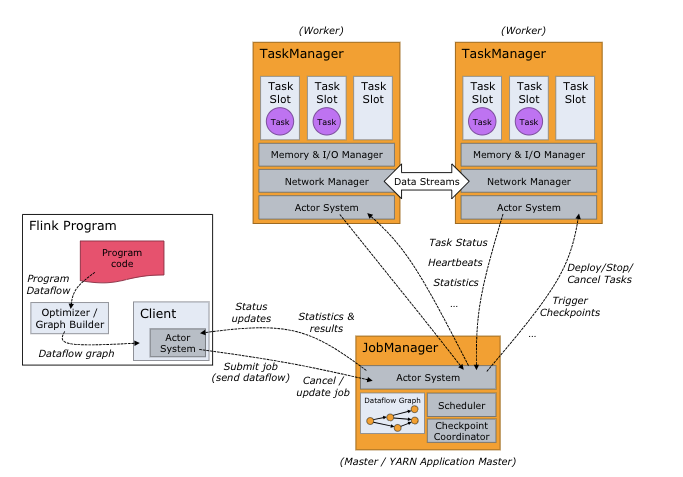

# 15_流式计算_Storm_Flink_SparkStreaming
[toc]

## Storm
流数据处理过程


开发者无需关注数据的流转、消息的处理和消费，只要编程开发好数据处理的逻辑bolt和数据源的逻辑spout，以及它们之间的拓扑逻辑关系toplogy，提交到Storm上运行就可以了。


Storm也是主从架构

nimbus是集群的Master，负责集群管理、任务分配等.
supervisor是Slave，是真正完成计算的地方，每个supervisor启动多个worker进程，每个worker上运行多个task，而task就是spout或者bolt。
supervisor和nimbus通过ZooKeeper完成任务分配、心跳检测等操作。


## Spark Streaming
Spark Streaming巧妙地利用了Spark的分片和快速计算的特性，将实时传输进来的数据按照时间进行分段，把一段时间传输进来的数据合并在一起，当作一批数据，再去交给Spark去处理。下图这张图描述了Spark Streaming将数据分段、分批的过程。



## Flink
Flink就是按照流处理计算去设计的。当把从文件系统（HDFS）中读入的数据也当做数据流看待，他就变成批处理系统了。
Flink既可以流处理又可以批处理:
进行流计算时，Flink会初始化一个流执行环境StreamExecutionEnvironment，然后利用这个执行环境构建数据流DataStream。
```
StreamExecutionEnvironment see = StreamExecutionEnvironment.getExecutionEnvironment();

DataStream<WikipediaEditEvent> edits = see.addSource(new WikipediaEditsSource());
```

进行批处理计算时，Flink会初始化一个批处理执行环境ExecutionEnvironment，然后利用这个环境构建数据集DataSet。
```
ExecutionEnvironment env = ExecutionEnvironment.getExecutionEnvironment();

DataSet<String> text = env.readTextFile("/path/to/file");
```
不管是流处理还是批处理，Flink运行时的执行引擎是相同的，只是数据源不同而已。

### Flink的架构



