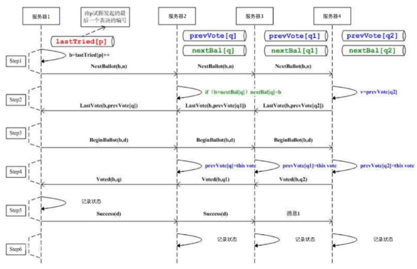

# 16_ZooKeeper是如何保证数据一致性的
分布式系统一致性与ZooKeeper的架构

"脑裂": 主从结构的集群中的Master存在主备时,如果多个应用程序对于哪台服务器是主服务器的判断不同，就会出现两连接到不同的Master中的情况，会导致集群混乱 -- 这就是"脑裂"。
那我们引入一个专门进行判断的服务器当"裁判"，让"裁判"决定哪个服务器是主服务器不就完事了吗？
我们比较常用的多台服务器状态一致性的解决方案就是ZooKeeper。

因为大数据系统通常都是主从架构，主服务器管理集群的状态和元信息（meta-info），为了保证集群状态一致防止"脑裂"，所以运行期只能有一个主服务器工作（active master），但是为了保证高可用，必须有另一个主服务器保持热备（standby master）。那么应用程序和集群其他服务器如何才能知道当前哪个服务器是实际工作的主服务器呢？
所以很多大数据系统都依赖ZooKeeper提供的一致性数据服务，用于选举集群当前工作的主服务器。一台主服务器启动后向ZooKeeper注册自己为当前工作的主服务器，因此另一台服务器就只能注册为热备主服务器，应用程序运行期都和当前工作的主服务器通信。

Paxos算法就是用来解决这类问题的，多台服务器通过内部的投票表决机制决定一个数据的更新与写入

