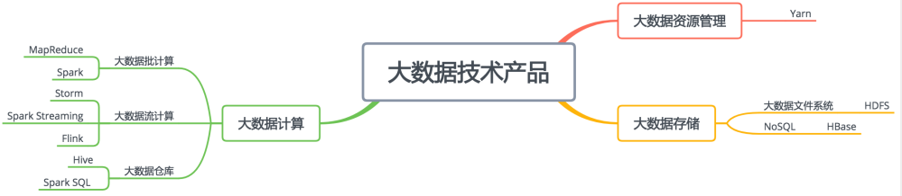

# 17_各大数据技术的应用场景

大数据技术我们可以分为存储、计算、资源管理三大类

最基本的存储技术是HDFS
HBase作为NoSQL类非关系数据库的代表性产品,它的底层存储也用到了HDFS.
大数据计算框架最早是MapReduce; 但目前用的最多的是Spark. -- 实际上更多是通过Hive或者Spark SQL进行.
MapReduce、Spark、Hive、Spark SQL这些技术主要用来解决离线大数据的计算; 而Storm、Spark Streaming、Flink这类的大数据技术是针对实时的数据进行计算.

这些技术在实际部署的时候，通常会部署在同一个集群中，也就是说，在由很多台服务器组成的服务器集群中，某台服务器可能运行着HDFS的DataNode进程，负责HDFS的数据存储；同时也运行着Yarn的NodeManager，负责计算资源的调度管理；而MapReduce、Spark、Storm、Flink这些批处理或者流处理大数据计算引擎则通过Yarn的调度，运行在NodeManager的容器（container）里面。至于Hive、Spark SQL这些运行在MapReduce或者Spark基础上的大数据仓库引擎，在经过自身的执行引擎将SQL语句解析成MapReduce或者Spark的执行计划以后，一样提交给Yarn去调度执行。

相对比较特殊的是HBase，作为一个NoSQL存储系统，HBase的应用场景是满足在线业务数据存储访问需求，通常是OLTP（在线事务处理）系统的一部分，为了保证在线业务的高可用和资源独占性，一般是独立部署自己的集群，和前面的Hadoop大数据集群分离部署。

