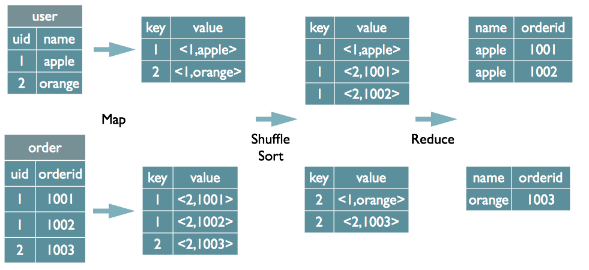
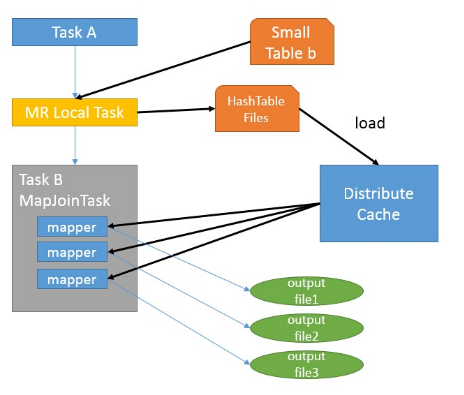

# 18_从原理上看待问题


被动接受总是困难的。但如果从开发者的视角看，很多东西就豁然开朗了，明白了原理，有时甚至不需要学习，顺着原理就可以推导出各种实现细节。


## 问题
**MapReduce实现数据库的join操作**?
Hive中的Join可分为Common Join(Reduce阶段完成join)和Map Join(Map阶段完成join):

**Common Join**
```
select u.name, o.orderid from order o join user u on o.uid = u.uid;
```
Map阶段
读取源表的数据，Map输出时候以Join on条件中的列为key，如果Join有多个关联键，则以这些关联键的组合作为key;
Map输出的value为join之后所关心的(select或者where中需要用到的)列；同时在value中还会包含表的Tag信息，用于标明此value对应哪个表；
按照key进行排序

Shuffle阶段
根据key的值进行hash,并将key/value按照hash值推送至不同的reduce中，这样确保两个表中相同的key位于同一个reduce中

Reduce阶段
根据key的值完成join操作，期间通过Tag来识别不同表中的数据。



**Map Join**
MapJoin通常用于一个很小的表和一个大表进行join的场景，具体小表有多小，由参数hive.mapjoin.smalltable.filesize来决定，该参数表示小表的总大小，默认值为25000000字节，即25M。
Hive0.7之前，需要使用hint提示 /+ mapjoin(table) /才会执行MapJoin,否则执行Common Join; 但在0.7版本之后，默认自动会转换Map Join，由参数hive.auto.convert.join来控制，默认为true.


如图中的流程，首先是Task A，它是一个Local Task（在客户端本地执行的Task），负责扫描小表b的数据，将其转换成一个HashTable的数据结构，并写入本地的文件中，之后将该文件加载到DistributeCache中.
接下来是Task B，该任务是一个没有Reduce的MR，启动MapTasks扫描大表a,在Map阶段，根据a的每一条记录去和DistributeCache中b表对应的HashTable关联，并直接输出结果。
由于MapJoin没有Reduce，所以由Map直接输出结果文件，有多少个Map Task，就有多少个结果文件。
