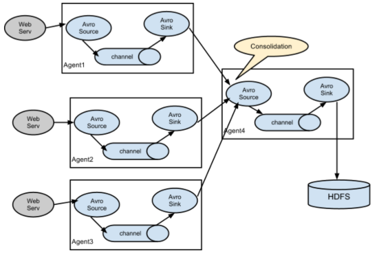

# 27_大数据从哪里来
大数据平台的数据来源主要有数据库、日志、前端程序埋点、爬虫系统。

**从数据库导入**
sqoop适合关系数据库数据的批量导入，如果想实时导入关系数据库的数据，可以选择Canal。

Sqoop是一个数据库批量导入导出工具，可以将关系数据库的数据批量导入到Hadoop，也可以将Hadoop的数据导出到关系数据库。

Sqoop数据导入命令示例如下
```
sqoop import --connect jdbc:mysql://localhost/db --username foo --password --table TEST
```


Canal是阿里巴巴开源的一个MySQL binlog获取工具，binlog是MySQL的事务日志，可用于MySQL数据库主从复制，Canal将自己伪装成MySQL从库，从MySQL获取binlog。

而我们只要开发一个Canal客户端程序就可以解析出来MySQL的写操作数据，将这些数据交给大数据流计算处理引擎，就可以实现对MySQL数据的实时处理了

**从日志文件导入**
Flume是大数据日志收集常用的工具


Flume收集日志的核心组件是Flume Agent，负责将日志从数据源收集起来并保存到大数据存储设备.
Agent Source负责收集日志数据，支持从Kafka、本地日志文件、Socket通信端口、Unix标准输出、Thrift等各种数据源获取日志数据。

Source收集到数据后，将数据封装成event事件，发送给Channel。Channel是一个队列，有内存、磁盘、数据库等几种实现方式，主要用来对event事件消息排队，然后发送给Sink。

Sink收到数据后，将数据输出保存到大数据存储设备，比如HDFS、HBase等。Sink的输出可以作为Source的输入，这样Agent就可以级联起来，依据具体需求，组成各种处理结构，比如下图的结构。


也可以将多个Agent输出汇聚到一个Agent，还可以将一个Agent输出路由分发到多个Agent，根据实际需求灵活组合。



**前端埋点采集**
所谓前端埋点，就是应用前端为了进行数据统计和分析而采集数据。
埋点的方式主要有手工埋点和自动化埋点:
手工埋点就是前端开发者手动编程将需要采集的前端数据发送到后端的数据采集系统.
自动化埋点则是通过一个前端程序SDK，自动收集全部用户操作事件，然后全量上传到后端服器(实际上是全埋点)。


**爬虫系统**


