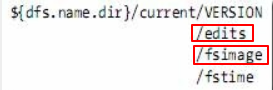
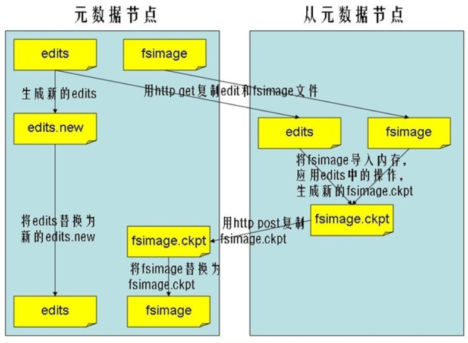

# 杂项

## SecondaryNameNode
[参考](https://www.cnblogs.com/likehua/p/4023777.html)
在启动Hadoop时，NameNode节点上会默认启动一个SecondaryNameNode进程，使用JSP命令可以查看到.
需要注意的是SecondaryNameNode并不是NameNode的热备进程
SecondaryNameNode是HDFS架构中的一个组成部分。它并不是元数据节点出现问题时的备用节点，它和元数据节点负责不同的事情。

### SecondaryNameNode节点的用途
SecondaryNameNode节点的主要功能是周期性将元数据节点的命名空间镜像文件和修改日志进行合并，以防日志文件过大。

### NameNode节点的主要工作
NameNode的主要功能之一是用来管理文件系统的命名空间, 其将所有的文件和文件目录的元数据保存在一个文件系统树中。为了保证交互速度，NameNode会在内存中保存这些元数据信息，但同时也会将这些信息保存到硬盘上进行持久化存储.
通常会被保存成以下文件：命名空间镜像文件（fsimage）和修改日志文件（edits）。
下图是NameNode节点上的文件目录结构：

fsimage文件: 即命名空间映像文件,是内存中的元数据在硬盘上的checkpoint,它是一种序列化的格式,并不能够在硬盘上直接修改。

有了这两个文件后,Hadoop在重启时就可以根据这两个文件来进行状态恢复,fsimage相当于一个checkpoint，所以当Hadoop重启时需要两个文件：fsimage+edits. 首先将最新的checkpoint的元数据信息从fsimage中加载到内存，然后逐一执行edits修改日志文件中的操作以恢复到重启之前的最终状态(类似全量备份和增量备份).

Hadoop的持久化过程是将上一次checkpoint以后最近一段时间的操作保存到修改日志文件edits中。

**这里出现的一个问题是edits会随着时间增加而越来越大**, 导致以后重启时需要花费很长的时间来按照edits中记录的操作进行恢复。所以Hadoop用到了SecondaryNameNode，它就是用来帮助元数据节点将内存中的元数据信息checkpoint到硬盘上的。

### SecondaryNameNode工作流程：
1. SecondaryNameNode节点通知NameNode节点生成新的日志文件，以后的日志都写到新的日志文件中.
2. SecondaryNameNode节点用http get从NameNode节点获得fsimage文件及旧的日志文件。
3. SecondaryNameNode节点将fsimage文件加载到内存中,并执行日志文件中的操作,然后生成新的fsimage文件。
4. SecondaryNameNode节点将新的fsimage文件用http post传回NameNode节点上。\
5. NameNode节点可以将旧的fsimage文件及旧的日志文件，换为新的fsimage文件和新的日志文件(第一步生成的)，然后更新fstime文件，写入此次checkpoint的时间。
6. 这样NameNode节点中的fsimage文件保存了最新的checkpoint的元数据信息，日志文件也重新开始，不会变的很大了。

**流程图如下所示**

