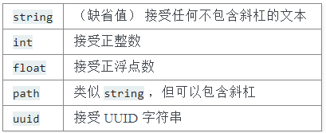

# Flask_study
一个 Flask 应用是一个 Flask 类的实例。应用的所有东西（例如配置 和 URL ）都会和这个实例一起注册。

设置环境变量: FLASK_APP=hello.py
启动flask: flask run

``` # hello.py
from flask import Flask # 导入flask类
app = Flask(__name__) # 创建flask实例

@app.route('/hello/<string:name>/', methods=['GET', 'POST'])
def hello(name):
    if request.method == 'POST':
        return 'POST: Hello, {}!'.format(name)
    else:
        return 'GET: Hello, {}!'.format(name)

@app.route('/projects/') # 可以对不是以'/'结尾的url进行重定向. url:"http://IP:Port/about/projects/"--ok; "IP:Port/projects"--ok
def projects():
    return 'The project page'

@app.route('/about') # 不能对不是以'/'结尾的url进行重定向. "IP:Port/projects"--Error:404
def about():
    return 'The about page'
```


**在URL中使用变量**:
将 URL 的一部分标记为 <variable_name> 就可以在 URL 中添加变量。标记的部分会作为关键字参数传递给函数。
标记变量格式:<converter:variable_name>
**转换器类型**:
    

# Note
1. 建议所有路由URL以'/'结尾.

# 重点函数:
1. app.route() -- URL路由装饰器
     功能与app.add_url_rule()相同
 2. url_for() --用于构建指定函数的URL.
``` #
@app.route('/user/<username>/')
def profile(username):
    return 'username: {}'.format(escape(username))

url_for('profile', username='gjy') # ==> '/user/gjy/'
```


#  Jinja2 模板文档 
pass


# flask中一般使用flask-sqlalchemy来操作数据库
