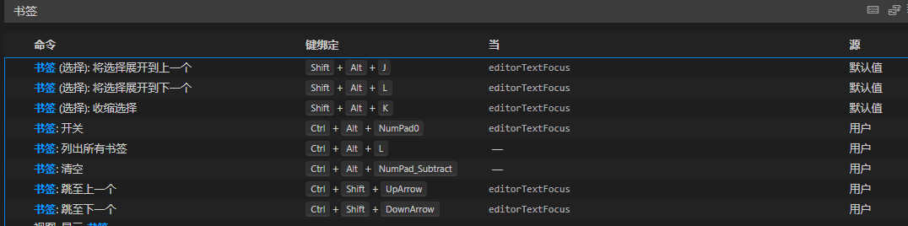

# 开发工具
## VSCode
代码格式化配置: python.formatting.provider
    YAPF

### 折叠&展开
折行显示: Alt+Z
上一个编辑位置：atl + p
切换折叠: alt+=
全部折叠/：alt+0
折叠级别1：alt+1
折叠级别2:  alt+2
递归折叠: alt+r

全部展开: alt+shift+0
递归展开:  alt+shift+r

### 跳转
alt+left, alt+right

书签插件：Bookmarks

### 大小写转换
ctrl+u, ctrl+l

