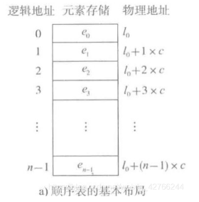
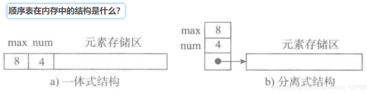
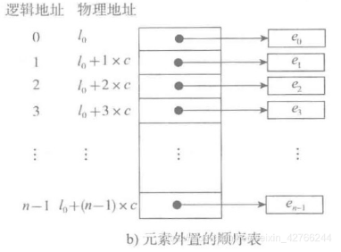
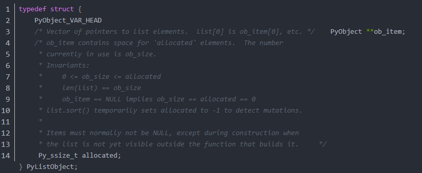

[toc]

# python常用数据结构

# List
## 基本存储结构
### 连续存储


### 顺序表在内存中的结构
一体式 和 分离式


一体式结构： 整体性强，易于管理。但是由于数据元素存储区域是表对象的一部分，顺序表创建后，元素存储区就固定了，不方便扩充。
分离式结构： 对象里只保存与整个对象有关的信息（即容量和元素个数），实际数据元素存放在另一个独立的元素存储区里，方便扩充。

### 不同类型的数据集合在内存中的存储



### python中的list。
1. 元素有位置下标，可以通过索引获取元素 --> 连续的存储空间，计算偏移量获取元素。
2. 元素无论如何改变，表对象都不变 --> 分离式结构，表头和元素内容分开存储。这样在更改list时，表对象始终是同一个，只是指向的地址不同
3. 元素可以是任意类型 --> 既要求连续存储，又可以存储不同类型的数据，用的是元素外置的方式，存储的只是数据地址的引用
4. 可以任意添加新元素 --> 动态扩充的策略

**list源码如下**


list 本质上是一个长度可变的连续数组。 其中 ob_item 指向一个指针列表（里边的每一个指针都指向列表中的元素），而 allocated 则用于存储该列表目前已被分配的空间大小。

## 常用方法
append -- 尾部追加
clear -- 移除所有
copy -- 浅拷贝
count -- 对某元素计算出现次数
extend -- 尾部追加另一个可迭代对象的元素
index -- 取索引
insert -- 根据索引插入
pop -- 根据索引弹出(默认弹出尾部元素)
remove -- 根据元素进行移除
reverse -- 原地逆转
sort -- 原地排序. key参数可指定排序函数，reverse参数可指定升降序。
 

```python

lst = ['a', 'b', 'c', 'b', [11, 22]]
lst

assert len(lst) == 5 # 计算列表长度

lst.append('e') # 在尾部追加元素
lst

lst2 = lst.copy() # 列表浅拷贝
assert id(lst2) != id(lst)
assert id(lst2[4])== id(lst[4]) # 浅拷贝时要注意内部的复杂类型

lst2.clear() # 清空列表(移除所有元素)
assert lst2 == []
assert lst == ['a', 'b', 'c', 'b', [11, 22], 'e']


lst.count(1) # 计算元素出现的次数


lst.extend(range(20, 23)) # 通过可迭代对象向列表尾部追加元素
assert lst == ['a', 'b', 'c', 'b', [11, 22], 'e', 20, 21, 22]

lst.index('b') # 获取元素的第一个索引(列表中无此元素时ValueError)

lst.insert(2, 10) # 在索引的前面插入元素(插入后的元素对就索引index)
assert lst == ['a', 'b', 10, 'c', 'b', [11, 22], 'e', 20, 21, 22]


item = lst.pop(2) # 根据索引弹出元素(默认弹出尾部元素)
assert lst == ['a', 'b', 'c', 'b', [11, 22], 'e', 20, 21, 22]
item = lst.pop() 
assert lst == ['a', 'b', 'c', 'b', [11, 22], 'e', 20, 21]

lst.remove(20) # 根据元素值进行移除
assert lst == ['a', 'b', 'c', 'b', [11, 22], 'e', 21]

lst2 = lst.copy()
lst2.reverse() # 原地逆转
assert lst2 == [21, 'e', [11, 22], 'b', 'c', 'b', 'a']


lst = ['a', 'b', 'c', 'b']
lst.sort(reverse=True) # 原地排序(reverse: True降序, False升序)
assert lst == ['a', 'b', 'b', 'c']
lst = [('a', 4), ('b', 3), ('c', 2), ('d', 1)]
lst.sort(key=lambda item:item[1]) # key指定排序方式
lst


```

# Stack(栈)
```python

class Stack:
    def __init__(self):
        self.items = []
    def isEmpty(self):
        return self.items == []
    def push(self, item):
        self.items.append(item)
    def pop(self):
        return self.items.pop()
    def peek(self):
        return self.items[len(self.items)-1]
    def size(self):
        return len(self.items)

```


# Dict
## 常用方法
 clear -- 清空所有元素
 copy -- 浅拷贝
 get -- 获取key对应的值(key不存在时可指定默认值)
 items --  提供k-v的可迭代视图
 keys -- 提供key的可迭代视图
 pop  -- 删除指定的key,并返回相应的value. (key不存在时会抛出异常)
 setdefault -- 获取或设置key-value
 update -- 使用另一个dic更新当前dic
 values -- 提供value的可迭代视图
 
```python

dic = {'a': 1, 'b':2, 'c':[10, 11]}
dic

dic2 = dic.copy() # 浅拷贝
assert id(dic) != id(dic2)
assert id(dic['c']) == id(dic2['c'])

dic2.clear() # 移除所有元素
assert dic2 == {}


v = dic.get('x', 0) # 获取key的值(key不在dict中时，返回默认值)。

dic.items() # 提供k-v的可迭代视图
for k,v in dic.items(): # 遍历key和value
    print(k, v)
    

dic.keys() # 提供key的可迭代视图
for k in dic.keys(): # 遍历key
    print(k)
    
if 'a' in dic.keys(): # 判断指定key是否存在于字典中
    print('key exist')

v = dic.pop('c') # 删除指定的key,并返回相应的value. (key不存在时会抛出异常)
    
v = dic.setdefault('x', 10) # 如果key存在则返回key对应的值; 如果key不存在则使用默认值插入key(并返回新设置的值)


dic = {'a': 1, 'b': 2}
other_dic = {'a': 11, 'c':13}
dic.update(other_dic) # 使用other_dic来更新dic; key存在值更新,key不存在则添加
assert dic  == {'a': 11, 'b': 2, 'c':13}

dic.values() # 提供value的可迭代视图

```


# heapq
python heapq是一个最小堆
常用函数
heap = [] # 创建一个空的堆
heappush(heap, item) # 将一个新的元素压入堆中
item = heappop(heap) # 弹出堆顶元素(最小元素)
item = heap[0] # 获取堆顶元素
heapify(x) # 原地将列表x转换为堆(线性时间)
item = heapreplace(heap, item) # 先弹出堆顶元素，再将item压入堆中
item = heappushpop(heap, item) # 先将item压入堆中，再弹出堆顶元素

```python

import heapq

heap = [5, 6, 8, 7, 9]
heapq.heapify(heap) # 原地将列表x转换为堆(线性时间)
heap # [5, 6, 8, 7, 9]


heapq.heappush(heap, 0) # 将一个新的元素压入堆中
item = heapq.heappop(heap) # 弹出堆顶元素
item, heap # (0, [5, 6, 8, 7, 9])

heap[0] # 获取堆顶元素  # 5

item = heapq.heapreplace(heap, -1) # 先弹出堆顶元素，再将item压入堆中
item, heap # (5, [-1, 6, 8, 7, 9])

item = heapq.heappushpop(heap, 0) # 先将item压入堆中，再弹出堆顶元素
item, heap # (-1, [0, 6, 8, 7, 9])

lst = [1, 2, 5, 4, 3, 6, 7, 8, 9, -9, -1]
heapq.nlargest(2, lst) # 返回lst中最大的n个元素
heapq.nlargest(2, lst, key=lambda item: abs(item)) # 返回lst中按指定方式进行排序后最大的n个元素.(本例为返回绝对值最大的2个元素)
heapq.nsmallest(2, lst) # 返回lst中最大小的n个元素


list(heapq.merge([1,3,5,7], [0,2,4,8], [5,10,15,20], [], [25])) # 将多个已排序的迭代器,合并成一个排序结果(要求:输入的迭代器是已排序好的)
list(heapq.merge([1, 2, 3], [1, -2, -4], key=lambda item: abs(item))) 
```

# queue
基本FIFO队列, 先进先出
```
# maxsize设置队列中数据上限(小于或等于0则不限制)，容器中大于这个数则阻塞，直到队列中的数据被消掉
q = Queue(maxsize=0)

# 写入队列数据
q.put(0)
q.put(1)
q.put(2)
print(q.queue) # >> [0, 1, 2]

# 删除队列数据，并返回该数据
q.get()
print(q.queue) # >> [1, 2]

```


