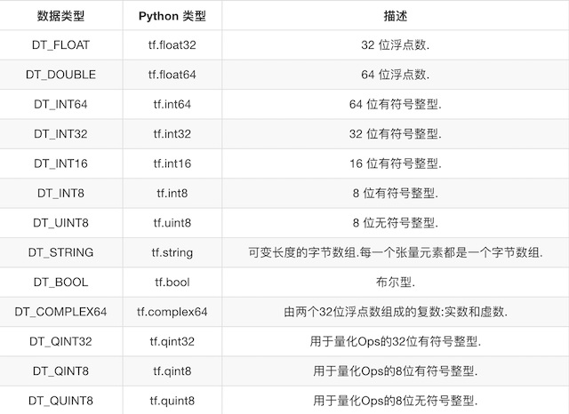
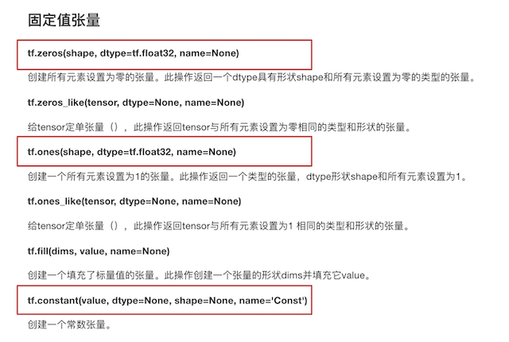
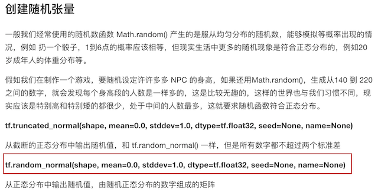
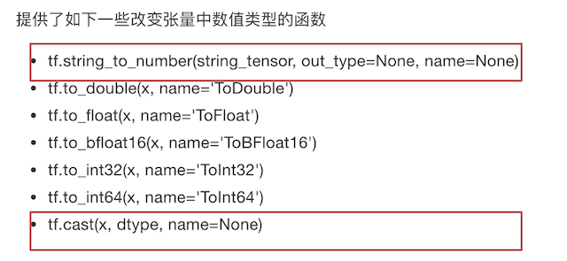

# Tensorflow1_基础
## Session会话
Session 类来表示客户端程序（如Python程序）与 C++ 运行时之间的连接。
**会话包含以下两种开启方式**
* tf.Session：用于完整的程序当中
* tf.InteractiveSession：用于交互式上下文中的TensorFlow ，例如shell
会话会占用资源，需要调用tf.Session.close()关闭会话，或将会话用作上下文管理器--with tf.Session() as sess。

**会话的run()**
run(fetches,feed_dict=None, options=None, run_metadata=None)
    * 通过使用sess.run()来运行operation
    * fetches：单一的operation，或者列表、元组(其它不属于tensorflow的类型不行)
    * feed_dict：参数允许调用者覆盖图中张量的值，运行时赋值,
                 与tf.placeholder搭配使用，则会检查值的形状是否与占位符兼容
             
### feed操作
placeholder提供占位符，run时候通过feed_dict指定参数
```
def session_run_demo():
    # 定义占位符
    a = tf.placeholder(tf.float32)
    b = tf.placeholder(tf.float32)
    sum_ab = tf.add(a, b)
    print("sum_ab:\n", sum_ab)
    # 开启会话
    with tf.Session() as sess:
        res = sess.run(sum_ab, feed_dict={a: 3.0, b: 4.0})
        print("占位符的结果:\n", res)
    return None
```

## 张量(Tensor)
TensorFlow 的张量就是一个 n 维数组,类型为tf.Tensor.
Tensor具有以下两个重要的属性:
    * type:数据类型
    * shape:形状(阶)
    * 
张量的类型:


创建张量的指令:



张量的变换:


TensorFlow的张量具有两种形状变换，动态形状和静态形状
    * tf.reshape
    * tf.set_shape
关于动态形状和静态形状必须符合以下规则
    静态形状
        转换静态形状的时候，1-D到1-D，2-D到2-D，不能跨阶数改变形状
        对于已经固定静态形状的张量，不能再次设置静态形状
    动态形状
        tf.reshape()动态创建新张量时，张量的元素个数必须匹配

## 变量
变量通过 tf.Variable OP类进行操作。
变量的特点：
    存储持久化
    可修改值
    ** 可指定被训练**

### 创建变量
tf.Variable(initial_value=None,**trainable**=True,collections=None,name=None)
    initial_value: 初始化的值
    **trainable: 是否被训练**
    collections：新变量将添加到collections指定的图中，默认为[GraphKeys.GLOBAL_VARIABLES];
    　　　　　　　如果trainable是True，变量也被添加到图形集合 GraphKeys.TRAINABLE_VARIABLES
    变量需要显式初始化，才能运行值


## 使用tf.variable_scope()指定变量的命名空间
会在OP的名字前面增加命名空间的指定名字
```
with tf.variable_scope("name_scope"):
    var = tf.Variable(name='var', initial_value=[4], dtype=tf.float32)
    var_double = tf.Variable(name='var', initial_value=[4], dtype=tf.float32)
    
# <tf.Variable 'name/var:0' shape=() dtype=float32_ref>
# <tf.Variable 'name/var_1:0' shape=() dtype=float32_ref>
```

应用op的name参数实现op的名字修改
应用variable_scope实现图程序作用域的添加
**应用scalar或histogram实现张量值的跟踪显示**
**应用merge_all实现张量值的合并**
**应用add_summary实现张量值写入文件**
应用tf.train.saver实现TensorFlow的模型保存以及加载
应用tf.app.flags实现命令行参数添加和使用
应用reduce_mean、square实现均方误差计算
应用tf.train.GradientDescentOptimizer实现有梯度下降优化器创建
应用minimize函数优化损失
知道梯度爆炸以及常见解决技巧

```
import tensorflow as tf
import os

# 定义一些常用的命令行参数
tf.app.flags.DEFINE_integer("max_step", 0, "训练模型的步数")
tf.app.flags.DEFINE_string("model_dir", " ", "模型保存的路径+模型名字")
FLAGS = tf.app.flags.FLAGS

# 按y=0.8x+0.7 构建样本, 并建模预测
def linear_regression():
    # 构建原始样本
    with tf.variable_scope("original_data"):
        X = tf.random_normal(shape=(100, 1), mean=2, stddev=2, name="original_data_x")
        y_true = tf.matmul(X, [[0.8]], name="original_matmul") + 0.7 # (100,1)*(1,1)=(100,1)

    # 建立线性模型: y=W·X+b,(求出权重W和偏置b)
    with tf.variable_scope("linear_model"):
        weights = tf.Variable(initial_value=tf.random_normal(shape=(1, 1)), name="weights")
        bias = tf.Variable(initial_value=tf.random_normal(shape=(1, 1)), name="bias")
        y_predict = tf.matmul(X, weights, name="model_matmul") + bias

    #　确定损失函数-均方误差
    with tf.variable_scope("loss"):
        error = tf.reduce_mean(tf.square(y_predict - y_true), name="error_op")

    # 梯度下降优化损失,需要指定学习率（超参数）
    with tf.variable_scope("gd_optimizer"):
        optimizer = tf.train.GradientDescentOptimizer(learning_rate=0.01, name="optimizer").minimize(error)

    # 收集变量
    tf.summary.scalar("error", error)
    tf.summary.histogram("weights", weights)
    tf.summary.histogram("bias", bias)

    # 合并所有收集的变量
    merge = tf.summary.merge_all()

    # 初始化变量
    init = tf.global_variables_initializer()

    # 开启会话进行训练
    with tf.Session() as sess:
        sess.run(init) # 运行初始化变量Op
        print("随机初始化的权重为%f， 偏置为%f" % (weights.eval(), bias.eval()))

        # 存在checkpoint文件，就从checkpoint加载模型，开始训练(这样可以在之前模型的基础上进行训练)
        checkpoint = tf.train.latest_checkpoint(FLAGS.model_dir)
        saver.restore(sess, checkpoint")

        # 创建事件文件
        file_writer = tf.summary.FileWriter(logdir="./summary", graph=sess.graph)
        for i in range(FLAGS.max_step): # 迭代训练模型
            sess.run(optimizer) #　运行优化器OP
            print("第%d步的误差为%f，权重为%f， 偏置为%f" % (i, error.eval(), weights.eval(), bias.eval()))

            # 运行合并所有收集的变量op, 并将收集到的tensor记录到事件文件以便进行可视化
            summary = sess.run(merge)
            file_writer.add_summary(summary, i)

            # 保存checkpoint文件
            saver.save(sess, checkpoint)

    return None


def main(argv):
    print("这是main函数")
    print(argv)
    print(FLAGS.model_path)
    linear_regression()

if __name__ == "__main__":
    tf.app.run()
```


## 计算


### 基于元素(element-wise)的操作
元素积:tf.multiply, tensor1 * tensor2
    tf.multiply计算的是对应元素的积,会自动进行广播.
    tensor1 * tensor2 与tf.multiply一样

对应元素平方:
    tf.square

### 基于矩阵(matrix)的操作
矩阵点乘：tf.matmul
    tf.matmul计算的是矩阵的乘法,要求操作元素的rank>=2（维度>=2, shape=(3,1)可以; shape=(3)不可以）。

### tf的向量点积通过'tf.multiply+tf.reduce_sum'来实现。
'tf.multiply+tf.reduce_sum'很适合用于加权平均
```
# tf.reduce_sum(tf.multiply(v1, v2),...)元素v1,v2按位置相乘再相加--实际上相当于向量点乘
v1 = tf.constant([1, 2, 3], name='v1', shape=(3,), dtype=tf.float32)
v2 = tf.constant([1, 2, 3], name='v2', shape=(3,), dtype=tf.float32)
tf.reduce_sum(tf.multiply(v1, v2), axis=0)  #keepdims=True


v1 = tf.constant([[1, 2, 3], [4, 5, 6]], name='v1', shape=(2,3), dtype=tf.float32) #(2, 3)
v2 = tf.constant([1, 2, 3], name='v2', shape=(3,), dtype=tf.float32)               #(3,)
tf.reduce_sum(tf.multiply(v1, v2), axis=1, keepdims=True) #tf.multiply(v1, v2)会先对v2进行广播   
```


   
## placeholder的填充方式
```
tf.reset_default_graph() # 重置默认计算图
a = tf.placeholder(tf.int16, shape=(1,), name='aName') 
b = tf.placeholder(tf.int16, shape=(1,), name='bName') 
c = a+b
with tf.Session() as sess:
    # 使用tensor对象来填充placeholder
    sess.run(c, feed_dict={a:np.array([1]),
                           b:np.array([2])})

    # 获取所有tensor（每个op的输出张量）的name
    for tensor_name in tf.contrib.graph_editor.get_tensors(tf.get_default_graph()):
        print(tensor_name)
    #  通过tensor对象的名字来填充placeholder
    sess.run(c, feed_dict={'aName:0':np.array([1]),
                           'bName:0':np.array([2])})
```

## tf.where函数
tf.where(
    condition,
    x=None,
    y=None,
    name=None
)
a). 如果x和y都为None，则该操作将返回condition中true元素的坐标
b). condition,x,y的shape相同; condition中为true位置的元素从x的对应位置取，condition中为false位置的元素从y的对应位置取
