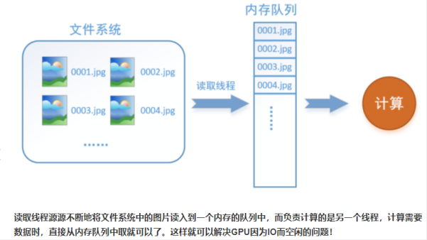

# Tensorflow

## Tensorflow2.x中参数的形状shape
DNN网络：
        

$$
\begin{align*}\label{2}
& n^{[l]}: 表示第l层的神经元个数.\\
& a^{[l]}: 表示第l层的输出.\\
& z^{[l]}: 表示第l层的输入.\\
& w^{[l]}: 表示第l层的权重矩阵.\\
& b^{[l]}: 表示第l层的偏置.\\
& \\
& 维度说明:\\
& \qquad 将输入层记为第0层:\\
& \qquad\qquad a^{[0]} = X, n^{[0]}=n\_featrue\\
& \qquad\qquad a^{[0]}.shape=(batch\_size, n\_feature)=(batch\_size, n^{[0]})\\
& \qquad w^{[l]}.shape=(n^{[l-1]}, n^{[l]})\\
& \qquad b^{[l]}.shape=(n^{[l]},)\\
& \qquad z^{[l]}.shape=(batch\_size, n^{[l]})\\
& \qquad a^{[l]}.shape=(batch\_size, n^{[l]})\\
& \\
& 计算公式:\\
& \qquad z^{[l]} = a^{[l-1]}W^{[l]} + b^{[l]}\\
& \qquad a^{[l]} = g(z^{[l]}), 其中g表示激活函数
\end{align*}
$$

## TensorFlow结构分析
TensorFlow 程序通常被组织成一个**构建图**阶段和一个**执行图**阶段。
* 在构建阶段，数据与操作的执行步骤被描述成一个图。
* 在执行阶段，使用会话执行构建好的图中的操作。
**图和会话**：
图：这是 TensorFlow 将计算表示为指令之间的依赖关系的一种表示法
会话：TensorFlow 跨一个或多个本地或远程设备运行数据流图的机制
张量：TensorFlow 中的基本数据对象
节点：提供图当中执行的操作

数据流图示例：


## Tensorflow流程


## tf.data
Dataset API 包含下列类:


* Dataset: 包含创建和转换数据集的方法的基类。您还可以通过该类从内存中的数据或 Python 生成器初始化数据集。
* TextLineDataset: 从文本文件中读取行。
* TFRecordDataset: 从 TFRecord 文件中读取记录。
* FixedLengthRecordDataset: 从二进制文件中读取具有固定大小的记录。
* Iterator: 提供一次访问一个数据集元素的方法


使用 tf.data API 可以轻松处理大量数据、不同的数据格式以及复杂的转换。
tf.data API 在 TensorFlow 中引入了两个新的抽象类：
+ tf.data.Dataset: 表示一系列元素，其中每个元素包含一个或多个 Tensor 对象
  - 创建来源（通过内存中的某些张量构建 Dataset: Dataset.from_tensor_slices()等）
  - 应用转换（将一个Dataset转换为另一个Dataset: Dataset.map(), Dataset.batch()等）
  - 以TFRecord文件创建Dataset: tf.data.TFRecordDataset
  - dataset如果用于tf.estimator， 必须是(字典形式的feature, label)
+ tf.data.Iterator 提供了从数据集中提取元素的主要方法。
  － Iterator.get_next(): 返回的OP会在执行时生成 Dataset 的下一个元素，此操作通常充当输入管道代码和模型之间的接口。
  － Dataset.make_one_shot_iterator(): 仅支持对数据集进行一次迭代.不能用于迭代有状态对象的数据集.

一个数据集Dataset包含多个元素(样本)，每个元素(样本)的结构都相同。
一个元素(样本)包含一个或多个 tf.Tensor 对象，这些对象称为组件。
可以通过 Dataset.output_types 和 Dataset.output_shapes 属性检查数据集元素各个组件的推理类型和形状。
```
# 数据集dataset1,包含4个元素．每个元素对应一个元组(包括一个1dim的tensor和一个100dim的tensor)
# 以元组的方式提供构成dataset的多个tensor．第一个维度必须相同
dataset1 = tf.data.Dataset.from_tensor_slices(
   (tf.random_uniform([4]),
    tf.random_uniform([4, 100], maxval=100, dtype=tf.int32)))
# dataset1 = tf.data.Dataset.from_tensor_slices(
#    {'xxx':tf.random_uniform([4]),
#     'yyy':tf.random_uniform([4, 100], maxval=100, dtype=tf.int32)})
print(dataset1.output_types)
print(dataset1.output_shapes)

# 使用迭代器访问dataset元素. 
dataset2 = tf.data.Dataset.range(5)
iterator2 = dataset2.make_one_shot_iterator() # 不能对dataset1用单次迭代器,因为dataset1是有状态对象的数据集
next_element2 = iterator2.get_next()
with tf.Session() as sess:
    for i in range(5):
      value = sess.run(next_element2)
      print(value)
      
```

**训练的数据集迭代轮次：Dataset.repeat()**
Dataset.repeat() 迭代同一数据数据集多个周期(epoch)
    例如，要创建一个将其输入重复 10 个周期的数据集：
    dataset = dataset.repeat(10) # Dataset.repeat()中没有参数 转换将无限次地重复输入
**训练的数据集重排：Dataset.shuffle()**
Dataset.shuffle() 会使用算法随机重排输入数据集：它会维持一个固定大小的缓冲区，并从该缓冲区统一地随机选择下一个元素。
    dataset = dataset.shuffle(buffer_size=10000) #buffer_size一般要大于等于dataset中的样本数

## 特征处理tf.feature_colum


## TFRecords
TFRecords是TensorFlow官方推荐使用的数据格式化存储工具，它不仅规范了数据的读写方式，还大大地提高了IO效率.
文件格式'*.tfrecords'.

### spark生成TFRecords


### 选择正确的IO训练方式
TensorFlow读取数据的方式主要有2种，一般选择错误会造成性能问题，两种方式为：

* Feed_dict
  通过feed_dict将数据喂给session.run函数.
  优点:清晰，易于理解
  缺点:性能差 --原因是feed给session的数据需要在session.run之前准备好，如果之前这个数据没有进入内存，那么就需要等待数据进入内存，而在实际场景中，这不仅仅是等待数据从磁盘或者网络进入内存的事情，还可能包括很多前期预处理的工作也在这里做，所以相当于一个串行过程。此时，GPU显存处于等待状态，同时，由于tf的Graph中的input为空，所以CPU也处于等待状态，无法运算。

* RecordReader：
  在tf中还有batch与threads的概念，可以异步的读取数据，保证在GPU或者CPU进行计算的时候，读取数据这个操作也可以多线程异步执行。
 
**好的IO训练方式(数据提供方式)** 是将程序中的预处理部分从代码中剥离出来，使用Map-Reduce批处理去做;MR输出为TensorFlow Record格式，避免使用Feed_dict。

### 使用TFRecords文件的优势
Tensorflow有和TFRecords配套的一些函数，可以加快数据的处理。实际读取TFRecords数据时，先以相应的TFRecords文件为参数，创建一个输入队列，这个队列有一定的容量（视具体硬件限制，用户可以设置不同的值），在一部分数据出队列时，TFRecords中的其他数据就可以通过预取进入队列，并且这个过程和网络的计算是独立进行的。
网络每一个iteration的训练不必等待数据队列准备好再开始，队列中的数据始终是充足的，而往队列中填充数据时，也可以使用多线程加速。



### Example结构解析
TFRecords文件包含了tf.train.Example 协议内存块(protocol buffer);
    议内存块包含了字段 Features。
    可以将你的数据填入到Example协议内存块(protocol buffer)，将协议内存块序列化为一个字符串， 并且通过tf.python_io.TFRecordWriter 写入到TFRecords文件。

```
# tf.train.Example协议内存块, 包含了字段 Features，Features包含了一个Feature字段，Features中包含要写入的数据、并指明数据类型。
# 这是一个样本的结构，批数据需要循环存入这样的结构
example = tf.train.Example(
  features=tf.train.Features(feature={
    "features": tf.train.Feature(bytes_list=tf.train.BytesList(value=[features])),
    "label": tf.train.Feature(int64_list=tf.train.Int64List(value=[label])),
  })
)
```
**特征**
+ tf.train.Feature(options)
  - 对应一批样本中某个特征的取值(相当于训练数据的一列)（这批样本的多少由TFRecordWriter()转换的原文件决定）
  - options：例如
   bytes_list=tf.train.BytesList(value=[Bytes]) # 参数类型为Bytes列表
   int64_list=tf.train.Int64List(value=[Value])
  - 支持存入的类型如下
    * tf.train.Int64List(value=[Value])
    * tf.train.BytesList(value=[Bytes])
    * tf.train.FloatList(value=[value])
  - 返回Feature

**样本(一组特征)**
+ tf.train.Features(feature=None)
  - 对应一批样本; 参数为{特征名:(Feature格式的)这批样本中该特征的值,...}
  - 构建每个样本特征的信息(字段)键值对
  - feature:字典数据
    * key为要保存的名字
    * value为tf.train.Feature实例
  - return:Features类型封装的一批样本

**example格式协议块(一组样本)**
+ tf.train.Example(features=None)
  - 写入tfrecords文件
  - features: tf.train.Features类型的特征实例
  - return：example格式协议块

将其他数据存储为TFRecords文件的步骤： 
1. 建立TFRecord存储器
2. 构造Example模块
3. 将example数据系列化为字符串
4. 使用TFRecord存储器将系列化为字符串的example数据写入协议缓冲区

**示例: 创建TFRecord**
```
data = {
    'price':[0, 0, 1, 1],
    'length': [0, 1.1, 2.2, 3.3],
    'width': [1.4, 1.5, 4.2,3.0]
}
df = pd.DataFrame(data, colnums=['price', 'length', 'width'])

# 建立TFRecord存储器
writer = tf.python_io.TFRecordWriter(tfrecord_path, options=None)

# 构造tf.train.Feature --> 构造tf.train.Features
feature_internal = {
    "label":tf.train.Feature(int64_list=tf.train.Int64List(value=df['price'])),
    "length":tf.train.Feature(float_list=tf.train.FloatList(value=df['length'])),
    "width":tf.train.Feature(float_list=tf.train.FloatList(value=df['width']))
}
features_extern = tf.train.Features(feature_internal)

# 构造tf.train.Example -- 相当于有4个样本的数据集df
example = tf.train.Example(features_extern)

# 将example数据系列化为字符串
example_str = example.SerializeToString()

# 将系列化为字符串的example数据写入协议缓冲区(即TFRecord文件)
writer.write(example_str)
writer.close()
```
**示例: 读取TFRecord**
```
# 读取TFRecord文件 -- 单个Example包含一批样本时
raw_dataset = tf.data.TFRecordDataset(tfrecord_path)    # 读取 TFRecord 文件
batch_size = df['price'].shape[0]
feature_description = { # 定义Feature结构，告诉解码器每个Feature的类型是什么
    'label': tf.io.FixedLenFeature((batch_size,), tf.int64),
    'length': tf.io.FixedLenFeature((batch_size,), tf.float64),
    'width': tf.io.FixedLenFeature((batch_size,), tf.float64)
}

def _parse_example(example_string): # 将 TFRecord 文件中的每一个序列化的 tf.train.Example 解码
    feature_dict = tf.io.parse_example(example_string, feature_description)
    def fn(length):
        return length+1
    feature_dict['length'] = tf.map_fn(fn, feature_dict['length'], dtype=tf.float64)
    return feature_dict['label'], feature_dict['length'], feature_dict['width']

dataset = raw_dataset.map(_parse_example)
for i, (label, length, width) in enumerate(dataset):
    print('iter:', i, label.shape)
```


数值型特征:
```
columnNameXXX1 = tf.feature_column.numeric_column('columnName')
```

固定数目的类别型特征
```
columnNameXXX2 = tf.feature_column.categorical_column_with_vocabulary_list(
    'columnName', ['类别取值1', '类别取值2', '...'])
```


不确定类别数量时，哈希列进行分桶
```
columnNameXXX3 = tf.feature_column.categorical_column_with_hash_bucket(
    'columnName', hash_bucket_size=N)
```


分桶：
```
age_buckets = tf.feature_column.bucketized_column(age, 
    boundaries=[18, 25, 30, 35, 40, 45, 50, 55, 60, 65])
```

交叉：
```
crossed_colNameX_colNameY = tf.feature_column.crossed_column(
    ['colNameX', 'colNameY'], hash_bucket_size=1000)
    
crossed_feature = tf.feature_column.crossed_column(
    [crossed_colNameX_colNameY, 'colNameXXX','colNameYYY'], hash_bucket_size=1000)
```


```
features =  [columnNameXXX1, columnNameXXX2, crossed_feature, ...]
classifiry = tf.estimator.LinearClassifier(feature_columns=features)
# tensorflow处理输入数据的函数格式(输入/输出)是固定的,因此需要使用partial处理
train_func = functools.partial(input_func, train_file, epoches=3, batch_size=32)
classifiry.train(train_func)
result = classifiry.evaluate(test_func)
```


## Keras
keras.preprocessing.sequence.pad_sequences(sequences, maxlen=None,    
    dtype='int32', padding='pre', truncating='pre', value=0.)
    **参数:**
    * sequences：浮点数或整数构成的两层嵌套列表
    * maxlen：None或整数，为序列的最大长度。
             大于此长度的序列将被截短，小于此长度的序列将在后部填0.
    * dtype：返回的numpy array的数据类型
    * padding：‘pre’或‘post’，确定当需要补0时，在序列的起始还是结尾补
    * truncating：‘pre’或‘post’，确定当需要截断序列时，从起始还是结尾截断
    * value：浮点数，此值将在填充时代替默认的填充值0


## Tensorboard
tensorFlow提供的可视化工具
* TensorBoard 通过读取 TensorFlow 的事件文件来运行，需要将数据生成一个序列化的 Summary protobuf 对象。
```
# 返回filewriter,写入事件文件到指定目录(最好用绝对路径)，以提供给tensorboard使用
tf.summary.FileWriter('./tmp/summary/test/', graph=sess.graph)

# 这将在指定目录中生成一个 event 文件，其名称格式如下：
events.out.tfevents.{timestamp}.{hostname}
```
* 启动TensorBoard:
    tensorboard  --logdir="./tmp/tensorflow/summary/test/" --hosts=127.0.0.1
* 在浏览器中访问127.0.0.1:6006 查看TensorBoard 的图页面 

## TODO
```
def parse_tfrecords_function(example_proto):
    features = {
        "label": tf.FixedLenFeature([], tf.int64),
        "feature": tf.FixedLenFeature([], tf.string)
    }
    parsed_features = tf.parse_single_example(example_proto, features) # ??

    feature = tf.decode_raw(parsed_features['feature'], tf.float64) # ??
    feature = tf.reshape(tf.cast(feature, tf.float32), [1, 121])
    label = tf.reshape(tf.cast(parsed_features['label'], tf.float32), [1, 1])
    return feature, label

dataset = tf.data.TFRecordDataset(["./train_ctr_201904.tfrecords"]) # ??
dataset = dataset.map(parse_tfrecords_function)
dataset = dataset.shuffle(buffer_size=10000)
dataset = dataset.repeat(10000)
```


## 代码相关
### 自动求导
* tape = tf.GradientTape()
* tape.gradient(损失函数, 要求导的变量列表)
* optimizer.apply_gradients(grads_and_vars=zip(梯度值, 对应的变量))

```
# 使用tf.GradientTape()记录损失函数的梯度信息
with tf.GradientTape() as tape:
    y_pred = tf.matmul(X, w) + b
    loss = tf.reduce_sum(tf.square(y_pred - y))

# TensorFlow自动计算损失函数关于自变量（模型参数）的梯度
grads = tape.gradient(loss, variables)

# TensorFlow自动根据梯度更新参数
optimizer.apply_gradients(grads_and_vars=zip(grads, variables))
```

### model.compile()
参数:
    loss: 指定模型训练用的损失函数, 如:'mean_absolute_error',
    optimizer: 指定最小化loss时用的优化器, 如：tf.keras.optimizers.Adam(),
    metrics: 指定评价时使用的评价指标. 如:['mae', 'accuracy']
        --与model.evaluate()配合生效。

### 交叉熵损失计算
在tf.keras中，有两个交叉熵相关的损失函数 tf.keras.losses.categorical_crossentropy和 tf.keras.losses.sparse_categorical_crossentropy 。
其中sparse的含义是，真实的标签值y_true直接传入int类型的标签类别,不需要进行one-hot编码。
具体而言：
```
loss = tf.keras.losses.sparse_categorical_crossentropy(y_true=y, y_pred=y_pred)
与
loss = tf.keras.losses.categorical_crossentropy(
    y_true=tf.one_hot(y, depth=tf.shape(y_pred)[-1]),
    y_pred=y_pred)
的结果相同。
```

### tf.argmax()获取指定轴上最大值的索引
```
y_pred = [[0.1, 0.2, 0.5, 0.2],
          [0.1, 0.2, 0.1, 0.6]]
tf.argmax(y_pred, axis=-1, output_type=tf.int32).numpy() # array([2, 3])
```


### Example中包含单个或多个样本时的创建与解析操作示例
tf.map_fn(f):将指定tensor按第一个维展开,并对第一个维度下的各元素执行f操作
函数原型:
```
map_fn(fn, elems, dtype=None, parallel_iterations=None, back_prop=True,
       swap_memory=False, infer_shape=True, name=None)
```

参数说明:
* fn: 一个可调用函数
* elems: 是需要处理的 tensors,tf将对其按第一个维展开,并对第一个维度下的各元素执行fn操作
* dtype: fn函数的输出类型;**如果fn返回的类型和elems中的不同，那么就必须显示指定dtype类型为fn返回类型**
返回:
    一个新的tensor对象．

示例1:  只包含一个样本的Example
```
# 示例1: 将数据集存储为TFRecord文件. --该示例中Example只包含一个样本，实际使用时可以包含一批样本
train_filenames=['D:/dogs/dog1.jpeg', 'D:/dogs/dog2.jpeg', ...,'D:/cats/cat1.jpeg', 'D:/cats/cat2.jpeg',...] #图片文件路径列表
train_labels=[0,0, ..., 1, 1,...] #图片文件对应的标签列表
# 写TFRecord
tfrecord_file_one = data_dir + '/train/train_one.tfrecords'
with tf.io.TFRecordWriter(tfrecord_file_one) as writer:
    for filename, label in zip(train_filenames, train_labels):
        image = open(filename, 'rb').read()     # 读取数据集图片到内存，image 为一个 Byte 类型的字符串
        feature = {                             # 建立 tf.train.Feature 字典
            'image': tf.train.Feature(bytes_list=tf.train.BytesList(value=[image])),  # 图片是一个 Bytes 对象
            'label': tf.train.Feature(int64_list=tf.train.Int64List(value=[label]))   # 标签是一个 Int 对象
        }
        example = tf.train.Example(features=tf.train.Features(feature=feature)) # 通过字典建立 Example
        writer.write(example.SerializeToString())   # 将Example序列化并写入 TFRecord 文件

# 读取TFRecord文件 -- 单个Example只包含一个样本时
raw_dataset = tf.data.TFRecordDataset(tfrecord_file_one)    # 读取 TFRecord 文件

feature_description = { # 定义Feature结构，告诉解码器每个Feature的类型是什么
    'image': tf.io.FixedLenFeature((), tf.string),
    'label': tf.io.FixedLenFeature((), tf.int64),
}

def _parse_example(example_string): # 将 TFRecord 文件中的每一个序列化的 tf.train.Example 解码
    feature_dict = tf.io.parse_single_example(example_string, feature_description)
    feature_dict['image'] = tf.io.decode_jpeg(feature_dict['image'])    # 解码JPEG图片
    return feature_dict['image'], feature_dict['label']
    
dataset = raw_dataset.map(_parse_example)
tmp_ds = dataset.take(8)
for i, (image, label) in enumerate(tmp_ds):
    print('iter:', i, image.shape)
```
示例2:  包含一批样本的Example
```
# 示例2: 将数据集存储为TFRecord文件. --该示例中Example包含batch_size个样本
train_filenames=['D:/dogs/dog1.jpeg', 'D:/dogs/dog2.jpeg', ...,'D:/cats/cat1.jpeg', 'D:/cats/cat2.jpeg',...] #图片文件路径列表
train_labels=[0,0, ..., 1, 1,...] #图片文件对应的标签列表
# 写TFRecord
tfrecord_file_batch = data_dir + '/train/train_batch.tfrecords'
batch_size = 4
with tf.io.TFRecordWriter(tfrecord_file_batch) as writer:
    count = 0
    batch_images = []
    batch_labels = []
    for filename, label in zip(train_filenames, train_labels):
        count += 1
        image = open(filename, 'rb').read()     # 读取数据集图片到内存，image 为一个 Byte 类型的字符串
        batch_images.append(image)
        batch_labels.append(label)
        if count == batch_size:
            count = 0
            feature = {                             # 建立 tf.train.Feature 字典
                'image': tf.train.Feature(bytes_list=tf.train.BytesList(value=batch_images)),  # 图片是一个 Bytes 对象
                'label': tf.train.Feature(int64_list=tf.train.Int64List(value=batch_labels))   # 标签是一个 Int 对象
            }
            example = tf.train.Example(features=tf.train.Features(feature=feature)) # 通过字典建立 Example
            writer.write(example.SerializeToString())   # 将Example序列化并写入 TFRecord 文件
            batch_images.clear()
            batch_labels.clear()

# 读取TFRecord文件 -- 单个Example包含一批样本时
raw_dataset = tf.data.TFRecordDataset(tfrecord_file_batch)    # 读取 TFRecord 文件

feature_description = { # 定义Feature结构，告诉解码器每个Feature的类型是什么
    'image': tf.io.FixedLenFeature((batch_size,), tf.string),
    'label': tf.io.FixedLenFeature((batch_size,), tf.int64),
}

# _parse_example1与_parse_example2实现同样的功能
def _parse_example1(example_string): # 将 TFRecord 文件中的每一个序列化的 tf.train.Example 解码
    feature_dict = tf.io.parse_example(example_string, feature_description)
    img_lst = []
    for i in range(feature_dict['image'].shape[0]): # 解码JPEG图片
        img = tf.image.resize(tf.io.decode_jpeg(feature_dict['image'][i]), (256, 256))
        img_lst.append(img)
    feature_dict['image'] = tf.convert_to_tensor(img_lst)
    return feature_dict['image'], feature_dict['label']

def _parse_example2(example_string): # 将 TFRecord 文件中的每一个序列化的 tf.train.Example 解码
    feature_dict = tf.io.parse_example(example_string, feature_description)
    def fn(img):
        return tf.image.resize(tf.io.decode_jpeg(img), (256, 256))
    feature_dict['image'] = tf.map_fn(fn, feature_dict['image'], dtype=tf.float32) #解多个图片文件
    return feature_dict['image'], feature_dict['label']

dataset = raw_dataset.map(_parse_example2)
tmp_ds = dataset.take(8)
for i, (images, labels) in enumerate(tmp_ds):
    print('iter:', i, images.shape)
#     for j,image in enumerate(images):
#         print('\tbatch_index:', j, image.shape)
           
    fig, axs = plt.subplots(1, batch_size)
    for i in range(batch_size):
        axs[i].set_title(labels.numpy()[i])
        axs[i].imshow(images.numpy()[i, :, :, 0])
    plt.show()

```


### Tensorflow中张量数据类型的转换
将x或者x.values转换为dtype
    # tf.cast(x, dtype, name=None)
    # tensor a is [1.8, 2.2], dtype=tf.float
    tf.cast(a, tf.int32) ==> [1, 2]，dtype=tf.int32

#### TensorFlow dtype
+ 有符号整型
    - tf.int8：8位整数。
    - tf.int16：16位整数。
    - tf.int32：32位整数。
    - tf.int64：64位整数。
+ 无符号整型
    - tf.uint8：8位无符号整数。
    - tf.uint16：16位无符号整数。
+ 浮点型
    - tf.float16：16位浮点数。
    - tf.float32：32位浮点数。
    - tf.float64：64位浮点数。
    - tf.double：等同于tf.float64。
+ 字符串型
    - tf.string：字符串。
+ 布尔型
    - tf.bool：布尔型。
+ 复数型
    - tf.complex64：64位复数。
    - tf.complex128：128位复数。

### tf.nn.dropout
TODO


### 一个示例
```
import tensorflow as tf
import time

#　限定当前程序只使用下标为 0、1 的两块显卡（GPU:0 和 GPU:1）
gpus = tf.config.list_physical_devices(device_type='GPU')
tf.config.set_visible_devices(devices=gpus[0:2], device_type='GPU')

# 自定义keras模型的构建： tf.keras.Model 和 tf.keras.layers
class MLP(tf.keras.Model):
    def __init__(self):
        super().__init__()
        self.flatten = tf.keras.layers.Flatten()    # Flatten层将除第一维（batch_size）以外的维度展平
        self.dense1 = tf.keras.layers.Dense(units=100, activation=tf.nn.relu)
        self.dense2 = tf.keras.layers.Dense(units=10)
        
    @tf.function(input_signature=[tf.TensorSpec([None, 28, 28, 1], tf.float32)])
    def call(self, inputs):         # [batch_size, 28, 28, 1]
        x = self.flatten(inputs)    # [batch_size, 784]
        x = self.dense1(x)          # [batch_size, 100]
        x = self.dense2(x)          # [batch_size, 10]
        output = tf.nn.softmax(x)
        return output

# 模型的训练： tf.keras.losses 和 tf.keras.optimizer
num_epochs = 5
batch_size = 50
learning_rate = 0.001

data_loader = MNISTLoader()
model = MLP()
optimizer = tf.keras.optimizers.Adam(learning_rate=learning_rate)

@tf.function #　图执行模式需要使用这个修饰
def train_one_step(X, y, batch_times):    
    with tf.GradientTape() as tape:
        y_pred = model(X)
        loss = tf.keras.losses.sparse_categorical_crossentropy(y_true=y, y_pred=y_pred)
        loss = tf.reduce_mean(loss)
        # 注意这里使用了TensorFlow内置的tf.print()。@tf.function不支持Python内置的print方法
        tf.print("batch %d: loss %f" % (batch_times, loss))
    grads = tape.gradient(loss, model.variables)    
    optimizer.apply_gradients(grads_and_vars=zip(grads, model.variables))

start_time = time.time()
num_batches = int(data_loader.num_train_data // batch_size * num_epochs)
for batch_index in range(num_batches):
    X, y = data_loader.get_batch(batch_size)
    train_one_step(X, y, batch_index)
end_time = time.time()
print(end_time - start_time)

# 模型的导出
tf.saved_model.save(model, "保存的目标文件夹名称")
```


### Kreas学习率(LearningRate)衰减
#### LearningRateScheduler:学习率调度器
如下实现在指定的迭代轮次上进行衰减
```
from tensorflow_core.python.keras.callbacks import LearningRateScheduler

# 如下实现在指定的迭代轮次上进行衰减
def specifyEpochChangedLearnRate(epoch):
    # 每100个epoch，学习率减小为原来的1/5
    if epoch%100 == 99:
        lr = K.get_value(model.optimizer.lr)
        K.set_value(model.optimizer.lr, lr * 0.2)
        print("lr changed to {}".format(lr * 0.2))
    return K.get_value(model.optimizer.lr)

reduce_lr = LearningRateScheduler(specifyEpochChangedLearnRate)
...
model.fit(train_X, train_y, batch_size =batch_size, epochs=epochs_num, 
          validation_data=(k_X_vali, k_y_vali),
          callbacks=[reduce_lr])
```


#### ReduceLROnPlateau:当评价指标不再'提升'时，衰减学习率
问题: 评价指标不在'提升'是指评价指标的值不再上升,还是指评价指标的值不再下降.
　　　--因为不同的评价指标优化的方向是不同的.有的指标是优化最大值(如Accuracy)，有的优化最小值(如RMSE)
　　　mode参数:指定评价指标的优化方向.
ReduceLROnPlateau(monitor='val_loss', factor=0.1, patience=10, 
                  verbose=0, mode='auto', min_delta=0.0001, 
                  cooldown=0, min_lr=1e-16)
参数:
    monitor: 被监测的指标
    factor: 每次减少学习率的因子，学习率将以lr=lr*factor的方式衰减
    patience: 当patience个epoch过去而模型性能不提升时，学习率减少的动作会被触发
    mode: 'auto','min','max'之一
          'min': 当monitor监控的指标不再下降则触发学习率衰减(即认为监测的指标值越小越好)
          'max': 当monitor监控的指标不再上升则触发学习率衰减(即认为监测的指标值越大越好)
          'auto': 根据monitor监控指标的名字来推断优化方向
    min_delta：阈值，当评价指标的'提升'小于该值时认为需要调整学习率
    cooldown: 冷却期(学习率衰减后，会经过cooldown个epoch才重新开始评估被监测的指标.)
    min_lr: 学习率的下限
```
from tensorflow_core.python.keras.callbacks import ReduceLROnPlateau

reduce_lr = ReduceLROnPlateau(monitor='val_loss', mode='auto',
                              factor=0.1, patience=10, cooldown=0,
                              min_delta=0.0001, min_lr=0)
...
model.fit(train_X, train_y, batch_size=32, epochs=300, 
　　　　　validation_split=0.1,　callbacks=[reduce_lr])
```

### 其它学习率调整方式
pass


## tf.reshape(tensor, shape)
shape中可以有一个维度为-1,tf能自动推导出其对应的值。只能有一个维度为-1.
```
x = tf.constant(range(12))
x = tf.reshape(x, (-1,4))
```

