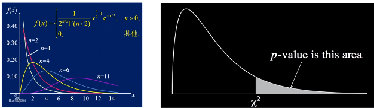

# 基本数学知识_统计&概率&优化

### 指数加权平均:
公式定义:
    
偏差修正:
    偏差修正可以让初始阶段(t较小时)的评估更准确，具体方案是：
    

由于权值是按照指数衰减的,忽略掉远离当前位置t的加权值后，可以简单的认为指数加权平均是窗口为(1/(1-β))的移动平均。

### Adam优化

## 卡方检验
原假设(无效假设,零假设)H_0:
  研究两个事物之间是否有关时能做出的最保守的假设, 即假设二者无关. 
  '零假设'的'零'即两个事物的相关系数是0.

如何判断两个变量之间有无关联?
    首先我们假设两个变量没有关系,做出预测,得到期望频数.观察实际情况,得到观察频数.若观察频数与期望频数没有差别,即H_0成立(),则两个变量真的没有关系. 反之,二者之间可能存在关系.

自由度 = (行数-1)*(列数-1)

p值:卡方分布图的面积计算
p值为原假设成立的概率(即两个变量没有关系的概率).

p值越大原假设成立的可能性也就越大; 
一般以p取0.05为判别边界. p>0.05则认为原假设可能成立; p<0.05则认为原假设不成立.

## 贝叶斯网络
### 贝叶斯网络判定条件独立的几种情况
1. tail-to-tail

2. head-to-tail

3. head-to-head

4. 贝叶斯网络判定条件独立-有向分离

