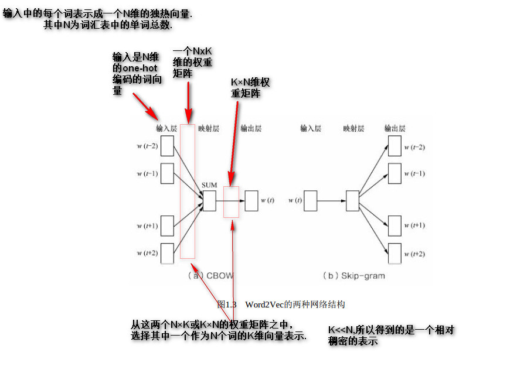
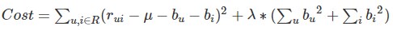
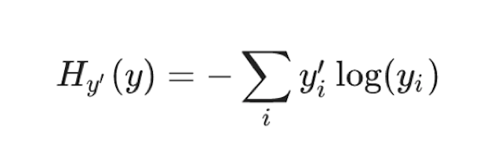

# 矩阵乘法与空间变换

# 常用算法&模型

# 正则化项
目标函数(损失函数)添加L1正则项可增加模型解的稀疏性，添加L2正则项有利于防止模型过拟合。

正则化(Regularization)的意义本质上是为了避免训练得到的模型过度拟合训练数据。
过拟合体现出来的现象就是特征权重W的各个维度的绝对值非常大(一些大正数，一些大负数)。
为了避免过拟合情况，我们通常会限制它的模不要太大，这时我们的目标就变成的带约束的损失函数最小化问题,通过KKT条件再转成无约束的最优化问题。

在Batch模式下，L1正则化通常产生更加稀疏的模型,而L2正则化则可以使模型更加简单(模型参数值较小).

## L2正则化项的理解
损失函数中增加L2正则化:
    
损失函数求梯度:
    
参数更新:
    
    我们通常称L2范数为权重衰减

# NLP
## 统计语言模型

语言模型就是用来计算一个句子的概率的模型.
* N-Gram：N元模型就是假设当前词的出现概率只与它前面的N-1个词有关
  + 语言是一种序列，词与词之间并不是相互独立
  + 一元模型(unigram model)：假设某个出现的概率与前面所有词无关
      P(s) = P(w1)P(w2)P(w3)…P(w4)
  + 二元模型(bigram model)：假设某个出现的概率与前面一个词相关
      P(s) = P(w1)P(w2|w1)P(w3|w2)…P(w_i|w_i-1)
  + 三元模型(trigram model)：假设某个出现的概率与前面两个词相关
      P(s) = P(w1)P(w2|w1)P(w3|w1,w2)…P(w_i|w_i-2,w_i-1)

根据条件概率公式与大数定律，当语料的规模足够大时，有:
$p(w_k|w_{k-1},w_{k-2},...w_{k-(n-1)}) = \frac{p(w_k,w_{k-1},w_{k-2},...w_{k-(n-1)})}{p(w_{k-1},w_{k-2},...w_{k-(n-1)})} = \frac{count(w_k,w_{k-1},w_{k-2},...w_{k-(n-1)})}{count(w_{k-1},w_{k-2},...w_{k-(n-1)})}$

## 神经网络语言模型NNLM
NNLM依然是一个概率语言模型，它通过神经网络来计算概率语言模型中每个参数.

**模型解释：**
* 输入层：将每个词w_t映射成一个长度为m的词向量(长度训练者指定)，词向量在开始是随机的，也参与网络训练
  + 使用随机初始化的方法建立一个m×N个词大小的查找表(lookup table)--N为词汇表大小
  + context(w_{t-1}, w_{t-2}, ...w_{t-n+1}):n为上下文窗口长度，类似N-gram
* 投影层：将所有的上下文词项来拼接成一个长向量，作为目标w的特征向量。长度为m*(n-1)
* 隐藏层：拼接后的向量会经过一个规模为h的隐藏层，论文中使用tanh
  $y = U\cdot tanh(Wx+b_1) + b_2$
* 输出层：最后输出会通过softmax输出预测结果在N个词上的概率分布(最大概率对应的词即为第w_t个词)

**训练过程：**
* 训练时，使用交叉熵作为损失函数，反向传播算法进行训练
* 当训练完成时，就得到了 N-gram 神经语言模型，以及副产品词向量
* 初始化的矩阵查找表是和神经网络的参数同时训练更新

## Word2Vec
word2Vec 本质上也是一个神经语言模型，但是它的目标并不是语言模型本身，而是词向量.

**word2vec提供了两套模型：CBOW和Skip-Gram，其基本思想如下：**
* CBOW在已知context(w)的情况下，预测w
* Skip-Gram在已知 w 的情况下预测context(w)

**CBOW前向计算与向量（参数）更新推导**

### Word2vec 的训练trick（优化）

Skip-Gram模型和CBOW模型计算softmax的时候都需要整个词表V，但实际当中，词语的个数非常多，需要用技巧来加速训练。
* **hierarchical softmax: 层次化softmax**
    本质是把 N 分类问题变成 log(N)次二分类，从O(N)时间复杂度编程O(log(N))
* **negative sampling: 负例采样**
    本质是预测总体类别的一个子集
    负例采样：
    一个正样本，V-1个负样本，对负样本做采样。
    
    出现频次越高的越可能被采样到。

### Word2vec 词向量工具使用
* 可以使用python 的gensim库进行词向量训练
* 使用google word2vec工具。地址： models/tutorials/embedding/word2vec.py
* Pyspark ml中的Word2Vec训练词向量

### Word2vec补充

# 模型整合
## stacking

训练时：第一级模型使用KFlod切分数据集进行训练，得到K个同类模型(参数不同－因为训练数据不同),
       将每折验证集(K折验证集组合起来刚好就是全样本)在对应模型上的预测结果(dim=sampleNum*1)作为第二级模型的输入。
       堆叠M个模型时，重复上述步骤 ==> 第二级的输入维度为(sampleNum, M)--(因为有M个模型堆叠,每个堆叠产生(sampleNum,1)个二级模型的输入).
预测时: 测试样本对第一级K个同类模型的预测结果取平均(因为测试样本没有进行KFlod,对每个样本都预测了K次,作对K次预测取平均得到dim=(sampleNum,1)作为第二级模型的输入.
       堆叠M个模型时，重复上述步骤 ==> 第二级的输入维度为(sampleNum,M)

相关库： !pip install mlxtend

# 推荐系统常用算法&模型
## 特征处理
### TF-IDF
TF-IDF(Term Frequency/Inverse Document Frequency)是信息检索领域非常重要的搜索词重要性度量；用以衡量一个关键词w对于查询(Query，可看作文档)所能提供的信息。

TF词频:表示关键词w在文档Di中出现的频率：

IDF逆文档频率:反映关键词的综合重要程度--当一个词越普遍(即有大量文档包含这个词)时，其IDF值越低；反之，则IDF值越高。IDF定义如下：

**关键词w在文档Di的TF-IDF值(相对与全量样本)**：

### TextRanK
思想：通过词之间的相邻关系构建网络，然后用PageRank迭代计算每个节点的rank值，排序rank值即可得到关键词。
PageRank:

其中，PR(Vi)表示结点Vi的rank值，In(Vi)表示结点Vi的前驱结点集合，Out(Vj)表示结点Vj的后继结点集合，d为damping factor用于做平滑。

TextRanK:
TextRank算法根据词之间的共现关系构造网络,网络中的边是无向有权边。TextRank算法的核心公式如下

注:正规的TextRank公式在PageRank的公式的基础上，引入了边的权值的概念
TextRank算法是利用局部词汇之间关系（共现窗口）对后续关键词进行排序，直接从文本本身抽取

基于TextRank的关键词提取过程步骤如下：
1. 把给定的文本T按照完整句子进行分割，对于每个句子，进行分词和词性标注处理，并过滤掉停用词，只保留指定词性的单词(得到候选关键词)。
2. 构建候选关键词图G = (V,E)，其中V为节点集，上一步生成的候选关键词组成，然后采用共现关系（co-occurrence）构造任两点之间的边，**两个节点之间存在边仅当它们对应的词汇在长度为K的窗口中共现，K表示窗口大小，即最多共现K个单词**。根据上面公式，迭代传播各节点的权重，直至收敛。
3. 对节点权重进行倒序排序，从而得到最重要的T个单词，作为候选关键词。

### LSH(Locality Sensitive Hashing:局部敏感哈希)
LSH是一种近似最近邻查找方法。
LSH依赖于hash冲突,其基本思想为：在原有的数据空间越是相似的两个文本，在经过某种哈希函数转换以后的它们冲突的概率越高。

总结：经过LSH后,同一个桶中存放的就是近似近邻的文本了, 更精确的近邻可以在同一个桶中使用更精确的近邻算法进行查找.
**MinHash原理**

说明: M:文章数,N:词汇量

Minhash的定义为
1. 获取签名矩阵:
矩阵按行进行S次随机置换,每次置换之后统计每一列(对应的是每个文档)第一个不为0位置的行号,S次置换能得到一个SxM的矩阵,称之为签名矩阵，对应签名矩阵的每一列即为文章的签名向量。
(如果两个文档足够相似(这两个文档中有很多元素是共有的),那么每次置换它们第一个不为０的位置很大概率是相同的,其签名向量相同的概率也较大。)

2. 对长为S的Signature向量按行分割成b个band（每个band包含r行--维度为rx1,相当于一个进行r次置换的签名向量, r<S)
    **我的理解**: 这个操作实际上就是把一个长的签名向量切分成多个短签名向量short signature vector, 两个不同文档只要有一个短签名向量hash到同一个桶中即认为这两个文档近邻。
    

最终：两个文档一共存在b个band, 这b个band都不相同的概率是(1−s^r)^b，至少一个band相同的概率:1−(1−s^r)^b
s∈[0,1]是这两个文档的相似度：
例:当s=0.8时，两个文档被映射到同一个哈希桶的概率是
    Pr(LSH(O1)=LSH(O2))=1−(1−0.85)5=0.9996439421094793

基于随机投影的方式的LSH API:
class pyspark.ml.feature.BucketedRandomProjectionLSH(inputCol=None, outputCol=None, seed=None, numHashTables=1, bucketLength=None)
    inputCol=None：输入特征列
    outputCol=None：输出特征列
    numHashTables=1：哈希表数量，几个hash function对数据进行hash操作
    bucketLength=None：桶的数量，值越大相同数据进入到同一个桶的概率越高
    method: approxSimilarityJoin(df1, df2, 2.0, distCol='EuclideanDistance') # 计算df1每个文章相似的df2数据集的数据

## 召回
### CF
#### User-Based
u2u2i
关键在于计算用户之间的相似度

#### Item-Based
u2i2i
物品的相似度是根据对该物品有共同操作的用户决定的。 UGC:用户生成内容
示例:
    
    

#### Context-Based.
u2i2i
物品的相似度由物品自身内容所决定。可用于针对物品的冷启动。

### ALS
基于模型的召回算法(Model-Based CF): u2i
交替最小二乘法优化(ALS)是一种优化方法:
它先只将其中某个参数当成变量,将其他参数当成已知,求得此时函数在该参数上的求得极值后（更新该参数）;再用相同的方式求另一个参数上的极值,...如此循环迭代,直到损失满足要求。

**Baseline：基准预测**
    假设函数: $\hat{r}_{ui} = \mu + b_u + b_i$
        $\mu$:全局平均评分
        $b_u$: 用户u评分与平均评分$\mu$的偏置值
        $b_i$: 电影i所接受的评分与平均评分$\mu$的偏置值
    损失函数：(平方差损失)
        
        加入L2正则化:
        
    优化:
        方法一：随机梯度下降法优化
        方法二：**交替最小二乘法优化(ALS)**
        
        通过最小二乘推导，我们得到了bu和bi​的表达式，他们的表达式中包含对方，因此我们使用交替最小二乘的方法来计算他们的值：
        计算其中一项，先固定其他未知参数，即看作其他未知参数为已知
        如求 bu时，将bi看作是已知；求bi时，将bu​ 看作是已知；如此反复交替，不断更新二者的值，求得最终的结果。
        这就是交替最小二乘法(ALS)

### SVD
Traditional SVD(传统奇异值分解)
    
    Traditional SVD分解的形式为3个矩阵相乘，中间矩阵为奇异值矩阵.
    使用Traditional SVD分解有一个前提:要求矩阵是稠密的(即矩阵里的元素要非空)，否则就不能运用SVD分解

### LFM(FunkSVD)
LFM(latent factor model)隐语义模型核心思想是通过隐含特征联系用户和物品。
FunkSVD的方法,它不再将矩阵分解为3个矩阵,而是分解为2个矩阵(用户-隐含特征矩阵，项目-隐含特征矩阵),FunkSVD也被称为最原始的LFM模型

LFM算法引入了隐变量，使参数规模大为减小。

PS: 用户u对物品i的关系 <==转换为==> 用户u与隐变量关系　以及　隐变量与物品的关系

利用矩阵分解技术，将原始User-Item的评分矩阵（稠密/稀疏）分解为P和Q矩阵，然后利用 P∗Q​ 还原出User-Item评分矩阵 R​ 。整个过程相当于降维处理。

1. 矩阵值 P11​ 表示用户1对隐含特征1的权重值
2. 矩阵值 Q11​ 表示隐含特征1在物品1上的权重值
3. 矩阵值 R11就表示预测的用户1对物品1的评分，且$R_{11}=\vec{P_{1,k}} \bullet \vec{Q_{k,1}}$

**假设函数：**
    

带有L2正则项的损失函数：
    

可以通过梯度下降或者随机梯度下降法来寻求最优解：
    SGD迭代更新公式：
    

## 排序
**CTR（Click-Through Rate）预估**：给定一个Item，预测该Item会被点击的概率
前在工业使用模型做预估的有这么几种类型:
+ 宽模型 + 特征工程
    - LR/MLR + 非ID类特征(人工离散/GBDT/FM)
    - spark 中可以直接使用
+ 宽模型 + 深模型
    - wide&deep,DeepFM
    - 使用TensorFlow进行训练
+ 深模型：
    - DNN + 特征embedding
    - 使用TensorFlow进行训练

### LR(Logistic Regression)
LR模型特征处理原则:
    * 离散数据
      one-hot编码
    * 连续数据
      归一化
    * 图片/文本
      文章标签/关键词提取
      embedding

假设函数(sigmoid函数):
    $y(x)=\frac{1}{1+e^{-w^Tx}}$

对数似然损失:
    $J(\theta)=-\frac{1}{m}\sum_{i=1}^m[y^{(i)}log(h_{\theta(x^{(i)})})+(1-y^{(i)})log(1-h_{\theta(x^{(i)})})]$; 其中m表示样本数。
    对数似然损失公式可以当成交叉熵损失来记
        交叉熵损失:
        

优化训练方式:
    使用Batch SGD优化
    加入正则化防止过拟合

**LR AIP:**
sklearn.linear_model.LogisticRegression(solver='liblinear', penalty=‘l2’, C = 1.0)
    * solver可选参数:{'liblinear', 'sag', 'saga','newton-cg', 'lbfgs'}，
    * 对于小数据集来说，“liblinear”是个不错的选择，而“sag”和'saga'对于大型数据集会更快。
    * 对于多类问题：可以选择'newton-cg','sag','saga'和'lbfgs';
                'liblinear'仅限于"one vs rest"分类。
    * penalty：正则化的种类
    * C：正则化力度

默认将类别数量少的当做正例。

LogisticRegression方法相当于SGDClassifier(loss="log", penalty=" "),
SGDClassifier实现了一个普通的随机梯度下降学习。而使用LogisticRegression(实现了SAG)

#### FM(隐向量特征交叉)
FM(Factorization Machine)因子分解机,旨在解决大规模稀疏数据下的特征组合问题,FM可以看做带特征交叉的LR.

假设函数：
    
        其中$\omega_{ij}$为组合特征的权重;$x_ix_j$为两两特征组合.
当特征维度n很高时,交叉项d^2将会有很多,每一个参数$\omega_{ij}$的学习过程需要大量的$x_i,x_j$同时非零的训练样本数据.
FM采用的解决方案：可以对$W_{n\times n}$进行矩阵分解$W_{n\times n}=V_{n\times k}V_{n\times k}^T$，即$w_{i,j}=< v_i, v_j >$. 
其中k<<n，本来需要训练的n×n个参数，现在只需要训练n×k个.

FM相当于在特征交叉中引入了隐变量，将特征$x_i$对其他特征$x_j$的组合，转换成$x_i$对隐变量$v_i$的组合与隐变量$v_i$对$X_j$的组合.

#### FFM(Field-aware Factorization Machine)
FFM模型是对FM模型的扩展，通过引入field的概念，FFM把相同性质的特征归于同一个field。例如，“Day=26/11/15”、 “Day=1/7/14”、 “Day=19/2/15”这三个特征都是代表日期的，可以放到同一个field中。简单来说，同一个categorical特征经过One-Hot编码生成的数值特征都可以放到同一个field，包括用户性别、职业、品类偏好等。在FFM中，每一维特征$xi$，针对其它特征的每一种field $fi$ ，都会学习一个隐向量$v_{i,fj}$ 。因此，隐向量不仅与特征相关，也与field相关。假设样本的n个特征属于f个field，那么FFM的二次项有nf个隐向量。

FM可以看作FFM的特例，在FM模型中，每一维特征的隐向量只有一个，即FM是把所有特征都归属到一个field时的FFM模型。

### FTRL
Follow-the-regularized-Leader一种在线实时(Online Learning)训练模型的方法.
Online Learning的流程包括: 将模型的预测结果展现给用户，然后收集用户的反馈数据，再用来训练模型，形成闭环的系统。
FTRL是一种可以获得稀疏模型并且防止过拟合的优化方法:

FTRL算法的设计思想: 就是每次找到让之前所有目标函数（损失函数加正则项）之和最小的参数。该算法在处理诸如逻辑回归之类的带非光滑正则化项（如L1正则项）的凸优化问题上表现出色，在计算精度和特征的稀疏性上做到了很好的trade-off，而且在工程实现上做了大量优化，性能优异。
    
参考: [在线优化算法参考](https://max.book118.com/html/2019/0803/7146014113002044.shtm)

### Wide&Deep

**Wide部分的输入特征：**
    离散特征 or 离散特征组合
    不输入有连续值特征的，在W&D的paper里面是这样使用的。
**Deep部分的输入特征：**
    raw input+embeding处理
    对非连续值特征做embedding处理。在TensorFlow里面的接口是：tf.feature_column.embedding_column
    对连续值特征的处理是：将其按照累积分布函数P(X≤x)，压缩至[0,1]内。
**注**：训练：notice: Wide部分用FTRL来训练；Deep部分用AdaGrad来训练。

Wide&Deep在TensorFlow里面的API接口为：
    tf.estimator.DNNLinearCombinedClassifier()

**tf.estimator传入参数原则**
    LinearClassifier 和 LinearRegressor：接受所有类型的特征列。
    DNNClassifier 和 DNNRegressor：只接受密集列;
                                  其他类型的列必须封装在indicator_column或embedding_column 中。
    DNNLinearCombinedClassifier 和 DNNLinearCombinedRegressor:
        linear_feature_columns 参数接受任何类型的特征列。
        dnn_feature_columns 参数只接受密集列。

# 评价指标
## 分类评估方法
### 精确率与召回率

查准率: 所有预测为正的结果中正确结果的比例。（召回集中正确结果的比例）
    $Precision = \frac{TP}{TP+FP}$
召回率:预测结果中正确结果占全部正样本的比例(查得全，对正样本的区分能力)
    $Recall = \frac{TP}{TP+FN}$

F1-score:
反映了模型的稳健型
$F1 = \frac{1}{\frac{1}{Precision}+\frac{1}{Recall}}$, 即查准率和召回率的调和平均

Fb-score:
能够反映是更关注查准率Precision还是召回率Recall。
    $F_b = \frac{1}{\frac{b^2}{b^2+1}\frac{1}{Recall}+\frac{1}{b^2+1}\frac{1}{Precision}}$
    b>1时，更关注召回率; b<1时更关注查准率。

## ROC曲线与AUC指标
TPR = TP / (TP + FN)
    正样本召回率:所有真实类别为1的样本中，预测类别为1的比例
FPR = FP / (FP + TN)
    负样本召回率:所有真实类别为0的样本中，预测类别为1的比例

ROC曲线的绘制. 
    横轴分成负样本数个单位(即FP+TN份)
    纵轴分成正样本数个单位(即TP+FN份),
    将样本按照预测值从大到小排序,每次取出一个样本,如果预测正确则向上走一步,如果预测错误则向右走一步.
可以简单看成:在召回一个负样本的情况下召回了多少个正样本（即每预测错一个样本的情况下，预测对了多少个正样本）。

