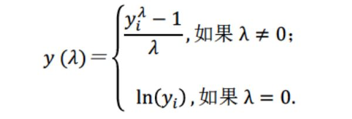
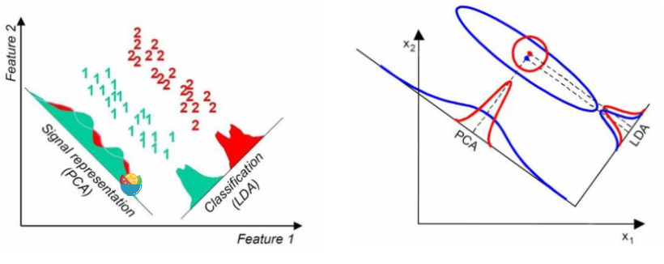

# 缺失值处理

## box-cox变换(log(1+x)变换)：、
box-cox的转换公式:
    
可以简单看成:box-cox变换即对特征X做log(1+X) -- 可以降低X的skewness(偏度)值,使其分布正态化, 使其更加符合后面数据挖掘方法对数据分布的假设

### 各种模型是如何处理缺失值的?
* LR
* DT
* XGBoost
* LightGBM
* SVM
* ...

### PCA & LDA
