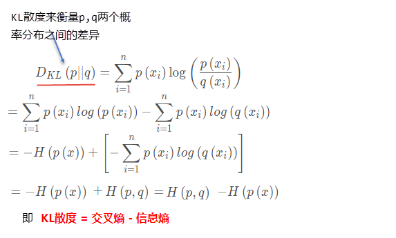
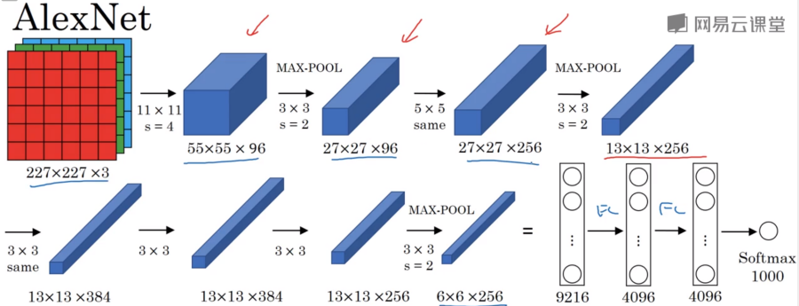

# 神经网络_NN


* 神经网络的特点:
  1. 每个连接都有个权值
  2. 同一层神经元之间没有连接
  3. 最后的输出结果对应的层也称之为全连接层
* 组成：
  1. 输入层：神经网络的第一层，原始的样本数据
  2. 输出层：神经网络的最后一层，最终的计算结果
  3. 隐藏层：其余的中间层都被称为隐藏层（hidden layer）
  4. 权重（weight）：就是之前所说的参数，这里被称为一个神经节点的权重。
  5. 激活函数（activation function）：激活函数是两层神经元之间的映射函数。常见的激活函数有：sigmoid,tanh,Relu...


# 感知机(PLA: Perceptron Learning Algorithm)


多层感知机: MLP

# 神经网络多分类原理与反向传播原理


+ 说明神经网络的softmax以及分类损失计算公式:
  - Softmax回归将神经网络输出转换成概率结果
     
  - 交叉熵损失
    

    *关于交叉熵的补充:*
        
        PS: *在机器学习训练网络时,pq分别对应预测分布和真实分布，由于训练样本和标签是确定的,那么真实概率分布P(x)也就确定下来了，所以信息熵H(p(x))在这里就是一个常量。因此在这里交叉熵跟KL散度一样，都能表示真实概率分布P(x)与预测概率分布Q(x)之间的差异，值越小表示预测的结果越好，交叉熵更容易计算，所以一般计算交叉熵损失。*
    二分类的对数似然损失公式可以当成交叉熵损失来记: $J(\theta)=-\frac{1}{m}\sum_{i=1}^m[y^{(i)}log(h_{\theta(x^{(i)})})+(1-y^{(i)})log(1-h_{\theta(x^{(i)})})]$; 其中m表示样本数


# 反向传播算法
反向传播算法实际就是：使用链式求导法则，反向层层推进，计算出每一层神经节点的偏导数，然后使用梯度下降，不断调整每一个节点的权重（也就是参数$\theta$），从而达到求得全局最小值的目的。

激活函数：
* tanh 函数（the hyperbolic tangent function，双曲正切函数）
     
    取值(-1, 1)

* ReLU 函数（the rectified linear unit，修正线性单元）
    
    max(0, kx)

* Leaky ReLU（带泄漏的 ReLU）
    


## DNN
### Bath Norm(批标准化)

先将Z标准化为Norm(0,1), 然后再使用新的超参(β,γ)变换到另一个分布下。


### 偏差＆方差


## CNN
### 卷积核提取垂直边界

### LeNet-5


### AlexNet


### VGG-16


## RNN(循环神经网络)
### RNN类型


### GRU(门控循环单元)


### LSTM(长短时记忆)


门值Γ还可以加入窥视孔连接. 即Γ的值不仅取决于a_t-1,x^t;也取决于c_t-1.

**TensorFlow中序列信号X的形状**:
X.shape＝(batch_size, sequence_len, element_feature_len)
    batch_size: 序列样本的个数(一批)
    sequence_len: 时间维度上的采样点个数
    element_feature_len: 每个采样点的特征长度
例: 以文本中前l个词预测下一个词为例(样本数为n，每个词使用长度为Nc的one-hot编码):
    X.shape=(n, l, Nc)

```
inputs = np.array([[0, 1, 2, 1],
                   [0, 2, 1, 2],
                   [0, 0, 2, 1],
                   [1, 2, 1, 0],
                   [1, 2, 0, 2],
                   [2, 2, 1, 0]])
inputs = tf.one_hot(indices=inputs, depth=3) # inputs.shape=(batch_size, seq_length, onehotLen)
cell = tf.keras.layers.LSTMCell(units=4) #units指定LSTM单元输出空间的维度, a_t.shape=(batch_size,units) 
state = self.cell.get_initial_state(batch_size=6, dtype=tf.float32)
for t in range(seq_length)
    output, state = self.cell(inputs[:, t, :], state) #batch_size

output结构: <tf.Tensor: shape=(1, 4), dtype=float32, numpy=array([[-0.10596395, -0.07717263, -0.05172994, -0.07536944]], dtype=float32)>
state结构:([<tf.Tensor: shape=(1, 4), dtype=float32, numpy=array([[-0.10596395, -0.07717263, -0.05172994, -0.07536944]], dtype=float32)>,
             <tf.Tensor: shape=(1, 4), dtype=float32, numpy=array([[-0.25958034, -0.19007361, -0.12399498, -0.17207272]], dtype=float32)>])
          --应该分别对应了LSTM单元的记忆线输出C_t和激活输出a_t. --(具体怎么对应有待分析).
```

### BRNN(双向RNN)


单向RNN在计算y^t时只能利用t之前的信息，无法利用t之后的信息;BRNN则可以用户前向信息和后向信息．

### DRNN(深度RNN)


### 序列模型(seq2seq)


## XX


