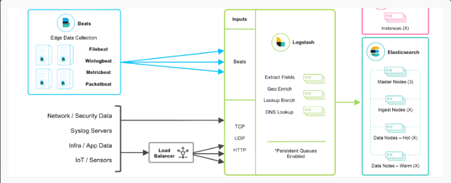
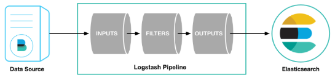

# ELK

[ELK helm包](https://github.com/elastic/helm-charts/tree/v8.5.1)

[学习视频](https://www.bilibili.com/video/BV1mE411f7w6)

[参考](https://zhuanlan.zhihu.com/p/351831747)

ELK = Elasticsearch + Logstash + Kibana
Filebeat：负责日志采集, 并将它们转发到Elasticsearch或 Logstash进行索引
Logstash：负责日志处理与传输
Elasticsearch：负责创建日志索引
Kibana： 负责可视化

## Filebeat
Filebeat负责日志采集； 可以监视指定的日志文件或位置，收集日志事件，并将它们转发到Elasticsearch或 Logstash进行索引。
Filebeat的工作方式如下：启动Filebeat时，它将启动一个或多个输入，这些输入将在为日志数据指定的位置中查找。
对于Filebeat所找到的每个日志，Filebeat都会启动收集器。每个收集器都读取单个日志以获取新内容，并将新日志数据发送到libbeat，libbeat将聚集事件，并将聚集的数据发送到为Filebeat配置的输出。

### logstash的基本原理
logstash分为三个步骤：inputs（必须的）→ filters（可选的）→ outputs（必须的），inputs生成时间，filters对其事件进行过滤和处理，outputs输出到输出端或者决定其存储在哪些组件里。inputs和outputs支持编码和解码。

## Logstash
Logstash是服务器端数据处理管能够从多个来源采集数据，转换数据，然后将数据发送到您最喜欢的“存储库”中。
Logstash能够动态地采集、转换和传输数据，不受格式或复杂度的影响。利用Grok从非结构化数据中派生出结构，从IP地址解码出地理坐标，匿名化或排除敏感字段，并简化整体处理过程。

## Elasticsearch
Elasticsearch是Elastic Stack核心的分布式搜索和分析引擎，是一个基于Lucene、分布式、通过Restful方式进行交互的近实时搜索平台框架。
Elasticsearch为所有类型的数据提供近乎实时的搜索和分析。无论您是结构化文本还是非结构化文本，数字数据或地理空间数据，Elasticsearch都能以支持快速搜索的方式有效地对其进行存储和索引。

## Kibana
Kibana是一个针对Elasticsearch的开源分析及可视化平台，用来搜索、查看交互存储在Elasticsearch索引中的数据。

