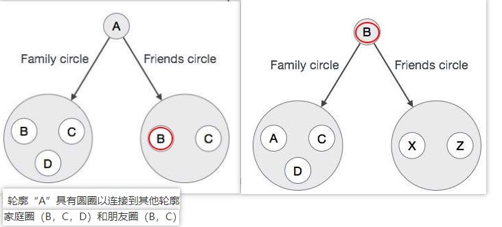
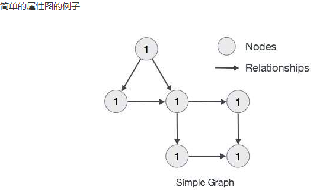

# 1.Neo4j
图数据库主要用于存储更多的连接数据

## 图形数据库数据模型的主要构建块
* 节点
    * 用圆圈表示
    * 包含属性
    * 节点可以有多个标签
* 关系
    * 用方向键表示(单向/双向)
    * 连接节点
    * 包含属性
    * 关系只能有一个标签
    * 关系包括 "开始节点"(也叫"从节点")和"结束节点"(也叫"到节点")
* 属性
    * 是键值对

### 简单的属性图的例子
