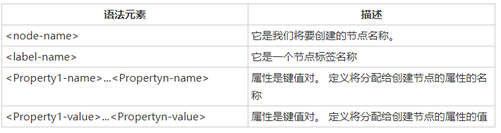
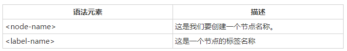
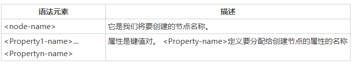
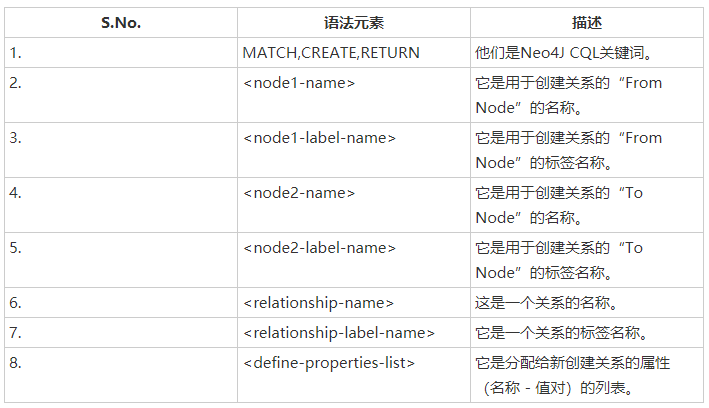
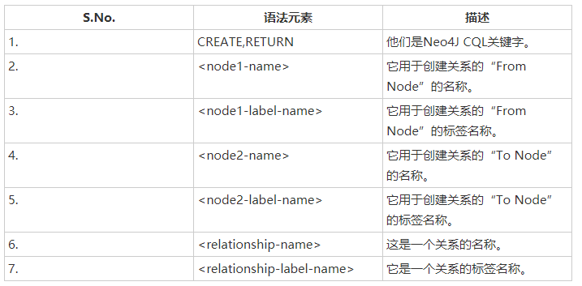
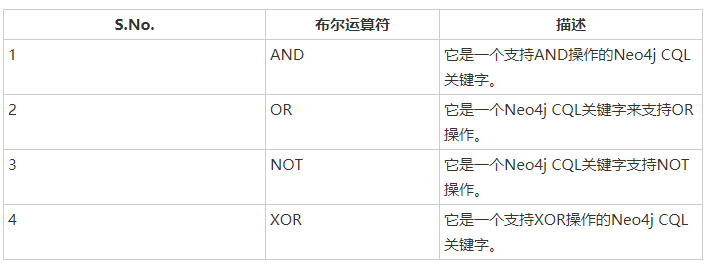
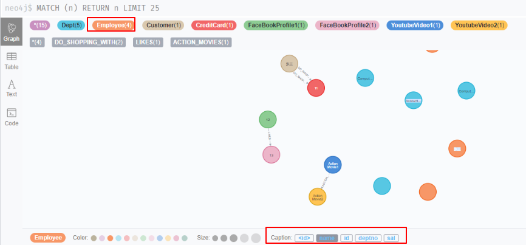

# 3.CREATE

## Neo4j使用CQL“CREATE”命令
* 创建没有属性的节点(或 使用属性创建节点)
* 在没有属性的节点之间创建关系(或 使用属性创建节点之间的关系)
* 为节点或关系创建单个或多个标签

## CREATE命令语法

### 创建一个没有属性的节点
```
# 单个标签的节点
CREATE (<node-name>:<label-name>)
# 多个标签的节点
CREATE (<node-name>:<label-name1>:<label-name2>.....:<label-namen>)
```

### 创建具有属性的节点
```
CREATE (
   <node-name>:<label-name>
   {
      <Property1-name>:<Property1-Value>
      ........
      <Propertyn-name>:<Propertyn-Value>
   }
)
```


eg:
```
CREATE (emp:Employee)
CREATE (emp:Employee{id:1, name:"张三", sal:4500, deptno:1})
CREATE (emp:Employee{id:2, name:"李四", sal:6500, deptno:2})
CREATE (emp:Employee{id:3, name:"王五", sal:5000, deptno:3})
CREATE (emp:Employee{id:4, name:"张三", sal:6500, deptno:4})

CREATE (dept:Dept)
CREATE (dept:Dept { deptno:1, dname:"Computer", location:"长沙" })
CREATE (dept:Dept { deptno:2, dname:"Computer", location:"杭州" })
CREATE (dept:Dept { deptno:3, dname:"Accounting", location:"长沙" })
CREATE (dept:Dept { deptno:4, dname:"management", location:"北京" })
```


# Match
MATCH 命令用于
* 从数据库获取有关节点和属性的数据
* 从数据库获取有关节点，关系和属性的数据
```
MATCH
(
   <node-name>:<label-name>
)
```

**PS**: 
1. match中的label-name用于匹配数据库中的数据(类似SQL中的表), node-name相当于匹配到的数据对象的别名(类似SQL中AS设置的表别名).
2. 名称(节点名/关系名)相当于一个变量名, 方便对节点和关系的引用.([Node Variables/Node Labels](https://neo4j.com/developer/cypher/intro-cypher/))
3. <label-name>与<node-name>的关系相当于编程语言中的'类型'与'变量'的关系

```
**注意事项-**
* Neo4j 数据库服务器使用此 <node-name> 将此节点详细信息存储在 Database.As 中作为 Neo4j DBA 或 Developer，**我们不能使用node-name来访问节点详细信息**。
* Neo4j 数据库服务器创建一个 <label-name> 作为内部节点名称的别名。作为 Neo4j DBA 或 Developer，**我们应该使用label-name称来访问节点详细信息**。

**注意** 我们不能单独使用 MATCH Command 从数据库检索数据。 如果我们单独使用它，那么我们将 InvalidSyntax 错误。MATCH 需要与其他的语句配合才可以使用.

Eg:
```CQL
# 查询Dept下的内容
MATCH (d:Dept) return d

# 查询Employee标签下 id=123，name="Lokesh"的节点
MATCH (e:Employee {id:123,name:"Lokesh"}) RETURN e

## 查询Employee标签下name="Lokesh"的节点，使用（where命令）
MATCH (e:Employee)
WHERE e.name = "Lokesh"
RETURN e
```

# RETURN子句
**RETURN子句用于**
* 检索节点的某些属性(或所有属性)
* 检索节点和关联关系的某些属性(或所有属性)

## RETURN命令语法
```CQL
RETURN
   <node-name>.<property1-name>,
   ........
   <node-name>.<propertyN-name>
```



# MATCH & RETURN匹配使用
我们不能单独使用MATCH或RETURN命令，因此我们应该合并这两个命令以从数据库检索数据。
Eg
```CQL
# 只返回需要的属性
MATCH (d: Dept)
WHERE d.dname='Accounting'
RETURN d.deptno,d.dname

# 返回整个节点
MATCH (d: Dept)
WHERE d.dname='Accounting'
RETURN d
```


# 示例,如何使用属性和这两个节点之间的关系创建两个节点
我们将创建两个节点：客户节点 (Customer) 和信用卡节点 (CreditCard)。
客户节点包含：ID，姓名，出生日期属性
CreditCard节点包含：id，number，cvv，expiredate属性
客户与信用卡关系：DO_SHOPPING_WITH
CreditCard到客户关系：ASSOCIATED_W

**步骤**：
* 创建客户节点
    CREATE (e:Customer{id:"1001", name:"张三" ,dob:"1982-01-10"})
* 创建CreditCard节点
    CREATE (cc:CreditCard{id:"5001", number:"1234567890" ,cvv:"888", expiredate:"20/17"})
* 观察先前创建的两个节点：Customer和CreditCard
```CQL
MATCH (e:Customer)
RETURN e.id,e.name,e.dob

# ===
MATCH (cc:CreditCard)
RETURN cc.id,cc.number,cc.cvv,cc.expiredate
```
* **创建客户和CreditCard节点之间的关系**
* 查看新创建的关系详细信息
* 详细查看每个节点和关系属性


# 关系基础
## 基于方向性，Neo4j关系被分为两种主要类型。
* 单向关系
* 双向关系

**关系说明**:
每个关系（→）包含两个节点: "从节点", "到节点"
 "从节点"对应"外向关系", "到节点"对应"传入关系"

**在以下场景中，我们可以使用Neo4j CQL CREATE命令来创建两个节点之间的关系。 这些情况适用于Uni和双向关系**, 这些情况适用于Uni和双向关系。
* 在两个现有节点之间创建无属性(或有属性)的关系
**语法**：
```CQL
MATCH (<node1-name>:<node1-label-name>),(<node2-name>:<node2-label-name>)
CREATE
	(<node1-label-name>)
	-[<relationship-name>:<relationship-label-name>{<define-properties-list>}]
	->(<node2-label-name>)
RETURN <relationship-name>
```

注意：
在此语法中，RETURN子句是可选的。 如果我们想立即看到结果，那么使用它。 否则，我们可以省略这个子句。

Eg:
```
# 基于已有节点创建无属性的关系
MATCH (e:Customer),(cc:CreditCard) 
CREATE (e)-[r:DO_SHOPPING_WITH ]->(cc)

# 基于已有节点创建有属性的关系
MATCH (cust:Customer),(cc:CreditCard) 
CREATE (cust)-[r:DO_SHOPPING_WITH{shopdate:"2014-12-12", price:55000}]->(cc) 
RETURN r
```
* 在两个新节点之间创建无属性(或有属性)的关系
```CQL
CREATE  
	(<node1-name>:<node1-label-name>{<define-properties-list>})
	-[<relationship-name>:<relationship-label-name>{<define-properties-list>}]
	->(<node2-name>:<node2-label-name>{<define-properties-list>})
RETURN <relationship-name>
```


Eg:
```CQL
# 创建新节点和无属性的关系
CREATE (fb1:FaceBookProfile1)-[like:LIKES]->(fb2:FaceBookProfile2)

# 创建新节点和有属性的关系
CREATE 
    (video1:YoutubeVideo1{title:"Action Movie1", updated_by:"Abc", uploaded_date:"10/10/2010"})
    -[movie:ACTION_MOVIES{rating:1}]
    ->(video2:YoutubeVideo2{title:"Action Movie2", updated_by:"Xyz", uploaded_date:"12/12/2012"}) 
```

* 使用WHERE子句创建关系
```
MATCH (<node1-name>:<node1-label-name>),(<node2-name>:<node2-label-name>) 
WHERE <condition>
CREATE (<node1-label-name>)
       -[<relationship-name>:<relationship-label-name>{<relationship-properties>}]
       ->(<node2-label-name>)
RETURN <relationship-name>
```

Eg:
```
MATCH (cust:Customer),(cc:CreditCard) 
WHERE cust.id = "1001" AND cc.id= "5001" 
CREATE (cust)-[r:DO_SHOPPING_WITH{shopdate:"12/12/2014",price:55000}]->(cc) 
RETURN r
```

### 检索关系节点的详细信息:
```
MATCH 
    (<node1-label-name>)
    -[<relationship-name>:<relationship-label-name>]
    ->(<node2-label-name>)
RETURN <relationship-name>
```

eg:
```CQL
MATCH (fb1:FaceBookProfile1)-[like:LIKES]->(fb2:FaceBookProfile2) 
RETURN like
```


# WHERE
`WHERE <condition> <boolean-operator> <condition>`

CQL中的布尔运算符



# DELETE删除
DELETE子句:
* 删除节点。
* 删除节点及相关节点和关系。

## 删除节点
`DELETE <node-name-list>`
eg:
```
# 删除指定标签的所有节点
MATCH (e: Employee) DELETE e
```

## 删除节点及其关联节点和关系
`DELETE <node1-name>,<node2-name>,<relationship-name>`
eg:
```
# 删除节点及其关联节点和关系
MATCH (cc:CreditCard)-[r]-(c:Customer)RETURN r 
```

# REMOVE
**REMOVE命令用于**:
* 删除节点或关系的标签
* 删除节点或关系的属性

**eo4j CQL DELETE和REMOVE命令之间的主要区别**:
* DELETE操作用于删除节点和关联关系。
* REMOVE操作用于删除标签和属性。

**Neo4j CQL DELETE和REMOVE命令之间的相似性**:
* 这两个命令不应单独使用。
* 两个命令都应该与MATCH命令一起使用。


## 删除属性语法
```
REMOVE <property-name-list>
其中:<property-name-list> 语法
    <node-name>.<property1-name>,
    <node-name>.<property2-name>,
    ....
    <node-name>.<propertyn-name>
```
eg:
```
CREATE (book:Book {id:122,title:"Neo4j Tutorial",pages:340,price:250}) 

# 从书节点中删除'price'属性
MATCH (book { id:122 })
REMOVE book.price
RETURN book
```

## 删除标签(节点标签/关系标签)
```
REMOVE <label-name-list>
其中<label-name-list>语法
    <node-name>:<label2-name>,
    ....
    <node-name>:<labeln-name>
```
eg:
```
MATCH (m:Movie) 
REMOVE m:Picture
```

# SET
SET 子句来执行以下操作。
* 向现有节点或关系添加新属性
* 添加或更新属性值
```
SET  <property-name-list>
其中<property-name-list>语法:
    <node-label-name>.<property1-name>,
    <node-label-name>.<property2-name>,
    ....
    <node-label-name>.<propertyn-name>
```
eg:
```
MATCH (book:Book)
SET book.title = 'superstar'
RETURN book
```

# ORDER BY
order by用于对MATCH查询返回的结果进行排序; 默认是升序, 如果要降序排列可使用DESC子句。
`ORDER BY  <property-name-list>  [DESC]	`
eg:
```
MATCH (emp:Employee)
RETURN emp.empid,emp.name,emp.salary,emp.deptno
ORDER BY emp.name
```

# UNION/ UNION ALL
效果与SQL一样
UNION子句语法
```
<MATCH Command1>
UNION
<MATCH Command2>
```
eg:
```
MATCH (cc:CreditCard) RETURN cc.id AS id, cc.number AS number
UNION
MATCH (dc:DebitCard) RETURN dc.id AS id, dc.number AS number
```

# SKIP, LIMIT子句
```
SKIP <number>
LIMIT <number>
```
eg:
```
# 跳过前2行,取2行
MATCH (emp:Employee) 
RETURN emp
SKIP 2
LIMIT 2
```


# MERGE
MERGE命令在图中搜索给定模式，如果存在，则返回结果;
如果它不存在于图中，则它创建新的节点/关系并返回结果。

MERGE命令用于:
* 创建节点，关系和属性
* 为从数据库检索数据
MERGE命令是CREATE命令和MATCH命令的组合。
```
MERGE (<node-name>:<label-name>
{
   <Property1-name>:<Pro<rty1-Value>
   .....
   <Propertyn-name>:<Propertyn-Value>
})
```
eg:
```
MERGE (gp2:GoogleProfile2{ Id: 201402,Name:"Nokia"})
```

# NULL值
Neo4j CQL将空值视为对节点或关系的属性的缺失值或未定义值。
eg:
```
MATCH (e:Employee)
WHERE e.id IS NOT NULL
RETURN e.id, e.name, e.sal, e.deptno
```

# IN
eg:
```
MATCH (e:Employee)
WHERE e.id IN [123, 124]
RETURN e.id,e.name,e.sal,e.deptno
```

# ID属性
在Neo4j中，“Id”是节点和关系的默认内部属性。 当我们创建一个新的节点或关系时，Neo4j数据库服务器将为内部使用分配一个数字。 它会自动递增。


# Caption标题
我们在Neo4j DATA浏览器中执行MATCH + RETURN命令以查看UI视图中的数据时，在UI界面展示的属性即'CAPTION'属性.




