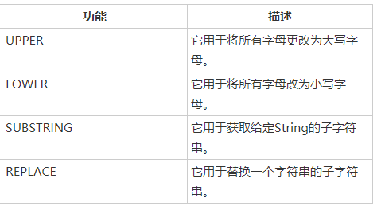
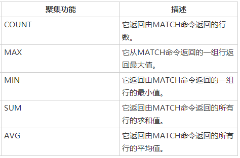
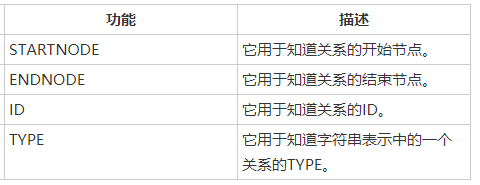

# 4.CQL_常用函数

# 字符串函数


str_func <input-string>: 可以是来自Neo4J数据库的节点或关系的**属性名称**。

```
# UPPER
MATCH (e:Employee)
RETURN e.id, UPPER(e.name), e.sal, e.deptno

# SUBSTRING(属性名, startIdx, endIdx) -- 取[start, endIdx)
MATCH (e:Employee)
RETURN e.id, SUBSTRING(e.name, 0, 2), e.sal, e.deptno
```

# AGGREGATION 聚合函数
使用MATCH命令中的RETURN +聚合函数来处理一组节点并返回一些聚合值。


```
# COUNT(<value>)
# 注意: <value>可以是*，节点标签名称,关系标签名称或属性名称。
MATCH (e:Employee) RETURN COUNT(*)

# MAX(<property-name>), MIN(<property-name> )
# 从给定的<property-name>列中查找最值
MATCH (e:Employee) 
RETURN MAX(e.sal),MIN(e.sal)
```

# 关系函数
CQL提供了一组关系函数，以在获取开始节点，结束节点等细节时知道关系的细节。


```
# STARTNODE (<relationship-name>)
# ENDNODE (<relationship-name>)
# <relationship-name>可以是来自Neo4j数据库的节点或关系的名称。
MATCH (a)-[movie:ACTION_MOVIES]->(b)
RETURN STARTNODE(movie)

# ID和TYPE关系函数来检索关系的Id和类型详细信息。
MATCH (a)-[movie:ACTION_MOVIES]->(b)
RETURN ID(movie),TYPE(movie)

```


