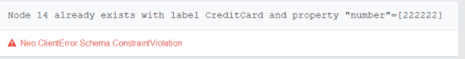

# 5.CQL_索引

Neo4j CQL支持节点或关系属性上的索引，以提高应用程序的性能
可以为具有相同标签名称的所有节点的属性创建索引。
可以在MATCH或WHERE或IN运算符上使用这些索引列来改进CQL Command的执行。

**索引操作**
* Create Index 创建索引
* Drop Index 丢弃索引

**创建索引的语法**：
`CREATE INDEX ON :<label_name> (<property_name>)`
注意：-
冒号（:)运算符用于引用节点或关系标签名称。
上述语法描述它在节点或关系的<label_name>的<property_name>上创建一个新索引
eg:
```
CREATE INDEX ON :Customer (name)
```


**Drop Index语法**：
`DROP INDEX ON :<label_name> (<property_name>)`
eg:
```
DROP INDEX ON :Customer (name)
```

# UNIQUE约束
在Neo4j数据库中，CREATE命令始终创建新的节点或关系; 这意味着即使您使用相同的值, 它也会插入一个新行.
根据我们对某些节点或关系的应用需求，我们必须避免这种重复.
我们应该使用一些数据库约束来创建节点或关系的一个或多个属性的规则。

**UNIQUE约束的优点**
* 避免重复记录。
* 强制执行数据完整性规则

## 创建唯一约束语法
```CQL
CREATE CONSTRAINT ON (<label_name>)
ASSERT <property_name> IS UNIQUE
```
eg:
```
CREATE CONSTRAINT ON (cc:CreditCard)
ASSERT cc.number IS UNIQUE
```
插入违反唯一约束的属性会报错:



## 删除UNIQUE约束
```CQL
DROP CONSTRAINT ON (<label_name>)
ASSERT <property_name> IS UNIQUE
```
eg:
```
DROP CONSTRAINT ON (cc:CreditCard)
ASSERT cc.number IS UNIQUE
```


