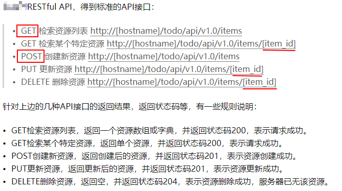
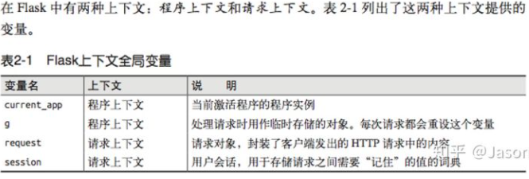

# flask-restful

**请求和 响应**:
一个web网站，请求响应是最频繁
常用的请求属性：
1. request.scheme : 获取请求协议
2. request.method : 获取本次请求的请求方式(GET / POST)
3. request.args : 获取以get请求方式提交的数据
4. request.form : 获取以post请求方式提交的数据
5. request.cookies:获取cookies中的相关信息
6. request.headers：获取请求信息头的相关信息
7. request.files：获取上传的文件
8. request.path：获取请求的资源具体路径(不带参数)
9. request.full_path：获取完整的请求资源具体路径(带参数)
10. request.url: 获取完整的请求地址，从协议开始
11. request.files 获取上传的文件（用save进行保存）
里面要注意低是request.args，request.form ，request.files 的返回值都是字典。
响应就是服务器响应给客户端的内容
响应的都是字符串， html文件也是字符串

请求-响应循环

