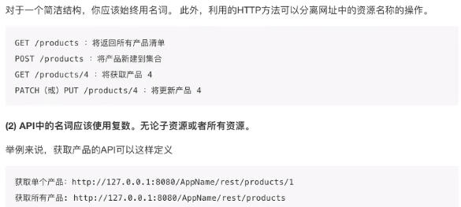

# flask

## web接口: RESTful
1. 请求方式
2. 请求路径
3. 请求参数
4. 返回结果

## RESTful设计方法

* 路径




* HTTP动词


* 过滤信息


* 状态码


* 错误处理


* 返回结果

 


## Flask 中请求上下文和应用上下文的区别和作用？
current_app、g 是应用上下文。
request、session 是请求上下文。
手动创建上下文的两种方法：
1. with app.app_context()
2. app = current_app._get_current_object()
**两者区别**：
请求上下文：保存了客户端和服务器交互的数据。
应用上下文：flask 应用程序运行过程中，保存的一些配置信息，比如程序名、数据库连接、应用
信息等。
**两者作用**：
* 请求上下文(request context)：
Flask 从客户端收到请求时，要让视图函数能访问一些对象，这样才能处理请求。请求对象是一个很好的例子，它封装了客户端发送的 HTTP 请求。要想让视图函数能够访问请求对象，一个显而易见的方式是将其作为参数传入视图函数，不过这会导致程序中的每个视图函数都增加一个参数，除了访问请求对象,如果视图函数在处理请求时还要访问其他对象，情况会变得更糟。为了避免大量可有可无的参数把视图函数弄得一团糟，Flask使用上下文临时把某些对象变为全局可访问。
* 应用上下文(application context)：
它的字面意思是 应用上下文，但它不是一直存在的，它只是 request context 中的一个对 app 的代理(人)，所谓 local proxy。它的作用主要是帮助 request 获取当前的应用，它是伴 request 而生，随 request 而灭的。


## 说说对Flask蓝图(Blueprint)的理解？
1. 蓝图的定义
蓝图 /Blueprint 是 Flask 应用程序组件化的方法，可以在一个应用内或跨越多个项目共用蓝图。
使用蓝图可以极大地简化大型应用的开发难度，也为 Flask 扩展 提供了一种在应用中注册服务的集中式机制。
2. 蓝图的应用场景
* 把一个应用分解为一个蓝图的集合。这对大型应用是理想的。一个项目可以实例化一个应用对象，初始化几个扩展，并注册一集合的蓝图。
* . 以 URL 前缀和/或子域名，在应用上注册一个蓝图。 URL 前缀/子域名中的参数即成为这个蓝图下的所有视图函数的共同的视图参数（默认情况下）。
* 在一个应用中用不同的 URL 规则多次注册一个蓝图。
* 通过蓝图提供模板过滤器、静态文件、模板和其它功能。一个蓝图不一定要实现应用或者视图函数。
*  初始化一个 Flask 扩展时，在这些情况中注册一个蓝图。
3. 蓝图的缺点
不能在应用创建后撤销注册一个蓝图而不销毁整个应用对象。
4. 使用蓝图的三个步骤
```
# 创建 一个蓝图对象
blue = Blueprint("blue"，__name__)
# 在这个蓝图对象上进行操作 ，例如注册路由、指定静态文件夹、注册模板过滤器...
@blue.route('/')
def blue_index():
    return 'Welcome to my blueprint'
# 在应用对象上注册这个蓝图对象
app.register_blueprint(blue，url_prefix='/blue')
```

## Flask 中请求钩子的理解和应用？
请求钩子是通过装饰器的形式实现的，支持以下四种：
1. before_first_request 在处理第一个请求前运行
2. before_request:在每次请求前运行
3. after_request:如果没有未处理的异常抛出，在每次请求后运行
4. teardown_request:即使有未处理的异常抛出，在每次请求后运行
应用：
```
# 请求钩子
@api.after_request
def after_request(response):
    """设置默认的响应报文格式为 application/json"""
    # 如果响应报文 response 的 Content-Type 是以 text 开头，则将其改为
    # 默认的 json 类型
    if response.headers.get("Content-Type").startswith("text"):
        response.headers["Content-Type"] = "application/json"
    return respon
```


