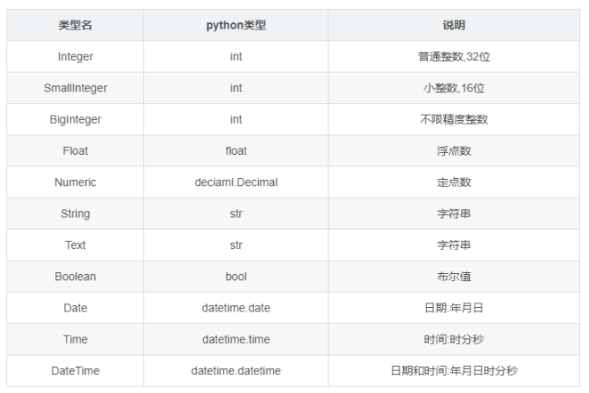
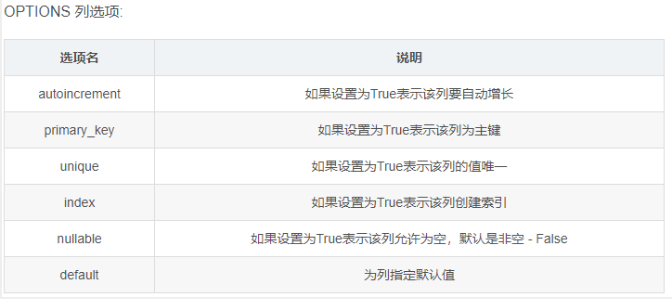

# 数据库配置

flask配置sqlite
```python
from flask import Flask
from flask_sqlalchemy import SQLAlchemy

app = Flask(__name__)
app.config['SQLALCHEMY_DATABASE_URI'] = 'sqlite:///test.db'
app.config['SQLALCHEMY_TRACK_MODIFICATIONS'] = True
db = SQLAlchemy(app)
```


```
class MODELNAME(db.Model):
	__tablename__ = "TABLENAME"
	COLUMN_NAME=db.Column(db.TYPE, OPTIONS)
	...
```
1. MODELNAME: 定义模型类的名称,尽量参考表名
2. TABLENAME: 映射到数据库中表的名称
3. COLUMN_NAME:属性名,映射到数据表中列的名称
4. TYPE: 映射到列的数据类型
5. OPTIONS:列选项,如:是否唯一,默认值,加索引…
db.TYPE 列类型如下:





# 部署
[flask部署](https://dormousehole.readthedocs.io/en/latest/deploying/index.html#deployment)


